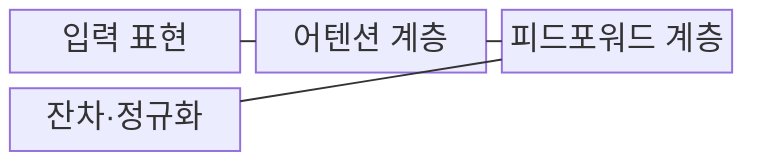
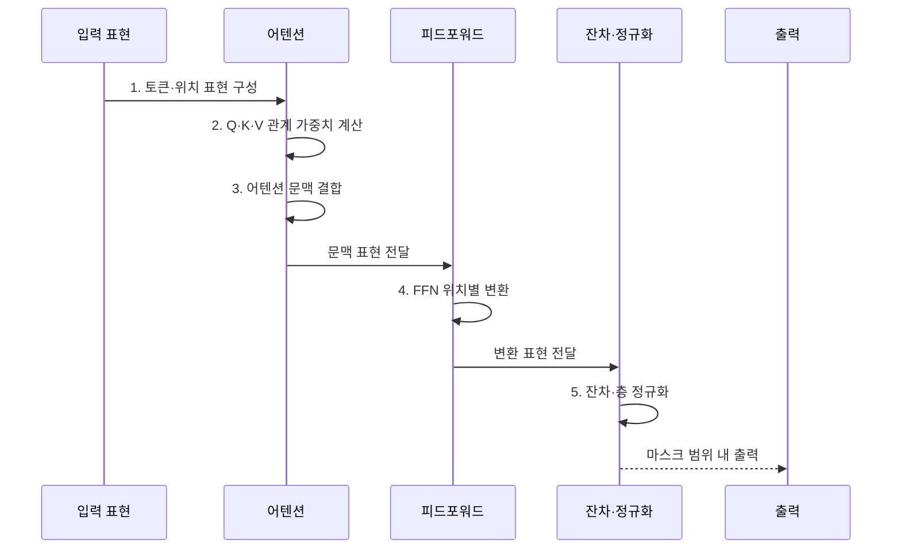

---
sidebar:
  order: 27
  label: "027. Transformer (트랜스포머)"
  badge:
    text: "기출 · 70%"
    variant: note
title: "Transformer (트랜스포머)"
date: "2026-08-02T08:54:00+09:00"
tags:
  - "notes-latest_tech"
weight: 27
extra:
  question_no: "027"
  source_status: "기출"
  source_history: "135회, 137회"
  priority: 70
  priority_note: "어텐션 기반 구조가 반복 출제되는 기반"
---

## Ⅰ. 개요

핵심 용어

- **트랜스포머(Transformer)**: 셀프 어텐션으로 토큰 관계를 직접 계산하고 피드포워드 계층으로 표현을 변환하는 신경망 구조다.
- **순환 신경망(Recurrent Neural Network, RNN)**: 이전 시점의 은닉 상태를 다음 시점으로 순차 전달하여 시퀀스를 처리하는 구조다.

- 정의/개념: 셀프 어텐션으로 시퀀스의 토큰 관계를 직접 계산하고 병렬 처리하는 **트랜스포머**
- 배경/필요성: 순환 신경망(Recurrent Neural Network, RNN)의 순차 상태 전달은 **학습 병렬화와 장거리 의존성 학습** 에 한계

#### 한줄 요약
- 단어 간 관계를 한 층에서 동시 계산함

## Ⅱ. 특징

핵심 용어

- **셀프 어텐션(Self-Attention)**: 같은 시퀀스 안의 토큰들이 서로의 관련도를 계산하여 문맥 정보를 결합하는 연산이다.
- **크로스 어텐션(Cross-Attention)**: 한 시퀀스의 쿼리가 다른 시퀀스의 키와 밸류를 참조하여 정보를 연결하는 연산이다.
- **GPU(Graphics Processing Unit)**: 대규모 행렬곱을 병렬로 처리하여 트랜스포머 학습을 가속하는 연산 장치다.

- 셀프 어텐션에 의한 **모든 토큰 쌍 관계의 직접 계산**
- **셀프·크로스 어텐션**: 동일·외부 시퀀스의 문맥 관계 결합
- 순환 구조 제거와 **그래픽 처리장치(Graphics Processing Unit, GPU) 병렬 학습**
- 마스크에 의한 참조 범위 제어와 **O(N²) 어텐션 비용**

#### 한줄 요약
- 학습은 병렬이나 생성은 순차적임

## Ⅲ. 구조 및 구성요소

핵심 용어

- **피드포워드 신경망(Feed-Forward Network, FFN)**: 어텐션을 거친 각 토큰 표현을 위치별로 비선형 변환하는 계층이다.
- **잔차 연결(Residual Connection)**: 계층 입력을 변환 결과에 더하여 원래 정보와 기울기 흐름을 보존하는 연결이다.
- **층 정규화(Layer Normalization)**: 각 토큰 표현의 특성 차원을 정규화하여 학습을 안정화하는 연산이다.

| 구성요소 | 책임 |
|:---|:---|
| 입력 표현 | 토큰 임베딩과 **위치 인코딩** 결합 |
| 어텐션 계층 | **셀프 어텐션** 으로 토큰 관계 추출 |
| 피드포워드 계층 | 위치별 비선형 변환으로 **표현 차원** 확장·압축 |
| 잔차·정규화 | 잔차 연결과 층 정규화로 **정보·학습 안정성** 유지 |

#### 한줄 요약
- 관계를 모으는 단계와 각 단어 표현을 다듬는 단계를 잔차 연결로 반복함

## Ⅳ. 흐름도

핵심 용어

- **쿼리·키·밸류(Query·Key·Value, Q·K·V)**: 어떤 정보를 찾을지, 무엇과 비교할지, 어떤 정보를 전달할지를 각각 나타내는 어텐션 벡터다.
- **위치 인코딩(Positional Encoding)**: 병렬 처리되는 토큰 표현에 순서와 상대 위치 정보를 더하는 표현이다.

1. **토큰·위치 표현 구성**: 토큰 의미와 **순서 정보** 결합
2. **쿼리·키·밸류(Query·Key·Value, Q·K·V) 관계 가중치 계산**: 토큰 쌍의 **참조 중요도** 산출
3. **어텐션 문맥 결합**: 가중치에 따라 Value를 합성해 **문맥 표현** 생성
4. **피드포워드 신경망(Feed-Forward Network, FFN) 위치별 변환**: 각 토큰 표현의 비선형 확장·압축
5. **잔차·층 정규화**: 잔차 경로와 정규화로 정보·기울기 안정화

#### 한줄 요약
- 단어별 정보를 모으고 다듬어 전달함

## Ⅴ. 종류 및 비교

핵심 용어

- **트랜스포머**: 어텐션으로 토큰 관계를 직접 계산하여 병렬 학습과 장거리 문맥 처리를 지원한다.
- **순환 신경망 계열(Recurrent Neural Network Family, RNN Family)**: 은닉 상태를 순차 전달하여 스트림 상태를 처리하지만 병렬화와 장거리 정보 보존에 제약이 있다.
- **BERT(Bidirectional Encoder Representations from Transformers)**: 양방향 트랜스포머 인코더를 사전학습하여 입력 문맥 표현을 만드는 모델이다.

- **트랜스포머(Transformer)** 및 **순환 신경망(Recurrent Neural Network, RNN)** 사이를 병렬 관계 계산과 순차 상태 전달 기준으로 구분한다.

| 비교 기준 | Transformer | RNN 계열 |
|:---|:---|:---|
| 적용 기준 | 긴 문맥의 **병렬 학습·확장** | 짧은 스트림의 **순차 상태 처리** |
| 핵심 특징 | 어텐션으로 **토큰 관계 직접 계산** | 은닉 상태로 **정보 순차 전달** |
| 한계 | 문맥 길이의 **O(N²) 비용** | 병렬화 제한·**장거리 정보 소실** |

#### 한줄 요약
- RNN은 상태를 순차 전달하고 트랜스포머는 토큰 관계를 직접 계산함

## Ⅵ. 실무 고려사항 및 대책

핵심 용어

- **희소 어텐션(Sparse Attention)**: 모든 토큰 쌍 대신 정해진 일부 관계만 계산하여 장문 연산량을 줄이는 방식이다.
- **키-값 캐시(Key-Value Cache, KV Cache)**: 자기회귀 생성 중 이전 토큰의 어텐션 키와 값을 저장하여 반복 계산을 줄이는 기법이다.
- **추측 디코딩(Speculative Decoding)**: 작은 모델이 제안한 여러 토큰을 큰 모델이 한 번에 검증하여 생성 지연을 줄이는 방식이다.

| 문제 | 대책 | 효과 |
|:---|:---|:---|
| 긴 문맥의 **O(N²) 메모리·연산량** | 청크·윈도·희소 어텐션과 길이별 부하 시험 | 처리량·문맥 보존의 **균형 확보** |
| 위치 표현의 **학습 길이 외 일반화** | 상대·회전 위치 표현과 최대 길이 평가 | 장문 순서 정보의 **왜곡 완화** |
| 자기회귀 생성의 **순차 지연** | **키-값 캐시(Key-Value Cache, KV Cache)·배치·추측 디코딩** 적용 | 토큰당 지연·비용 **절감** |
| 마스크 오류에 의한 **미래·패딩 정보 누출** | 마스크 단위 시험과 학습·추론 조건 일치 검증 | 잘못된 참조와 평가 과대 **차단** |

#### 한줄 요약
- 긴 문맥을 구간별로 나누거나 중요한 토큰 관계만 계산하여 메모리와 처리 비용을 절감한다.

## Ⅶ. 결론

핵심 용어

- **트랜스포머 선택 기준**: 긴 문맥의 관계를 직접 계산하고 대규모 병렬 학습이 필요할 때 선택한다.
- **순환 신경망 선택 기준(Recurrent Neural Network Selection Criteria, RNN Selection Criteria)**: 문맥이 짧고 순차 상태를 낮은 자원으로 계속 갱신하는 스트림 처리에 선택한다.

- 긴 문맥 병렬 학습에는 **트랜스포머**, 짧은 순차 상태에는 **순환 신경망(Recurrent Neural Network, RNN)** 선택

#### 한줄 요약
- 문맥 처리 성능과 어텐션의 제곱 복잡도를 함께 고려함
