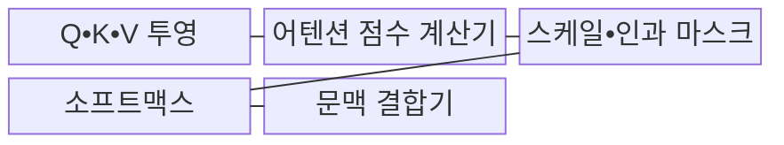
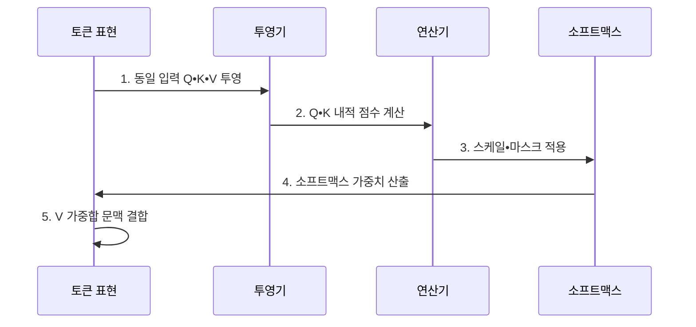

---
sidebar:
  order: 28
  label: "028. Self-Attention (셀프 어텐션)"
  badge:
    text: "기출 • 50%"
    variant: note
title: "Self-Attention (셀프 어텐션)"
date: "2026-08-04T13:47:00+09:00"
tags:
  - "notes-latest_tech"
weight: 28
extra:
  question_no: "028"
  source_status: "기출"
  source_history: "135회"
  priority: 50
  priority_note: "토큰 관계 학습이 트랜스포머 핵심"
---

## Ⅰ. 개요

핵심 용어

- **셀프 어텐션(Self-Attention)**: 같은 시퀀스 안의 토큰 관계를 계산하고 관련 정보의 가중합으로 각 토큰 표현을 갱신하는 연산이다.
- **시퀀스(Sequence)**: 순서가 있는 토큰이나 시점의 연속된 입력이다.

- 정의/개념: 동일 시퀀스의 각 토큰이 다른 토큰과의 관련도에 따라 값 벡터를 가중 결합하는 **셀프 어텐션**
- 배경/필요성: 순차 상태 전달 구조는 멀리 떨어진 토큰의 **직접 관계 계산** 에 한계

#### 한줄 요약
- 각 토큰이 같은 문맥의 다른 토큰을 얼마나 참고할지 계산하여 의미 표현을 갱신한다.

## Ⅱ. 특징

핵심 용어

- **쿼리(Query, Q)**: 현재 토큰이 어떤 정보를 찾을지 나타내는 조회 기준 벡터다.
- **키(Key, K)**: 각 토큰이 쿼리와 얼마나 관련 있는지 비교하는 식별 벡터다.
- **밸류(Value, V)**: 계산된 어텐션 가중치에 따라 실제로 가중합되는 정보 벡터다.

- **Q**: 입력을 조회 기준 벡터로 투영
- **K**: 입력을 비교 식별 벡터로 투영
- **V**: 입력을 전달 정보 벡터로 투영
- **Q•K 유사도**: V 가중합의 참조 비율 산출
- 마스크 기반 참조 제어와 **O(N²) 연산•메모리**

#### 한줄 요약
- 모든 단어 쌍을 비교하여 먼 관계도 찾으나 문장이 길어질수록 계산량 급증

## Ⅲ. 구조 및 구성요소

핵심 용어

- **어텐션 점수(Attention Score)**: 쿼리와 키의 내적으로 계산하여 토큰 사이의 원시 관련도를 나타낸 값이다.
- **소프트맥스(Softmax)**: 실수 점수 벡터를 각 값이 0과 1 사이이고 합이 1인 가중치로 정규화하는 함수다.
- **인과 마스크(Causal Mask)**: 자기회귀 생성에서 현재 토큰이 미래 위치의 토큰을 참조하지 못하도록 점수를 차단하는 행렬이다.

- 입력을 **Q•K•V** 벡터로 투영한 뒤 점수•마스크•소프트맥스•문맥 결합 순서로 처리한다.

| 구성요소 | 책임 |
|:---|:---|
| **Q•K•V 투영** | 입력 임베딩의 **선형 변환** |
| **어텐션 점수 계산기** | Q와 K의 **내적 유사도** 계산 |
| **스케일•인과 마스크** | 점수 안정화와 **미래 참조 차단** |
| **소프트맥스** | 합 1인 **어텐션 가중치** 정규화 |
| **문맥 결합기** | 가중치 기반 **V 가중합** 산출 |

#### 한줄 요약
- 질문과 찾아볼 표지를 비교해 참고 비율을 정하고 실제 정보 조각을 그 비율로 섞음

## Ⅳ. 흐름도

핵심 용어

- **선형 투영(Linear Projection)**: 같은 입력 표현에 서로 다른 가중치 행렬을 곱해 Q•K•V 벡터로 변환하는 연산이다.
- **문맥 벡터(Context Vector)**: 어텐션 가중치에 따라 밸류를 합산하여 주변 토큰 정보를 결합한 출력 표현이다.

1. **동일 입력 Q•K•V 투영**: 토큰 표현을 조회•식별•전달 목적의 **세 벡터** 로 변환
2. **Q•K 내적 점수 계산**: 각 토큰이 다른 토큰을 참조할 **원시 관련도** 산출
3. **스케일•마스크 적용**: 점수 폭을 안정화하고 미래•패딩 토큰의 **참조 차단**
4. **소프트맥스 가중치 산출**: 점수를 합이 1인 **참조 비율** 로 정규화
5. **V 가중합 문맥 결합**: 참조 비율대로 토큰별 문맥 표현 생성

#### 한줄 요약
- 점수를 보정한 뒤 참고 비율로 바꾸어 합침

## Ⅴ. 종류 및 비교

핵심 용어

- **크로스 어텐션(Cross-Attention)**: 대상 시퀀스의 Q가 원천 시퀀스의 K•V를 참조하여 서로 다른 시퀀스나 양식을 연결한다.

- **셀프 어텐션** 및 **크로스 어텐션** 사이를 내부 문맥과 외부 시퀀스 연결 기준으로 구분하며 두 방식 모두 **Q•K•V** 관계를 사용한다.

| 비교 기준 | 셀프 어텐션 | 크로스 어텐션 |
|:---|:---|:---|
| 적용 기준 | 동일 시퀀스의 **내부 문맥 학습** | 서로 다른 **시퀀스•양식 연결** |
| 핵심 특징 | 같은 입력에서 **Q•K•V 생성** | 대상 Q가 원천의 **K•V 참조** |
| 한계 | 길이에 따른 **O(N²) 비용** | 원천•대상의 **정렬 품질 의존** |

#### 한줄 요약
- 내부와 외부 문맥 참고로 구분함

## Ⅵ. 실무 고려사항 및 대책

핵심 용어

- **FlashAttention**: 어텐션 계산을 블록 단위로 재구성하여 전체 점수 행렬의 메모리 입출력을 줄이는 구현 기법이다.
- **패딩 마스크(Padding Mask)**: 길이를 맞추기 위해 추가한 무효 토큰이 어텐션에 반영되지 않도록 참조를 차단한다.
- **교란 실험**: 입력이나 어텐션 요소를 변경•제거했을 때 출력이 어떻게 달라지는지 측정하여 설명의 타당성을 확인하는 방법이다.

| 문제 | 대책 | 효과 |
|:---|:---|:---|
| 장문에서 **점수 행렬 메모리 급증** | FlashAttention•윈도•희소 어텐션 적용 | 정확도 보존과 **메모리 접근 절감** |
| 인과•패딩 마스크의 **참조 오류** | 경계 사례 단위 시험•시각화 | 미래•무효 토큰의 **정보 누출 차단** |
| 어텐션 가중치의 **설명 과신** | 삭제•교란 실험과 별도 설명 기법 병행 | 인과적 해석의 **오판 방지** |
| 긴 문맥의 **핵심 정보 희석** | 검색•요약•계층적 청킹과 회수율 평가 | 중요 근거의 **참조 가능성 향상** |

#### 한줄 요약
- 긴 문장을 읽을 때 메모리를 덜 쓰도록 어텐션 연산을 효율화함

## Ⅶ. 결론

핵심 용어

- 동일 시퀀스는 **셀프 어텐션**, 외부 문맥은 **크로스 어텐션** 선택

#### 한줄 요약
- 동일한 문장 안에서 단어 간의 관계를 한 번에 계산함
