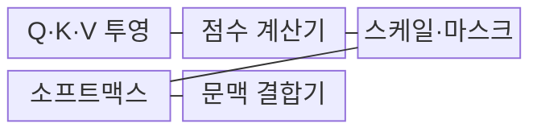
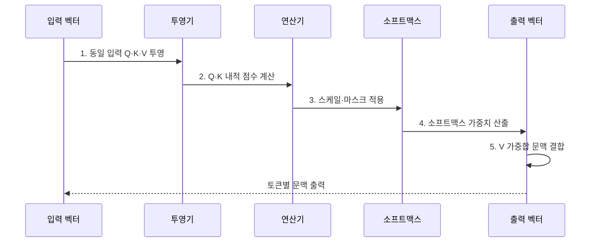

---
sidebar:
  order: 28
  label: "028. Self-Attention (셀프 어텐션)"
  badge:
    text: "기출 · 50%"
    variant: note
title: "Self-Attention (셀프 어텐션)"
date: "2026-07-31T11:56:10+09:00"
tags:
  - "notes-latest_tech"
weight: 28
extra:
  question_no: "028"
  source_status: "기출"
  source_history: "135회"
  priority: 50
  priority_note: "토큰 관계 학습이 트랜스포머 핵심"
---

## 미리 알고가기

- **쿼리(Query, Q)**: 검색 대상이 되는 입력 토큰의 기준 벡터
- **키(Key, K)**: 쿼리와의 관련성을 비교할 대상 토큰의 식별 벡터
- **밸류(Value, V)**: 어텐션 가중치에 따라 최종 가중합되는 정보 벡터
- **셀프 어텐션(Self-Attention)**: 동일 시퀀스 내 토큰 간의 유사도를 계산하는 연산
- **크로스 어텐션(Cross-Attention)**: 타 시퀀스의 K·V를 참조하여 문맥을 연결하는 연산
- **어텐션 점수(Attention Score)**: 쿼리와 키의 유사도를 내적으로 계산한 값
- **소프트맥스(Softmax)**: 실수 벡터를 합이 1인 확률 분포로 정규화하는 함수
- **인과 마스크(Causal Mask)**: 미래 시점 토큰을 참조하지 못하도록 차단하는 행렬

## Ⅰ. 개요

- 정의/개념: 동일 시퀀스의 토큰 관계를 결합하는 **셀프 어텐션**
- 배경/필요성: 순차 상태 전달 구조는 멀리 떨어진 토큰의 **직접 관계 계산**에 한계

### 쉽게 이해하기 (학습용)
- 각 토큰이 같은 문맥의 다른 토큰을 얼마나 참고할지 계산하여 의미 표현을 갱신한다.

## Ⅱ. 특징

- 동일 입력을 목적별 **Q·K·V 벡터로 투영**
- Q·K 유사도에 따른 **V의 가중합 문맥 생성**
- 마스크 기반 참조 제어와 **O(N²) 연산·메모리**

### 쉽게 이해하기 (학습용)
- 모든 단어 쌍을 비교하여 먼 관계도 찾으나 문장이 길어질수록 계산량 급증

## Ⅲ. 구조 및 구성요소

| 구성요소 | 책임 |
|:---|:---|
| **Q·K·V 투영** | 입력 임베딩의 **선형 변환** |
| **어텐션 점수 계산기** | Q와 K의 **내적 유사도** 계산 |
| **스케일·인과 마스크** | 점수 안정화와 **미래 참조 차단** |
| **소프트맥스** | 합 1인 **어텐션 가중치** 정규화 |
| **문맥 결합기** | 가중치 기반 **V 가중합** 산출 |

### 쉽게 이해하기 (학습용)
- 질문과 찾아볼 표지를 비교해 참고 비율을 정하고 실제 정보 조각을 그 비율로 섞음

## Ⅳ. 흐름도

1. **동일 입력 Q·K·V 투영**: 토큰 표현을 조회·식별·전달 목적의 **세 벡터**로 변환
2. **Q·K 내적 점수 계산**: 각 토큰이 다른 토큰을 참조할 **원시 관련도** 산출
3. **스케일·마스크 적용**: 점수 폭을 안정화하고 미래·패딩 토큰의 **참조 차단**
4. **소프트맥스 가중치 산출**: 점수를 합이 1인 **참조 비율**로 정규화
5. **V 가중합 문맥 결합**: 참조 비율대로 토큰별 문맥 표현 생성

### 쉽게 이해하기 (학습용)
- 점수를 보정한 뒤 참고 비율로 바꾸어 합침

## Ⅴ. 종류 및 비교

| 비교 기준 | Self-Attention | Cross-Attention |
|:---|:---|:---|
| 적용 기준 | 동일 시퀀스의 **내부 문맥 학습** | 서로 다른 **시퀀스·양식 연결** |
| 핵심 특징 | 같은 입력에서 **Q·K·V 생성** | 대상 Q가 원천의 **K·V 참조** |
| 한계 | 길이에 따른 **O(N²) 비용** | 원천·대상의 **정렬 품질 의존** |

### 쉽게 이해하기 (학습용)
- 내부와 외부 문맥 참고로 구분함

## Ⅵ. 실무 고려사항 및 대책

| 고려사항 | 대책 | 효과 |
|:---|:---|:---|
| 장문에서 **점수 행렬 메모리 급증** | FlashAttention·윈도·희소 어텐션 적용 | 정확도 보존과 **메모리 접근 절감** |
| 인과·패딩 마스크의 **참조 오류** | 경계 사례 단위 시험·시각화 | 미래·무효 토큰의 **정보 누출 차단** |
| 어텐션 가중치의 **설명 과신** | 삭제·교란 실험과 별도 설명 기법 병행 | 인과적 해석의 **오판 방지** |
| 긴 문맥의 **핵심 정보 희석** | 검색·요약·계층적 청킹과 회수율 평가 | 중요 근거의 **참조 가능성 향상** |

### 쉽게 이해하기 (학습용)
- 긴 문장을 읽을 때 메모리를 덜 쓰도록 어텐션 연산을 효율화함

## Ⅶ. 결론

- 동일 시퀀스는 **셀프 어텐션**, 외부 문맥은 **크로스 어텐션** 선택

### 쉽게 이해하기 (학습용)
- 동일한 문장 안에서 단어 간의 관계를 한 번에 계산함
