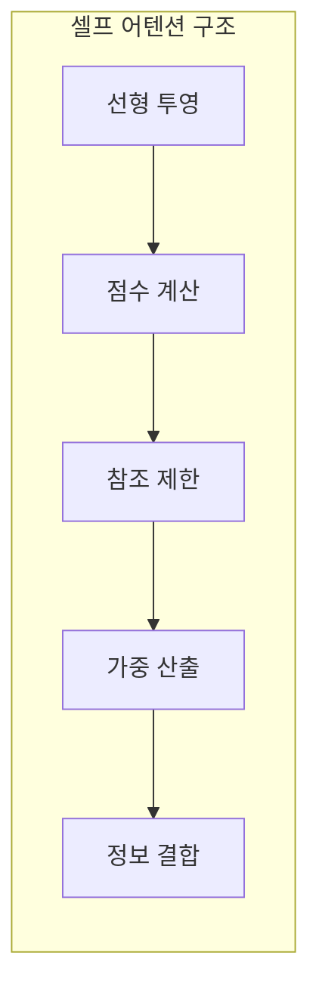
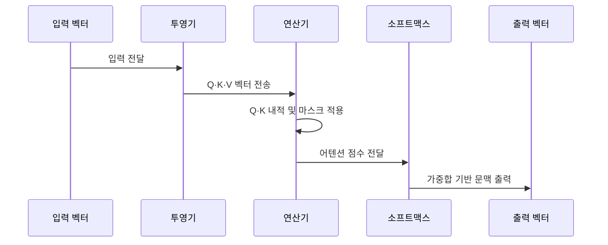

---
sidebar:
  order: 28
  label: "028. Self-Attention (셀프 어텐션)"
  badge:
    text: "기출 · 50%"
    variant: note
title: "Self-Attention (셀프 어텐션)"
date: "2026-07-25T01:25:00+09:00"
tags:
  - "cspe-latest_tech"
weight: 28
extra:
  question_no: "028"
  exam_status: "기출"
  exam_history: "135회"
  exam_probability: 50
  exam_note: "토큰 관계 학습이 트랜스포머 핵심"
---

## 미리 알고가기

- **쿼리(Query, Q)**: 검색 대상이 되는 입력 토큰의 기준 벡터
- **키(Key, K)**: 쿼리와의 관련성을 비교할 대상 토큰의 식별 벡터
- **밸류(Value, V)**: 어텐션 가중치에 따라 최종 가중합되는 정보 벡터
- **셀프 어텐션(Self-Attention)**: 동일 시퀀스 내 토큰 간의 유사도를 계산하는 연산
- **크로스 어텐션(Cross-Attention)**: 타 시퀀스의 K·V를 참조하여 문맥을 연결하는 연산
- **어텐션 점수(Attention Score)**: 쿼리와 키의 유사도를 내적으로 계산한 값
- **소프트맥스(Softmax)**: 실수 벡터를 합이 1인 확률 분포로 정규화하는 함수
- **인과 마스크(Causal Mask)**: 미래 시점 토큰을 참조하지 못하도록 차단하는 행렬

## Ⅰ. 개요

- 정의/개념: **셀프 어텐션**은 동일 시퀀스의 토큰 간 관련도를 계산하고, 그 가중치로 각 토큰의 정보를 결합하여 문맥 표현을 생성하는 연산이다.
- 기존 한계: 순차적으로 상태를 전달하는 구조는 멀리 떨어진 토큰 간 의존성을 직접 계산하기 어렵다.

### 쉽게 이해하기 (학습용)
- 각 토큰이 같은 문맥의 다른 토큰을 얼마나 참고할지 계산하여 의미 표현을 갱신한다.

## Ⅱ. 특징

- 입력을 투영해 Q·K·V 벡터를 만든다
- Q·K 유사도가 V의 가중합 비율을 정한다
- 마스크가 미래·패딩 토큰 참조를 차단한다
- 연산·메모리는 문맥 길이 제곱으로 늘어난다

### 쉽게 이해하기 (학습용)
- 모든 단어 쌍을 비교하여 먼 관계도 찾으나 문장이 길어질수록 계산량 급증

## Ⅲ. 아키텍처 및 구성요소

| 설계 요소 | 설명 |
|:---|:---|
| 선형 투영 | 입력 임베딩의 Q·K·V 차원 선형 변환 |
| 점수 계산 | Q와 K의 내적을 통한 원시 유사도 계산 |
| 참조 제한 | 스케일링 및 마스크 행렬 적용 |
| 가중 산출 | 소프트맥스를 통한 합 1인 어텐션 가중치 정규화 |
| 정보 결합 | 가중치 기반 V의 가중합으로 최종 문맥 산출 |

### 쉽게 이해하기 (학습용)
- 질문과 찾아볼 표지를 비교해 참고 비율을 정하고 실제 정보 조각을 그 비율로 섞음

## Ⅳ. 원리 및 절차 흐름도

| 절차 | 설명 |
|:---|:---|
| 입력 전달 | 입력 시퀀스 벡터의 선형 변환 요청 |
| Q·K·V 벡터 전송 | 각각의 가중치 행렬 곱 연산 수행 |
| Q·K 내적 및 마스크 적용 | 유사도 산출과 인과 마스크 가림막 적용 |
| 어텐션 점수 전달 | 스케일링 보정 후 소프트맥스 입력 |
| 가중합 기반 문맥 출력 | 가중치와 V의 결합으로 문맥 벡터 산출 |

### 쉽게 이해하기 (학습용)
- 점수를 보정한 뒤 참고 비율로 바꾸어 합침

## Ⅴ. 종류 및 비교

| 판단 기준 | Self-Attention | Cross-Attention |
|:---|:---|:---|
| 정보 출처 | 동일 시퀀스 내에서 추출된 Q·K·V | 디코더의 Q와 인코더의 K·V 결합 |
| 핵심 목적 | 단일 텍스트 내 의미적 연결 구조 추출 | 입력 문맥과 출력 타겟 간 관계 추출 |
| 적용 기준 | 입력 시퀀스 내부 문맥 관계를 학습할 때 | 번역 등 서로 다른 시퀀스 관계를 매핑할 때 |

> 요약: 셀프 어텐션은 동일 시퀀스의 토큰 관계를 학습하여 문맥 정보를 결합한다.

### 쉽게 이해하기 (학습용)
- 내부와 외부 문맥 참고로 구분함

## Ⅵ. 실무 사례

1. 장문 처리 모델에 FlashAttention을 적용하여 정확한 어텐션 결과를 유지하면서 GPU 메모리 접근과 연산 시간을 줄인다.

### 쉽게 이해하기 (학습용)
- 긴 문장을 읽을 때 메모리를 덜 쓰도록 어텐션 연산을 효율화함

## Ⅶ. 결론

- 시퀀스 내부의 장거리 토큰 관계를 학습하기 위해 문맥 길이와 연산·메모리 비용을 검토하여 **셀프 어텐션**을 활용해야 한다.

### 쉽게 이해하기 (학습용)
- 동일한 문장 안에서 단어 간의 관계를 한 번에 계산함
