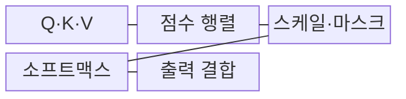
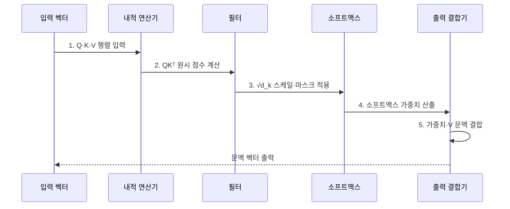

---
sidebar:
  order: 29
  label: "029. Scaled Dot-Product Attention (스케일드 닷 프로덕트 어텐션)"
  badge:
    text: "기출 · 50%"
    variant: note
title: "Scaled Dot-Product Attention (스케일드 닷 프로덕트 어텐션)"
date: "2026-07-31T08:37:31+09:00"
tags:
  - "notes-latest_tech"
weight: 29
extra:
  question_no: "029"
  source_status: "기출"
  source_history: "135회"
  priority: 50
  priority_note: "어텐션 점수 계산의 핵심 원리"
---

## 미리 알고가기

- **쿼리·키·밸류(Query·Key·Value, Q·K·V)**: 어텐션 연산의 검색·비교·전달 정보 벡터
- **키 차원(d_k)**: 스케일링 보정 기준이 되는 키 벡터의 차원 수
- **시퀀스 길이(N)**: 입력 시퀀스를 구성하는 토큰 수
- **소프트맥스(Softmax)**: 점수 벡터를 합이 1인 확률 분포로 정규화하는 함수
- **스케일링(Scaling)**: 점수 폭증과 그라디언트 소실을 막기 위한 분산 보정 연산
- **패딩 마스크(Padding Mask)**: 무효 토큰인 패딩의 참조를 차단하는 마스크
- **그래픽 처리 장치(Graphics Processing Unit, GPU)**: 대규모 행렬 병렬 연산 장치
- **자료형(Data Type, dtype)**: 텐서의 원소를 저장하는 수치 형식

## Ⅰ. 개요

- 정의/개념: Q·K 내적을 √d_k로 보정해 V를 결합하는 **어텐션 연산**
- 배경/필요성: 고차원 Q·K 내적값 증가는 **소프트맥스 포화와 학습 경사 소실** 유발

### 쉽게 이해하기 (학습용)
- 유사도를 적당한 범위로 조정한 뒤 참고 비율로 합산함

## Ⅱ. 특징

- 행렬곱 `QKᵀ`에 의한 **모든 토큰 쌍 유사도 계산**
- `√d_k` 스케일링에 의한 **점수 분산·소프트맥스 안정화**
- 마스크 기반 무효 참조 차단과 **O(N²) 점수 행렬**

### 쉽게 이해하기 (학습용)
- 비교 점수가 커지면 한 대상에 몰리므로 스케일링 수행

## Ⅲ. 구조 및 구성요소

| 구성요소 | 책임 |
|:---|:---|
| **Q·K·V** | 어텐션의 조회·비교·전달 **입력 벡터** |
| **점수 행렬** | QKᵀ 내적으로 **토큰 쌍 유사도** 산출 |
| **스케일·패딩 마스크** | √d_k 보정과 **무효 참조 차단** |
| **소프트맥스** | 최종 **어텐션 가중치** 정규화 |
| **출력 결합** | 가중치 기반 **V 가중합** 산출 |

### 쉽게 이해하기 (학습용)
- 비교표에 가림막을 씌운 뒤 각 행을 참고 비율로 바꾸어 정보 조각을 합산함

## Ⅳ. 흐름도

1. **Q·K·V 행렬 입력**: 조회·비교·전달용 **토큰 표현** 준비
2. **QKᵀ 원시 점수 계산**: 행렬곱으로 토큰 쌍의 **유사도 행렬** 생성
3. **√d_k 스케일·마스크 적용**: `Attention(Q,K,V)=softmax(QKᵀ/√d_k)V`로 분산 보정·**무효 참조 차단**
4. **소프트맥스 가중치 산출**: 행별 점수를 합이 1인 **참조 비율**로 정규화
5. **가중치·V 문맥 결합**: 정규화 가중치와 V의 행렬곱으로 **문맥 벡터** 출력

### 쉽게 이해하기 (학습용)
- 점수 보정 후 비율대로 정보를 합침

## Ⅴ. 종류 및 비교

| 비교 기준 | Scaled Dot-Product | Additive | Unscaled Dot-Product |
|:---|:---|:---|:---|
| **적용 기준** | 고차원 행렬의 **병렬 어텐션** | 작은 차원의 **복잡 관계 학습** | 낮은 차원의 **단순 내적** |
| 핵심 특징 | 내적값을 **√d_k로 보정** | 신경망으로 **점수 함수 학습** | 원시 내적값 직접 정규화 |
| **한계** | **O(N²) 점수 행렬** | 추가 **매개변수·연산 비용** | 고차원 **소프트맥스 포화** |

### 쉽게 이해하기 (학습용)
- 내적 방식의 장점을 살리면서 점수 폭증 문제를 보정함

## Ⅵ. 실무 고려사항 및 대책

| 고려사항 | 대책 | 효과 |
|:---|:---|:---|
| 장문의 **O(N²) 중간 행렬** | FlashAttention·블록 계산 적용 | **GPU 메모리** 접근·저장 절감 |
| 저정밀도에서 **마스크·소프트맥스 오버플로** | 안정 소프트맥스·**dtype별 마스크값** 시험 | NaN·무효 토큰 참조 **방지** |
| 잘못된 `d_k` 기준의 **스케일 불일치** | 헤드별 키 차원에서 `√d_k` 산출 검증 | 점수 분산·학습 경사 **안정화** |

### 쉽게 이해하기 (학습용)
- 메모리를 임시로 쓰고 지우는 작업을 줄여 계산 속도를 높임

## Ⅶ. 결론

- 고차원 어텐션은 **√d_k 스케일링**, 장문은 **블록 계산** 적용

### 쉽게 이해하기 (학습용)
- 키 차원에 맞춰 내적값을 보정하여 소프트맥스 포화와 학습 불안정을 줄인다.
