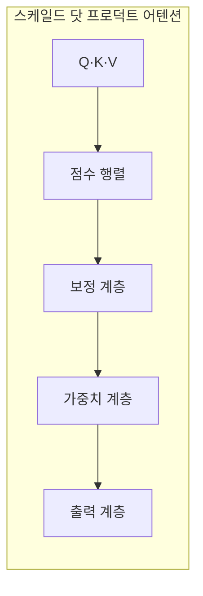
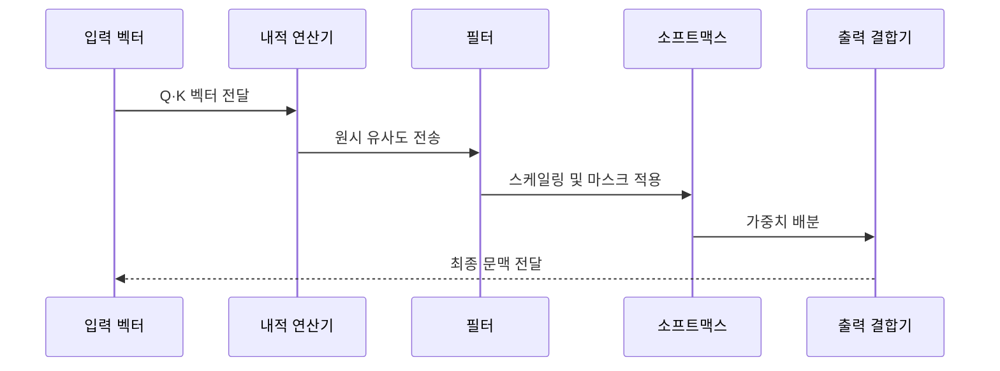

---
sidebar:
  order: 29
  label: "029. Scaled Dot-Product Attention (스케일드 닷 프로덕트 어텐션)"
  badge:
    text: "기출 · 50%"
    variant: note
title: "Scaled Dot-Product Attention (스케일드 닷 프로덕트 어텐션)"
date: "2026-07-25T01:25:00+09:00"
tags:
  - "cspe-latest_tech"
weight: 29
extra:
  question_no: "029"
  exam_status: "기출"
  exam_history: "135회"
  exam_probability: 50
  exam_note: "어텐션 점수 계산의 핵심 원리"
---

## 미리 알고가기

- **쿼리·키·밸류(Query·Key·Value, Q·K·V)**: 어텐션 연산의 검색·비교·전달 정보 벡터
- **키 차원(d_k)**: 스케일링 보정 기준이 되는 키 벡터의 차원 수
- **시퀀스 길이(N)**: 입력 시퀀스를 구성하는 토큰 수
- **소프트맥스(Softmax)**: 점수 벡터를 합이 1인 확률 분포로 정규화하는 함수
- **스케일링(Scaling)**: 점수 폭증과 그라디언트 소실을 막기 위한 분산 보정 연산
- **패딩 마스크(Padding Mask)**: 무효 토큰인 패딩의 참조를 차단하는 마스크
- **그래픽 처리 장치(Graphics Processing Unit, GPU)**: 대규모 행렬 병렬 연산 장치
- **자료형(Data Type, dtype)**: 텐서의 원소를 저장하는 수치 형식

## Ⅰ. 개요

- **정의/개념**: 스케일된 QK 점수로 V를 가중합
- **배경/필요성**: 큰 내적의 소프트맥스 포화 완화

### 쉽게 이해하기 (학습용)
- 유사도를 적당한 범위로 조정한 뒤 참고 비율로 합산함

## Ⅱ. 특징

- 행렬곱으로 모든 토큰 쌍 유사도를 계산한다
- 스케일링이 소프트맥스 포화를 완화한다
- 패딩·인과 마스크가 무효 참조를 막는다
- 연산·메모리는 문맥 길이 제곱으로 늘어난다

### 쉽게 이해하기 (학습용)
- 비교 점수가 커지면 한 대상에 몰리므로 스케일링 수행

## Ⅲ. 아키텍처 및 구성요소

| 설계 요소 | 설명 |
|:---|:---|
| Q·K·V | 어텐션 연산의 기본 입력 벡터 집합 |
| 점수 행렬 | Q와 K의 전치 행렬 내적으로 원시 점수 산출 |
| 보정 계층 | 스케일링 및 마스크 적용으로 점수 보정 |
| 가중치 계층 | 소프트맥스를 통한 최종 어텐션 가중치 정규화 |
| 출력 계층 | 가중치 기반 V의 가중합으로 문맥 벡터 산출 |

### 쉽게 이해하기 (학습용)
- 비교표에 가림막을 씌운 뒤 각 행을 참고 비율로 바꾸어 정보 조각을 합산함

## Ⅳ. 원리 및 절차 흐며도

| 절차 | 설명 |
|:---|:---|
| Q·K 벡터 전달 | 입력 데이터의 검색 및 비교 기준 전송 |
| 원시 유사도 전송 | Q와 K의 내적을 통한 관련도 행렬 생성 |
| 스케일링 및 마스크 적용 | 키 차원 제곱근 보정 및 무효 토큰 가림막 |
| 가중치 배분 | 소프트맥스 정규화 후 밸류 가중치 분배 |
| 최종 문맥 전달 | 가중합된 문맥 벡터 결과값 반환 |

### 쉽게 이해하기 (학습용)
- 점수 보정 후 비율대로 정보를 합침

## Ⅴ. 종류 및 비교

| 판단 기준 | Scaled | Additive | Unscaled |
|:---|:---|:---|:---|
| 점수 방식 | 내적 점수를 키 차원 제곱근으로 보정 | 단층 신경망을 통한 가중치 학습 | 단순 내적을 통한 점수 계산 |
| 차원 영향 | 고차원에서도 소프트맥스 경사 소실 방지 | 차원 증가에 따른 연산 비용 급증 | 고차원 진입 시 소프트맥스 포화 위험 |
| 적용 기준 | 고차원 키 벡터의 안정적 계산 필요 시 | 작은 차원의 정밀한 복잡 관계 학습 시 | 낮은 차원의 단순 내적 연산 수행 시 |

> 요약: 스케일링 보정을 통한 고차원 내적 어텐션 안정화

### 쉽게 이해하기 (학습용)
- 내적 방식의 장점을 살리면서 점수 폭증 문제를 보정함

## Ⅵ. 실무 사례

1. Flash Attention 기반 메모리 병목 우회
2. 인과 마스크 정밀 검증으로 토큰 정보 누출 차단

### 쉽게 이해하기 (학습용)
- 메모리를 임시로 쓰고 지우는 작업을 줄여 계산 속도를 높임
- 시험지를 풀 때 뒷장의 해설지가 보이지 않게 가림막을 씌움

## Ⅶ. 결론

- 경사 소실 방지를 위한 스케일링 어텐션 아키텍처 선택

### 쉽게 이해하기 (학습용)
- 내적 결과가 너무 커져 계산이 먹통이 되지 않도록 크기를 줄임
