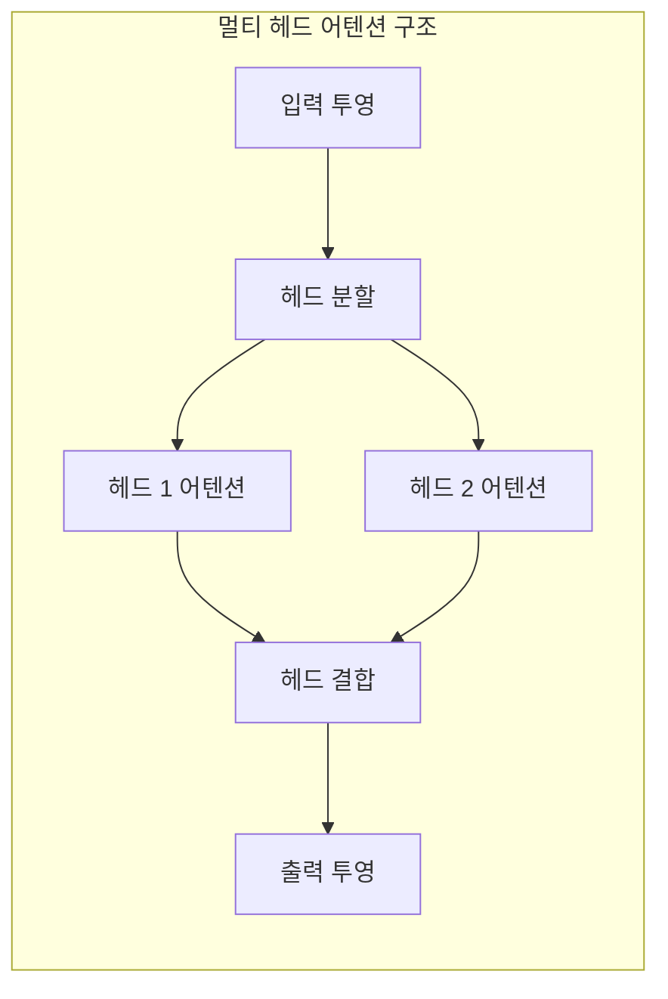
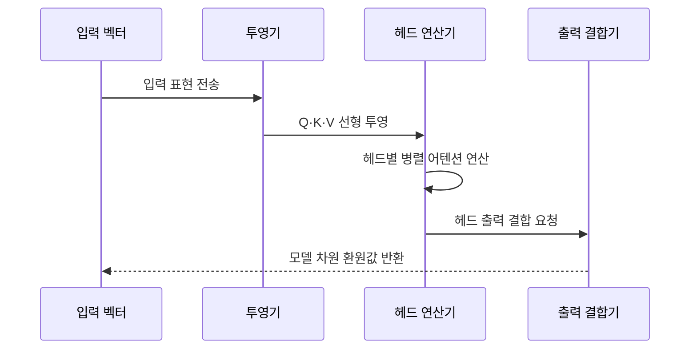

---
sidebar:
  order: 30
  label: "030. Multi-Head Attention (멀티 헤드 어텐션)"
  badge:
    text: "기출 · 50%"
    variant: note
title: "Multi-Head Attention (멀티 헤드 어텐션)"
date: "2026-07-25T01:25:00+09:00"
tags:
  - "cspe-latest_tech"
weight: 30
extra:
  question_no: "030"
  exam_status: "기출"
  exam_history: "135회"
  exam_probability: 50
  exam_note: "다중 표현 공간 학습의 핵심 구성"
---

## 미리 알고가기

- **멀티 헤드 어텐션(Multi-Head Attention, MHA)**: 헤드 수만큼 별도의 K·V 벡터를 사용하여 병렬 연산하는 구조
- **멀티 쿼리 어텐션(Multi-Query Attention, MQA)**: 모든 쿼리 헤드가 하나의 K·V 헤드를 공유하는 구조
- **그룹 쿼리 어텐션(Grouped-Query Attention, GQA)**: 쿼리 헤드 그룹별로 K·V 헤드를 공유하는 구조
- **쿼리·키·밸류(Query·Key·Value, Q·K·V)**: 어텐션 연산의 검색·비교·전달 정보 벡터
- **키-값 캐시(Key-Value Cache, KV Cache)**: 이전 토큰들의 키·밸류 연산 결과를 재사용하기 위해 보관하는 캐시
- **출력 투영(Output Projection)**: 결합된 헤드 출력 정보를 모델 차원 가중치 행렬(W^O)로 선형 변환하는 연산
- **그래픽 처리 장치(Graphics Processing Unit, GPU)**: 행렬 연산을 처리하는 하드웨어 가속기
- **연결(Concatenation, Concat)**: 헤드별 출력 벡터를 가로 방향으로 이어 붙여 차원을 결합하는 연산

## Ⅰ. 개요

- 정의/개념: **멀티 헤드 어텐션**은 입력을 여러 표현 공간으로 투영하여 어텐션을 병렬 계산한 뒤, 헤드별 결과를 결합하는 구조다.
- 기존 한계: 단일 어텐션만으로는 문법·의미·위치 등 서로 다른 토큰 관계를 다양한 표현 공간에서 동시에 학습하기 어렵다.

### 쉽게 이해하기 (학습용)
- 여러 관점의 비교 결과들을 하나로 합침

## Ⅱ. 특징

- 헤드별 투영이 서로 다른 관계를 학습한다
- 각 헤드의 어텐션을 병렬 계산한다
- 헤드 출력을 결합해 모델 차원으로 투영한다
- 헤드 증가는 중복으로 성능 이득이 정체될 수 있다

### 쉽게 이해하기 (학습용)
- 관점 수 증가가 반드시 품질 향상을 보장하지는 않음

## Ⅲ. 아키텍처 및 구성요소

| 설계 요소 | 설명 |
|:---|:---|
| 입력 투영 | 가중치 행렬 기반 Q·K·V 차원 선형 변환 |
| 헤드 분할 | 어텐션 연산을 위한 헤드 단위 차원 재배열 |
| 병렬 연산 | 각 헤드별 스케일드 닷 프로덕트 어텐션 계산 |
| 헤드 결합 | 각 헤드 출력의 연결(Concat)을 통한 통합 |
| 출력 투영 | W^O 행렬 곱을 적용해 원래 모델 차원으로 환원 |

### 쉽게 이해하기 (학습용)
- 입력을 헤드별로 계산한 뒤 결합해 다음 층에 전달함

## Ⅳ. 원리 및 절차 흐름도

| 절차 | 설명 |
|:---|:---|
| 입력 표현 전송 | 입력 시퀀스 표현의 선형 변환 준비 |
| Q·K·V 선형 투영 | 헤드 수만큼 나누어 Q·K·V 벡터 생성 |
| 헤드별 병렬 어텐션 연산 | 서로 다른 부분공간에서의 어텐션 병렬 계산 |
| 헤드 출력 결합 요청 | 개별 어텐션 결과 결합 후 연결 연산 수행 |
| 모델 차원 환원값 반환 | 출력 가중치 행렬 곱으로 최종 결과 반환 |

### 쉽게 이해하기 (학습용)
- 여러 조사 결과를 모아 통합 표현 생성

## Ⅴ. 종류 및 비교

| 판단 기준 | MHA | MQA | GQA |
|:---|:---|:---|:---|
| KV 헤드 | 헤드별 독립적인 키·밸류 벡터 보유 | 단일 키·밸류 헤드를 모든 쿼리가 공유 | 헤드 그룹별로 키·밸류 헤드 공유 |
| 캐시 비용 | KV 캐시 점유량 최대 | KV 캐시 점유량 최소 | KV 캐시 점유량 중간 |
| 적용 기준 | 최대의 모델 표현 용량 확보 필요 시 | 추론 단계 메모리 대역폭 한계 극복 시 | 모델 품질과 추론 효율의 절충 필요 시 |

> 요약: MQA와 GQA는 키·값 헤드의 공유 범위를 조정하여 KV 캐시와 추론 대역폭을 줄인다.

### 쉽게 이해하기 (학습용)
- MHA·MQA·GQA는 키·값 헤드의 공유 범위에 따라 표현력과 KV 캐시 비용이 달라진다.

## Ⅵ. 실무 사례

1. 대규모 언어 모델 서빙에 GQA를 적용하여 생성 품질을 유지하면서 KV 캐시 사용량과 메모리 대역폭 병목을 줄인다.

### 쉽게 이해하기 (학습용)
- 메모리 저장 공간을 아끼기 위해 키와 값의 저장소를 묶어 관리함

## Ⅶ. 결론

- 다양한 토큰 관계를 병렬 학습하기 위해 표현력과 헤드 수·KV 캐시·메모리 대역폭을 검토하여 **멀티 헤드 어텐션**을 활용해야 한다.

### 쉽게 이해하기 (학습용)
- 여러 관점에서 관계를 찾아내되, 계산 효율을 위해 일부를 공유함
