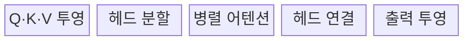
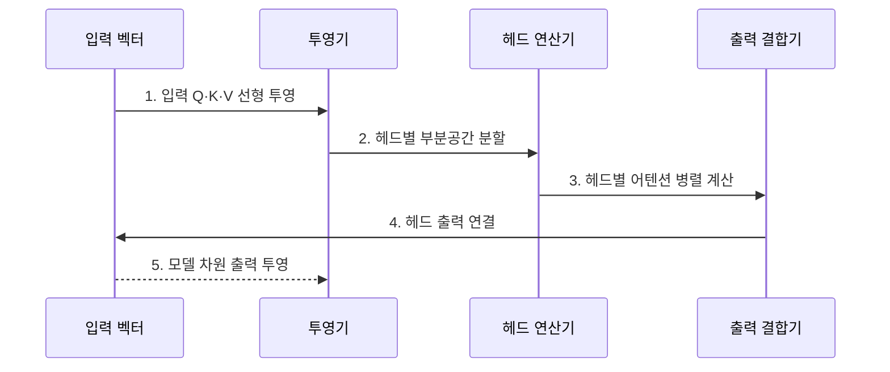

---
sidebar:
  order: 30
  label: "030. Multi-Head Attention (멀티 헤드 어텐션)"
  badge:
    text: "기출 · 50%"
    variant: note
title: "Multi-Head Attention (멀티 헤드 어텐션)"
date: "2026-07-25T01:25:00+09:00"
tags:
  - "notes-latest_tech"
weight: 30
extra:
  question_no: "030"
  source_status: "기출"
  source_history: "135회"
  priority: 50
  priority_note: "다중 표현 공간 학습의 핵심 구성"
---

## 미리 알고가기

- **멀티 헤드 어텐션(Multi-Head Attention, MHA)**: 헤드 수만큼 별도의 K·V 벡터를 사용하여 병렬 연산하는 구조
- **멀티 쿼리 어텐션(Multi-Query Attention, MQA)**: 모든 쿼리 헤드가 하나의 K·V 헤드를 공유하는 구조
- **그룹 쿼리 어텐션(Grouped-Query Attention, GQA)**: 쿼리 헤드 그룹별로 K·V 헤드를 공유하는 구조
- **쿼리·키·밸류(Query·Key·Value, Q·K·V)**: 어텐션 연산의 검색·비교·전달 정보 벡터
- **키-값 캐시(Key-Value Cache, KV Cache)**: 이전 토큰들의 키·밸류 연산 결과를 재사용하기 위해 보관하는 캐시
- **출력 투영(Output Projection)**: 결합된 헤드 출력 정보를 모델 차원 가중치 행렬(W^O)로 선형 변환하는 연산
- **그래픽 처리 장치(Graphics Processing Unit, GPU)**: 행렬 연산을 처리하는 하드웨어 가속기
- **연결(Concatenation, Concat)**: 헤드별 출력 벡터를 가로 방향으로 이어 붙여 차원을 결합하는 연산

## Ⅰ. 개요

- 정의/개념: **멀티 헤드 어텐션**은 입력을 여러 표현 공간으로 투영하여 어텐션을 병렬 계산한 뒤, 헤드별 결과를 결합하는 구조다.
- 배경/필요성: 단일 어텐션은 문법·의미·위치 관계를 **서로 다른 표현 공간에서 동시 학습**하기 곤란

### 쉽게 이해하기 (학습용)
- 여러 관점의 비교 결과들을 하나로 합침

## Ⅱ. 특징

- 헤드별 독립 투영에 의한 **다중 표현 부분공간 학습**
- 병렬 어텐션 결과의 연결과 **출력 투영 통합**
- MHA·MQA·GQA의 KV 공유 범위에 따른 **표현력·캐시 절충**

### 쉽게 이해하기 (학습용)
- 관점 수 증가가 반드시 품질 향상을 보장하지는 않음

## Ⅲ. 구조 및 구성요소

| 구성요소 | 책임 |
|:---|:---|
| 입력 투영 | 가중치 행렬 기반 Q·K·V 차원 선형 변환 |
| 헤드 분할 | 어텐션 연산을 위한 헤드 단위 차원 재배열 |
| 병렬 연산 | 각 헤드별 스케일드 닷 프로덕트 어텐션 계산 |
| 헤드 결합 | 각 헤드 출력의 연결(Concat)을 통한 통합 |
| 출력 투영 | W^O 행렬 곱을 적용해 원래 모델 차원으로 환원 |

### 쉽게 이해하기 (학습용)
- 입력을 헤드별로 계산한 뒤 결합해 다음 층에 전달함

## Ⅳ. 흐름도

### 동작 원리

1. **입력 Q·K·V 선형 투영**: 헤드마다 독립 가중치로 **관계 관점** 생성
2. **헤드별 부분공간 분할**: 모델 차원을 여러 **저차원 표현 공간**으로 재배열
3. **헤드별 어텐션 병렬 계산**: 각 부분공간에서 서로 다른 **토큰 관계** 추출
4. **헤드 출력 연결**: 병렬 결과를 Concat해 **통합 표현** 구성
5. **모델 차원 출력 투영**: `W^O` 행렬로 헤드 정보를 혼합해 **다음 계층 차원**으로 환원

### 쉽게 이해하기 (학습용)
- 여러 조사 결과를 모아 통합 표현 생성

## Ⅴ. 종류 및 비교

| 비교 기준 | MHA | MQA | GQA |
|:---|:---|:---|:---|
| 적용 기준 | 최대 표현 용량 | 최소 추론 메모리·대역폭 | 품질·효율 절충 |
| 핵심 특징 | 헤드별 **독립 K·V** | 모든 Q가 **단일 K·V 공유** | Q 그룹별 **K·V 공유** |
| 한계 | KV 캐시 비용 최대 | 표현력·품질 저하 가능 | 그룹 수 튜닝 필요 |

### 쉽게 이해하기 (학습용)
- MHA·MQA·GQA는 키·값 헤드의 공유 범위에 따라 표현력과 KV 캐시 비용이 달라진다.

## Ⅵ. 실무 고려사항 및 대책

| 고려사항 | 대책 | 효과 |
|:---|:---|:---|
| 헤드 증가에 따른 **관계 학습 중복** | 헤드별 다양성·제거 실험 후 수 조정 | 불필요 연산과 매개변수 **감축** |
| 모델 차원과 헤드 수의 **분할 불일치** | `d_model % h = 0` 검증·텐서 형상 시험 | 구현 오류와 차원 손실 **방지** |
| 생성 시 **KV 캐시·대역폭 병목** | 품질 평가 후 GQA·MQA 적용 | 동시 처리량·메모리 효율 **향상** |
| MHA↔GQA 변환의 **체크포인트 비호환** | K·V 헤드 매핑·변환 회귀 시험 | 변환 후 품질·배포 안정성 **확보** |

### 쉽게 이해하기 (학습용)
- 메모리 저장 공간을 아끼기 위해 키와 값의 저장소를 묶어 관리함

## Ⅶ. 결론

- 다양한 토큰 관계를 병렬 학습하기 위해 표현력과 헤드 수·KV 캐시·메모리 대역폭을 검토하여 **멀티 헤드 어텐션**을 활용해야 한다.

### 쉽게 이해하기 (학습용)
- 여러 관점에서 관계를 찾아내되, 계산 효율을 위해 일부를 공유함
