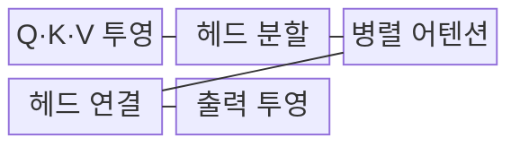
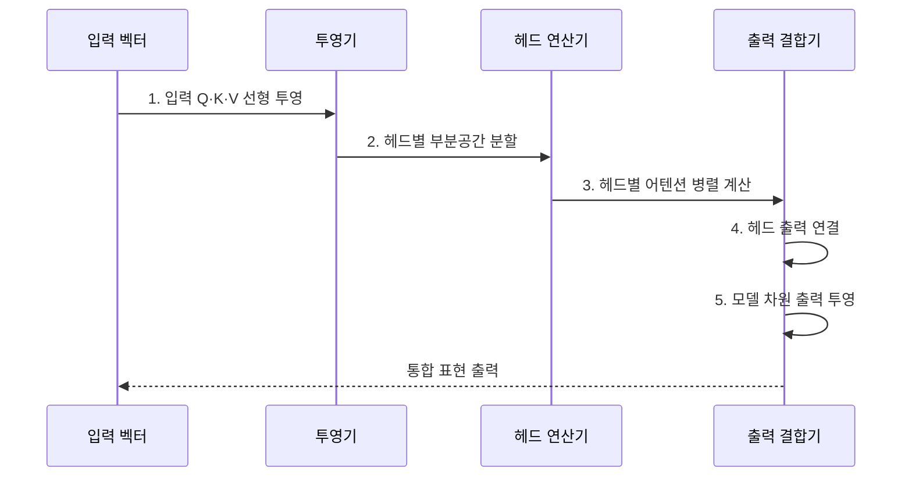

---
sidebar:
  order: 30
  label: "030. Multi-Head Attention (멀티 헤드 어텐션)"
  badge:
    text: "기출 · 50%"
    variant: note
title: "Multi-Head Attention (멀티 헤드 어텐션)"
date: "2026-08-02T08:59:00+09:00"
tags:
  - "notes-latest_tech"
weight: 30
extra:
  question_no: "030"
  source_status: "기출"
  source_history: "135회"
  priority: 50
  priority_note: "다중 표현 공간 학습의 핵심 구성"
---

## Ⅰ. 개요

핵심 용어

- **멀티 헤드 어텐션(Multi-Head Attention, MHA)**: 입력을 여러 표현 부분공간에 투영해 서로 다른 어텐션을 병렬 계산하고 결과를 결합하는 구조다.
- **어텐션 헤드(Attention Head)**: 독립된 Q·K·V 투영으로 하나의 관계 관점을 학습하는 연산 단위다.

- 정의/개념: 입력을 여러 표현 공간으로 투영해 각 헤드의 어텐션을 병렬 계산하고 결합하는 **멀티 헤드 어텐션(Multi-Head Attention, MHA)**
- 배경/필요성: 단일 어텐션은 문법·의미·위치 관계를 **서로 다른 표현 공간에서 동시 학습**하기 곤란

#### 한줄 요약
- 여러 관점의 비교 결과들을 하나로 합침

## Ⅱ. 특징

핵심 용어

- **멀티 쿼리 어텐션(Multi-Query Attention, MQA)**: 모든 쿼리 헤드가 하나의 K·V 헤드를 공유하여 추론 메모리를 줄이는 구조다.
- **그룹 쿼리 어텐션(Grouped-Query Attention, GQA)**: 쿼리 헤드를 여러 그룹으로 나누고 그룹마다 하나의 K·V 헤드를 공유하는 구조다.
- **표현 부분공간**: 모델 표현을 더 작은 차원으로 나누어 헤드별로 서로 다른 관계를 학습하는 공간이다.

- 헤드별 독립 투영에 의한 **다중 표현 부분공간 학습**
- 병렬 어텐션 결과의 연결과 **출력 투영 통합**
- **멀티 쿼리 어텐션(Multi-Query Attention, MQA)**: 모든 쿼리 헤드가 단일 **키(Key, K)·밸류(Value, V)** 헤드 공유
- **그룹 쿼리 어텐션(Grouped-Query Attention, GQA)**: 쿼리 헤드 그룹별 K·V 공유로 캐시를 줄이고 MQA보다 표현력 보존

#### 한줄 요약
- 관점 수 증가가 반드시 품질 향상을 보장하지는 않음

## Ⅲ. 구조 및 구성요소

핵심 용어

- **쿼리·키·밸류(Query·Key·Value, Q·K·V)**: 조회 기준·비교 표지·전달 정보를 각각 나타내는 어텐션 벡터다.
- **연결(Concatenation, Concat)**: 헤드별 출력 벡터를 특성 차원 방향으로 이어 붙여 통합 표현을 만드는 연산이다.
- **출력 투영(Output Projection)**: 연결한 헤드 출력을 $W^O$ 가중치 행렬로 변환해 모델 차원으로 되돌리는 연산이다.

- **쿼리(Query, Q)·키(Key, K)·밸류(Value, V) 투영**, 헤드 분할, 병렬 어텐션, **연결(Concatenation, Concat)**, 출력 투영 순서로 처리한다.

| 구성요소 | 책임 |
|:---|:---|
| **Q·K·V 투영** | 가중치 행렬 기반 **선형 변환** |
| **헤드 분할** | 헤드 단위의 **차원 재배열** |
| **병렬 어텐션** | 헤드별 **스케일드 닷 프로덕트** 계산 |
| **헤드 연결·Concat** | 각 헤드 출력의 **통합 표현** 구성 |
| **출력 투영** | W^O로 **모델 차원 환원** |

#### 한줄 요약
- 입력을 헤드별로 계산한 뒤 결합해 다음 층에 전달함

## Ⅳ. 흐름도

핵심 용어

- **헤드 분할**: 모델 차원을 헤드 수만큼 저차원 표현으로 재배열하여 병렬 어텐션 입력을 만드는 과정이다.
- **스케일드 닷 프로덕트 어텐션**: 각 헤드에서 Q·K 내적을 키 차원으로 보정하고 V를 가중합하는 연산이다.

1. **입력 쿼리(Query, Q)·키(Key, K)·밸류(Value, V) 선형 투영**: 헤드마다 독립 가중치로 **관계 관점** 생성
2. **헤드별 부분공간 분할**: 모델 차원을 여러 **저차원 표현 공간**으로 재배열
3. **헤드별 어텐션 병렬 계산**: 각 부분공간에서 서로 다른 **토큰 관계** 추출
4. **헤드 출력 연결**: 병렬 결과를 연결(Concatenation, Concat)해 **통합 표현** 구성
5. **모델 차원 출력 투영**: `W^O` 행렬로 헤드 정보를 혼합해 **다음 계층 차원**으로 환원

#### 한줄 요약
- 여러 조사 결과를 모아 통합 표현 생성

## Ⅴ. 종류 및 비교

핵심 용어

- **멀티 헤드 어텐션(Multi-Head Attention, MHA)**: 쿼리 헤드마다 독립된 K·V 헤드를 사용하여 표현 용량이 크지만 캐시 비용도 크다.
- **멀티 쿼리 어텐션(Multi-Query Attention, MQA)**: 모든 쿼리 헤드가 단일 K·V를 공유하여 캐시 비용을 최소화하지만 표현력이 낮아질 수 있다.
- **그룹 쿼리 어텐션(Grouped-Query Attention, GQA)**: 그룹별 K·V 공유로 MHA의 표현력과 MQA의 캐시 효율 사이를 절충한다.

- **멀티 헤드 어텐션(Multi-Head Attention, MHA)**, **멀티 쿼리 어텐션(Multi-Query Attention, MQA)**, **그룹 쿼리 어텐션(Grouped-Query Attention, GQA)** 사이를 키·값 헤드 공유 범위와 **키-값 캐시(Key-Value Cache, KV Cache)** 비용으로 구분한다.

| 비교 기준 | MHA | MQA | GQA |
|:---|:---|:---|:---|
| 적용 기준 | 최대 **표현 용량** | 최소 **추론 메모리·대역폭** | **캐시 절감·표현력 보존** |
| 핵심 특징 | 헤드별 **독립 K·V** | 모든 Q가 **단일 K·V 공유** | Q 그룹별 **K·V 공유** |
| 한계 | **KV 캐시 비용** 최대 | 표현력·**품질 저하 가능** | **그룹 수 튜닝** 필요 |

#### 한줄 요약
- MHA·MQA·GQA는 키·값 헤드의 공유 범위에 따라 표현력과 KV 캐시 비용이 달라진다.

## Ⅵ. 실무 고려사항 및 대책

핵심 용어

- **키-값 캐시(Key-Value Cache, KV Cache)**: 생성한 이전 토큰의 K·V를 저장하여 다음 토큰 어텐션에서 재사용하는 메모리다.
- **헤드 제거 실험**: 특정 헤드를 비활성화한 뒤 품질 변화를 측정하여 관계 학습의 중복 여부를 확인하는 평가다.
- **체크포인트 변환**: MHA 가중치의 K·V 헤드를 매핑·병합하여 GQA나 MQA 구조에서 사용할 수 있게 바꾸는 과정이다.

| 문제 | 대책 | 효과 |
|:---|:---|:---|
| 헤드 증가에 따른 **관계 학습 중복** | 헤드별 다양성·제거 실험 후 수 조정 | 불필요 연산과 매개변수 **감축** |
| 모델 차원과 헤드 수의 **분할 불일치** | `d_model % h = 0` 검증·텐서 형상 시험 | 구현 오류와 차원 손실 **방지** |
| 생성 시 **키-값 캐시(Key-Value Cache, KV Cache)·대역폭 병목** | 품질 평가 후 **그룹 쿼리 어텐션(Grouped-Query Attention, GQA)·멀티 쿼리 어텐션(Multi-Query Attention, MQA)** 적용 | 동시 처리량·메모리 효율 **향상** |
| 멀티 헤드 어텐션(Multi-Head Attention, MHA)↔그룹 쿼리 어텐션(Grouped-Query Attention, GQA) 변환의 **체크포인트 비호환** | 키(K)·밸류(V) 헤드 매핑·변환 회귀 시험 | 변환 후 품질·배포 안정성 **확보** |

#### 한줄 요약
- 메모리 저장 공간을 아끼기 위해 키와 값의 저장소를 묶어 관리함

## Ⅶ. 결론

핵심 용어

- **멀티 헤드 어텐션 선택 기준(Multi-Head Attention Selection Criteria, MHA Selection Criteria)**: 메모리보다 최대 표현력과 품질이 우선일 때 독립 K·V 헤드를 사용한다.
- **멀티 쿼리 어텐션 선택 기준(Multi-Query Attention Selection Criteria, MQA Selection Criteria)**: 생성 캐시와 메모리 대역폭을 최소화해야 할 때 단일 K·V를 공유한다.
- **그룹 쿼리 어텐션 선택 기준(Grouped-Query Attention Selection Criteria, GQA Selection Criteria)**: 캐시를 줄이면서 MHA에 가까운 표현력을 보존해야 할 때 그룹 공유를 적용한다.

- 최대 표현력에는 **멀티 헤드 어텐션(Multi-Head Attention, MHA)**, 최소 캐시에는 **멀티 쿼리 어텐션(Multi-Query Attention, MQA)**, 절충에는 **그룹 쿼리 어텐션(Grouped-Query Attention, GQA)** 선택

#### 한줄 요약
- 여러 관점에서 관계를 찾아내되, 계산 효율을 위해 일부를 공유함
