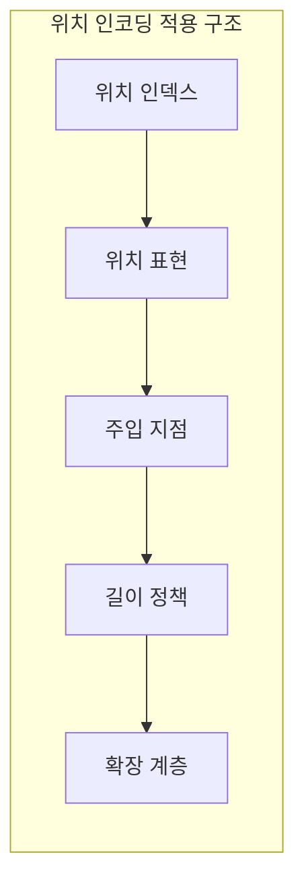
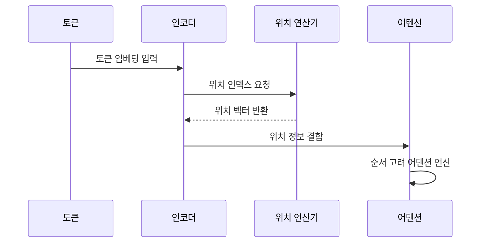

---
sidebar:
  order: 31
  label: "031. Positional Encoding (위치 인코딩)"
  badge:
    text: "기출 · 50%"
    variant: note
title: "Positional Encoding (위치 인코딩)"
date: "2026-07-25T01:25:00+09:00"
tags:
  - "cspe-latest_tech"
weight: 31
extra:
  question_no: "031"
  exam_status: "기출"
  exam_history: "135회"
  exam_probability: 50
  exam_note: "순서 정보 주입이 병렬 처리의 전제"
---

## 미리 알고가기

- **어텐션(Attention)**: 입력 시퀀스 내 토큰 간의 유사도를 계산하여 문맥을 연결하는 메커니즘
- **회전 위치 임베딩(Rotary Position Embedding, RoPE)**: 쿼리와 키 벡터를 회전시켜 상대적 거리를 반영하는 위치 인코딩 방식
- **쿼리·키(Query·Key, Q·K)**: 어텐션 연산에서 검색 기준과 비교 대상이 되는 벡터
- **외삽(Extrapolation)**: 학습된 시퀀스 길이를 초과하는 긴 문맥을 처리하는 예측 기술

## Ⅰ. 개요

- 정의/개념: 토큰의 순서·거리 정보를 주입하는 기법
- 기존 한계: 어텐션만으로는 **토큰 순서·상대 거리**를 구분할 수 없음

### 쉽게 이해하기 (학습용)
- 단어의 위치에 따라 뜻이 달라지므로 각 단어에 순서 번호를 붙임

## Ⅱ. 특징

- 위치 정보를 임베딩·QK 연산에 반영한다
- 절대 위치는 순서, 상대 위치는 거리를 표현한다
- 고정 방식과 학습 방식은 외삽 성능이 다르다
- 학습 길이 초과 시 위치 외삽 오차가 커진다

### 쉽게 이해하기 (학습용)
- 단어의 정확한 순서나 단어 사이의 상대적 거리를 숫자로 나타냄

## Ⅲ. 아키텍처 및 구성요소

| 설계 요소 | 설명 |
|:---|:---|
| 위치 인덱스 | 토큰의 절대 순서 및 해상도별 패치 좌표 생성 |
| 위치 표현 | 삼각함수 값 또는 학습 가중치로 위치 정보 벡터화 |
| 주입 지점 | 입력 임베딩 또는 쿼리·키 벡터에 위치 정보 결합 |
| 길이 정책 | 학습 시점의 시퀀스 제한 길이와 마스킹 설정 |
| 확장 계층 | 보간 기법을 통한 학습 범위 밖 외삽 성능 확보 |

### 쉽게 이해하기 (학습용)
- 단어에 번호표를 붙여 입력 표현과 합친 뒤 분석에 사용함

## Ⅳ. 원리 및 절차 흐름도

| 절차 | 설명 |
|:---|:---|
| 토큰 임베딩 입력 | 시퀀스 토큰의 의미를 벡터로 변환하여 입력 |
| 위치 인덱스 요청 | 각 토큰의 순서에 해당하는 번호 부여 |
| 위치 벡터 반환 | 삼각함수 또는 학습 벡터로 표현된 정보 반환 |
| 위치 정보 결합 | 의미 벡터와 위치 벡터를 합하여 인코더에 전달 |
| 순서 고려 어텐션 연산 | 단어 간 거리를 반영하여 최종 어텐션 계산 |

### 쉽게 이해하기 (학습용)
- 단어 의미 벡터에 자리 정보 번호표를 더해 어텐션으로 보냄

## Ⅴ. 종류 및 비교

| 판단 기준 | 상대 위치 인코딩 | 절대 위치 인코딩 |
|:---|:---|:---|
| 개념 정의 | 토큰 간의 상대적 거리 정보 주입 | 토큰의 절대적 순서 정보 주입 |
| 주입 지점 | 어텐션 유사도 계산 단계에서 결합 | 첫 입력 임베딩 단계에서 덧셈 |
| 적용 기준 | 문맥 길이가 길고 외삽이 필요할 때 | 시퀀스 길이가 고정되어 있을 때 |

> 요약: 상대 거리 반영 방식으로 장문 외삽 한계 개선

### 쉽게 이해하기 (학습용)
- 절대 번호를 매기는 방식과 단어 사이 거리를 재는 방식의 차이임

## Ⅵ. 실무 사례

1. RoPE 기반 모델의 시각적 외삽을 위한 위치 보간

### 쉽게 이해하기 (학습용)
- 문맥 길이를 넓힐 때 단어 위치 눈금을 촘촘하게 좁힘

## Ⅶ. 결론

- 어순을 모르는 어텐션에 토큰의 순서와 거리를 제공하기 위해 **최대 문맥 길이·길이 외삽·임베딩 차원·계산 비용**을 검토하고, 모델 구조에 맞는 위치 인코딩을 적용해야 한다.

### 쉽게 이해하기 (학습용)
- 대규모 텍스트를 처리할 수 있도록 거리 보간 기법을 사용함
