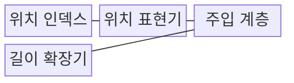
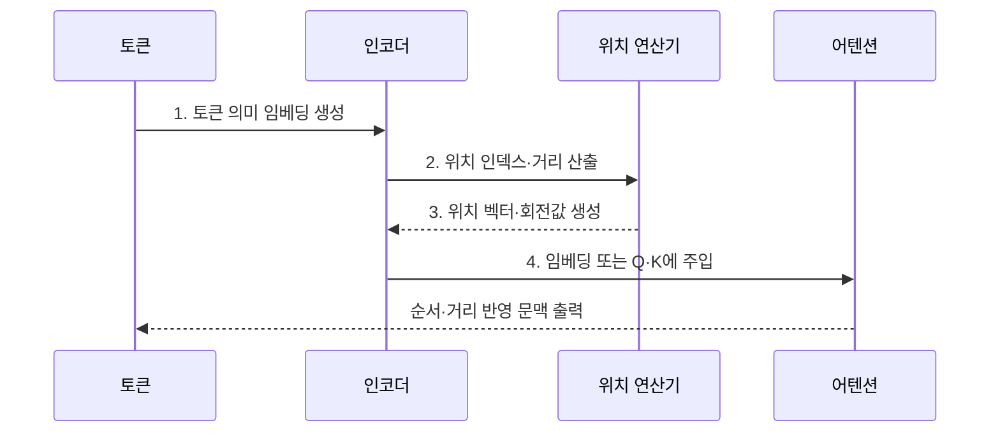

---
sidebar:
  order: 31
  label: "031. Positional Encoding (위치 인코딩)"
  badge:
    text: "기출 · 50%"
    variant: note
title: "Positional Encoding (위치 인코딩)"
date: "2026-07-31T11:59:07+09:00"
tags:
  - "notes-latest_tech"
weight: 31
extra:
  question_no: "031"
  source_status: "기출"
  source_history: "135회"
  priority: 50
  priority_note: "순서 정보 주입이 병렬 처리의 전제"
---

## 미리 알고가기

- **어텐션(Attention)**: 입력 시퀀스 내 토큰 간의 유사도를 계산하여 문맥을 연결하는 메커니즘
- **회전 위치 임베딩(Rotary Position Embedding, RoPE)**: 쿼리와 키 벡터를 회전시켜 상대적 거리를 반영하는 위치 인코딩 방식
- **쿼리·키(Query·Key, Q·K)**: 어텐션 연산에서 검색 기준과 비교 대상이 되는 벡터
- **외삽(Extrapolation)**: 학습 때 보지 못한 최대 길이 밖의 위치까지 위치 규칙을 연장하여 적용하는 방식
- **위치 보간(Position Interpolation)**: 긴 위치 범위를 학습 범위 안으로 압축하여 위치 표현의 길이를 확장하는 방식

## Ⅰ. 개요

- 정의/개념: 순열 불변 어텐션에 순서·거리를 주입하는 **위치 인코딩**
- 배경/필요성: 내용 벡터만 비교하는 셀프 어텐션은 **동일 토큰 집합의 배열 순서·거리** 구분 곤란

### 쉽게 이해하기 (학습용)
- 단어의 위치에 따라 뜻이 달라지므로 각 단어에 순서 번호를 붙임

## Ⅱ. 특징

> 빠른 주기는 인접 위치를 세밀하게 구분하고, 느린 주기는 넓은 위치 범위의 변화를 표현한다.

- 입력 임베딩 또는 Q·K 회전에 의한 **순서·거리 정보 주입**
- 절대 위치·상대 위치에 따른 **참조 관계 표현 방식** 차이
- 학습 문맥 길이 밖에서 발생하는 **위치 외삽 오차**

### 쉽게 이해하기 (학습용)
- 단어의 정확한 순서나 단어 사이의 상대적 거리를 숫자로 나타냄

## Ⅲ. 구조 및 구성요소

| 구성요소 | 책임 |
|:---|:---|
| **위치 인덱스** | 절대 순서·상대 거리 또는 **패치 좌표** 생성 |
| **위치 표현기** | 삼각함수·학습 벡터·**RoPE 회전** 변환 |
| **주입 계층** | 임베딩 가산 또는 **Q·K 변환** |
| **길이 확장기** | **위치 보간·스케일 조정**으로 장문 보정 |

### 쉽게 이해하기 (학습용)
- 단어에 번호표를 붙여 입력 표현과 합친 뒤 분석에 사용함

## Ⅳ. 흐름도

1. **토큰 의미 임베딩 생성**: 위치를 제외한 토큰의 **내용 표현** 준비
2. **위치 인덱스·거리 산출**: 토큰별 절대 순서나 토큰 쌍의 **상대 거리** 계산
3. **위치 벡터·회전값 생성**: 고정 함수·학습값·RoPE로 **위치 신호** 변환
4. **임베딩 또는 Q·K에 주입**: 위치 신호를 내용 표현이나 **어텐션 유사도**에 결합

### 쉽게 이해하기 (학습용)
- 단어 의미 벡터에 자리 정보 번호표를 더해 어텐션으로 보냄

## Ⅴ. 종류 및 비교

| 비교 기준 | 상대 위치 인코딩 | 절대 위치 인코딩 |
|:---|:---|:---|
| 적용 기준 | 거리 관계·**장문 일반화** 중심 | 고정 길이의 **명시적 순서** 중심 |
| 핵심 특징 | 어텐션 점수·Q·K에 **토큰 간 거리** 반영 | 입력 표현에 **토큰별 위치값** 가산 |
| 한계 | 구현·**캐시 변환 복잡성** | 학습 최대 길이 밖 **외삽 취약** |

### 쉽게 이해하기 (학습용)
- 절대 번호를 매기는 방식과 단어 사이 거리를 재는 방식의 차이임

## Ⅵ. 실무 고려사항 및 대책

| 고려사항 | 대책 | 효과 |
|:---|:---|:---|
| 학습 길이 초과 시 **위치 외삽 오차** | 위치 보간·RoPE 스케일 조정 후 길이별 평가 | 장문 정확도 **급락 완화** |
| 위치 확장에 따른 **단거리 해상도 저하** | 짧은·긴 문맥 평가셋과 주파수별 보정 비교 | 단거리 해상도 보존과 **장거리 관계 확장** |
| 학습·추론의 **위치 인덱스 불일치** | 패딩·캐시·청크 경계 인덱스 단위 시험 | 토큰 순서 왜곡과 **캐시 오류 방지** |

### 쉽게 이해하기 (학습용)
- 긴 문맥을 쓰기 전 짧은 거리 관계가 흐려지지 않는지도 함께 시험함

## Ⅶ. 결론

- 고정 길이는 **절대 위치**, 장문 외삽은 **RoPE·위치 보간** 선택

### 쉽게 이해하기 (학습용)
- 대규모 텍스트를 처리할 수 있도록 거리 보간 기법을 사용함
