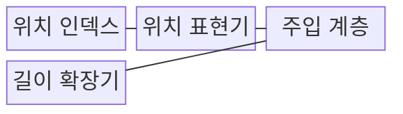

---
sidebar:
  order: 31
  label: "031. Positional Encoding (위치 인코딩)"
  badge:
    text: "기출 • 50%"
    variant: note
title: "Positional Encoding (위치 인코딩)"
date: "2026-08-04T14:05:00+09:00"
tags:
  - "notes-latest_tech"
weight: 31
extra:
  question_no: "031"
  source_status: "기출"
  source_history: "135회"
  priority: 50
  priority_note: "순서 정보 주입이 병렬 처리의 전제"
---

## Ⅰ. 개요

핵심 용어

- **위치 인코딩(Positional Encoding)**: 순열에 불변인 어텐션이 토큰의 순서와 거리를 구분하도록 위치 신호를 주입하는 기법이다.
- **순열 불변성**: 입력 원소의 순서를 바꿔도 연산 결과가 같은 성질로, 내용만 비교하는 어텐션은 별도 위치 정보가 필요하다.

- 정의/개념: 순열에 불변인 셀프 어텐션이 토큰의 순서와 상대 거리를 구분하도록 위치 정보를 표현에 결합하는 **위치 인코딩**
- 배경/필요성: 내용 벡터만 비교하는 셀프 어텐션은 **동일 토큰 집합의 배열 순서•거리** 구분 곤란

#### 한줄 요약
- 단어의 위치에 따라 뜻이 달라지므로 각 단어에 순서 번호를 붙임

## Ⅱ. 특징

핵심 용어

- **절대 위치 인코딩**: 각 토큰의 고유한 순번에 대응하는 위치값을 입력 표현에 더하는 방식이다.
- **상대 위치 인코딩**: 토큰 쌍 사이의 거리나 방향을 어텐션 점수 또는 Q•K 변환에 반영하는 방식이다.
- **외삽(Extrapolation)**: 학습 때 보지 못한 최대 길이 밖의 위치까지 학습한 위치 규칙을 연장하여 적용하는 방식이다.
- **쿼리(Query, Q)**: 현재 토큰이 찾을 정보의 조회 기준 벡터다.
- **키(Key, K)**: 쿼리와 비교할 식별 벡터다.

> 빠른 주기는 인접 위치를 세밀하게 구분하고, 느린 주기는 넓은 위치 범위의 변화를 표현한다.

- 입력 임베딩 또는 **Q•K 회전 기반 순서•거리 정보 주입**
- 절대 위치•상대 위치에 따른 **참조 관계 표현 방식** 차이
- 학습 문맥 길이 밖에서 발생하는 **위치 외삽 오차**

#### 한줄 요약
- 단어의 정확한 순서나 단어 사이의 상대적 거리를 숫자로 나타냄

## Ⅲ. 구조 및 구성요소

핵심 용어

- **회전 위치 임베딩(Rotary Position Embedding, RoPE)**: 위치에 따라 Q•K 벡터를 회전시켜 내적에 상대적 거리를 반영하는 방식이다.
- **위치 보간(Position Interpolation)**: 긴 위치 인덱스를 학습된 범위 안으로 비례 압축하여 위치 표현을 확장하는 방식이다.
- **주입 계층**: 위치 벡터를 임베딩에 더하거나 회전값을 Q•K에 적용하여 내용과 위치를 결합하는 계층이다.

| 구성요소 | 책임 |
|:---|:---|
| **위치 인덱스** | 절대 순서•상대 거리 또는 **패치 좌표** 생성 |
| **위치 표현기** | 삼각함수•학습 벡터•**RoPE 회전 변환** |
| **주입 계층** | 임베딩 가산 또는 **Q•K 변환** |
| **길이 확장기** | **위치 보간•스케일 조정** 으로 장문 보정 |

#### 한줄 요약
- 단어에 번호표를 붙여 입력 표현과 합친 뒤 분석에 사용함

## Ⅳ. 흐름도

핵심 용어

- **위치 신호**: 고정 함수•학습 벡터•회전값으로 토큰의 순서나 거리를 표현한 값이다.

1. **토큰 의미 임베딩 생성**: 위치를 제외한 토큰의 **내용 표현** 준비
2. **위치 인덱스•거리 산출**: 토큰별 절대 순서나 토큰 쌍의 **상대 거리** 계산
3. **위치 벡터•회전값 생성**: 고정 함수•학습값•**RoPE** 기반 위치 신호 변환
4. **임베딩 또는 Q•K에 주입**: 위치 신호를 내용 표현이나 **어텐션 유사도** 에 결합

#### 한줄 요약
- 단어 의미 벡터에 자리 정보 번호표를 더해 어텐션으로 보냄

## Ⅴ. 종류 및 비교

핵심 용어

- **상대 위치 방식**: 토큰 사이 거리 관계를 어텐션 계산에 반영하여 장문 일반화에 유리한 방식이다.
- **절대 위치 방식**: 토큰별 위치값을 입력에 직접 더하여 고정 길이의 명시적 순서를 표현하는 방식이다.

| 비교 기준 | 상대 위치 인코딩 | 절대 위치 인코딩 |
|:---|:---|:---|
| 적용 기준 | 거리 관계•**장문 일반화** 중심 | 고정 길이의 **명시적 순서** 중심 |
| 핵심 특징 | 어텐션 점수•Q•K에 **토큰 간 거리** 반영 | 입력 표현에 **토큰별 위치값** 가산 |
| 한계 | 구현•**캐시 변환 복잡성** | 학습 최대 길이 밖 **외삽 취약** |

#### 한줄 요약
- 절대 번호를 매기는 방식과 단어 사이 거리를 재는 방식의 차이임

## Ⅵ. 실무 고려사항 및 대책

핵심 용어

- **위치 외삽 오차**: 학습 길이 밖의 위치 신호가 훈련 분포와 달라져 순서•거리 해석이 부정확해지는 현상이다.
- **단거리 해상도**: 가까운 토큰 사이의 작은 위치 차이를 구분하는 위치 표현의 정밀도다.
- **위치 인덱스 일치**: 학습•추론의 패딩•캐시•청크 경계에서 같은 토큰에 같은 위치 규칙을 적용하는 조건이다.

| 문제 | 대책 | 효과 |
|:---|:---|:---|
| 학습 길이 초과 시 **위치 외삽 오차** | 위치 보간•**RoPE 스케일 조정** 후 길이별 평가 | 장문 정확도 **급락 완화** |
| 위치 확장에 따른 **단거리 해상도 저하** | 짧은•긴 문맥 평가셋과 주파수별 보정 비교 | 단거리 해상도 보존과 **장거리 관계 확장** |
| 학습•추론의 **위치 인덱스 불일치** | 패딩•캐시•청크 경계 인덱스 단위 시험 | 토큰 순서 왜곡과 **캐시 오류 방지** |

#### 한줄 요약
- 긴 문맥을 쓰기 전 짧은 거리 관계가 흐려지지 않는지도 함께 시험함

## Ⅶ. 결론

핵심 용어

- 고정 길이에는 **절대 위치**, 장문 외삽에는 **RoPE•위치 보간** 선택

#### 한줄 요약
- 대규모 텍스트를 처리할 수 있도록 거리 보간 기법을 사용함
