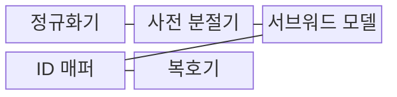
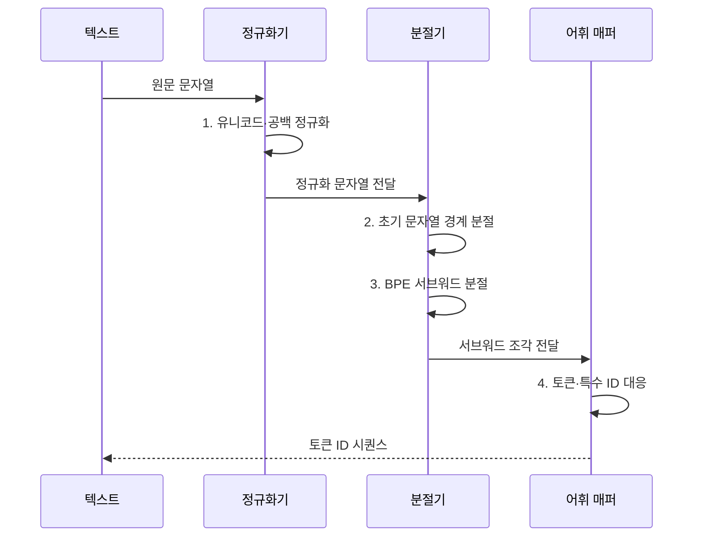

---
sidebar:
  order: 32
  label: "032. Tokenization (토큰화)"
  badge:
    text: "기출 · 50%"
    variant: note
title: "Tokenization (토큰화)"
date: "2026-08-02T08:59:00+09:00"
tags:
  - "notes-latest_tech"
weight: 32
extra:
  question_no: "032"
  source_status: "기출"
  source_history: "135회"
  priority: 50
  priority_note: "입력 단위와 비용·문맥 품질을 결정"
---

## Ⅰ. 개요

핵심 용어

- **토큰화(Tokenization)**: 원문 문자열을 모델 어휘에 정의된 토큰 조각으로 나누고 정수 ID 열로 변환하는 과정이다.
- **토큰 식별자(Token Identifier, Token ID)**: 모델 어휘의 각 토큰에 대응하여 신경망 입력으로 사용하는 정수 식별자다.

- 정의/개념: 입력 문자열을 모델 어휘의 부분 단위로 분할하고 각 단위를 토큰 식별자(Token Identifier, Token ID)로 변환하는 **토큰화**
- 배경/필요성: 신경망은 원문 문자열이 아니라 **고정 어휘의 정수 인덱스** 를 입력으로 요구

#### 한줄 요약
- 글을 모델 조각 번호로 바꾸고 번호를 다시 글로 합침

## Ⅱ. 특징

핵심 용어

- **어휘(Vocabulary)**: 모델이 직접 표현하고 생성할 수 있는 토큰과 ID의 정의 집합이다.
- **서브워드(Subword)**: 단어보다 작지만 반복되는 형태나 의미를 보존하는 가변 길이 문자열 조각이다.
- **미등록어(Out-of-Vocabulary, OOV)**: 어휘에 완전한 형태로 존재하지 않아 더 작은 조각으로 분절해야 하는 문자열이다.

- 정규화·사전 분절·학습 규칙에 따른 **분절 경계 결정**
- 희귀어를 문자보다 큰 조각으로 표현하는 **미등록어 완화**
- **어휘 크기·토큰 수 관계**: 어휘가 커지면 토큰 수는 줄지만 임베딩 매개변수 증가

#### 한줄 요약
- 사전을 크게 만들면 조각 수는 줄지만 모델 표가 커지고 작은 사전은 문장이 길어짐

## Ⅲ. 구조 및 구성요소

핵심 용어

- **유니코드 정규화(Unicode Normalization)**: 같은 문자를 나타내는 여러 코드 조합을 일관된 문자열 형태로 맞추는 처리다.
- **바이트 페어 인코딩(Byte Pair Encoding, BPE)**: 말뭉치에서 자주 함께 나타나는 문자·토큰 쌍을 반복 병합하여 서브워드 어휘를 만드는 알고리즘이다.
- **스페셜 토큰(Special Token)**: 시퀀스 시작·종료·패딩·역할 구분처럼 모델 제어에 사용하는 특수 ID다.

| 구성요소 | 책임 |
|:---|:---|
| **정규화기** | **유니코드 정규화** 와 공백 표기 정책 적용 |
| **사전 분절기** | 공백·구두점으로 **초기 문자열 경계** 생성 |
| **서브워드 모델** | **바이트 페어 인코딩(Byte Pair Encoding, BPE)·어휘 조각 탐색** |
| **식별자 매퍼(Identifier Mapper, ID Mapper)** | 조각·**스페셜 토큰** 을 토큰 식별자(Token ID)에 대응 |
| **복호기·디코딩** | 토큰 식별자(Token ID)에서 **출력 문자열** 복원 |

#### 한줄 요약
- 표기를 통일하고 기본 경계를 만든 뒤 사전 규칙에 맞는 조각 번호를 찾음

## Ⅳ. 흐름도

핵심 용어

- **사전 분절(Pre-tokenization)**: 공백·구두점·언어 규칙으로 서브워드 탐색 전에 기본 문자열 경계를 만드는 과정이다.
- **식별자 매핑(Identifier Mapping, ID Mapping)**: 분절한 문자열 조각과 제어 기호를 어휘표의 정수 식별자에 대응시키는 과정이다.

1. **유니코드·공백 정규화**: 학습·운영에 동일한 표기 정책 적용
2. **초기 문자열 경계 분절**: 공백·구두점·언어 규칙으로 기본 경계 생성
3. **바이트 페어 인코딩(Byte Pair Encoding, BPE) 서브워드 분절**: 어휘에 존재하는 최장·최적 조각 탐색
4. **토큰·특수 식별자(Token and Special Identifier, Token and Special ID) 대응**: 시작·끝 등 제어 기호를 포함해 **정수 식별자(Integer Identifier, Integer ID)** 로 매핑

#### 한줄 요약
- 학습 때와 운영 때 같은 분절 규칙을 써야 모델이 익힌 번호 의미가 유지됨

## Ⅴ. 종류 및 비교

핵심 용어

- **단어 단위 토큰화**: 단어 전체를 하나의 토큰 식별자(Token Identifier, Token ID)로 표현하여 토큰열은 짧지만 어휘와 미등록어가 늘어나는 방식이다.
- **서브워드 단위 토큰화**: 빈번한 문자열 조각을 가변 길이로 사용하여 어휘 크기와 토큰 수를 절충하는 방식이다.
- **문자·바이트 단위 토큰화**: 모든 입력을 기본 문자나 바이트로 분해하여 미등록어를 없애지만 토큰열이 길어지는 방식이다.

| 비교 기준 | 단어 단위 | 서브워드 단위 | 문자·바이트 단위 |
|:---|:---|:---|:---|
| 적용 기준 | 제한 어휘·**명확한 단어 경계** | **범용·다국어 모델** | 미지 문자열·**어휘 최소화** |
| 핵심 특징 | 단어별 **직접 ID 대응** | 빈번 문자열의 **가변 길이 조각화** | 모든 입력의 **기본 단위 분해** |
| 한계 | 큰 어휘·**미등록어 발생** | 말뭉치 편향·**분절 품질 의존** | 토큰열 증가·**문맥 비용 확대** |

#### 한줄 요약
- 단어 통째로, 글자 하나씩, 자주 쓰는 중간 크기 조각으로 나누는 방식의 차이임

## Ⅵ. 실무 고려사항 및 대책

핵심 용어

- **토크나이저 버전 고정**: 학습과 운영에서 같은 정규화·어휘·ID 규칙을 사용하도록 파일과 버전을 명시하는 통제다.
- **복원율**: 토큰 ID를 다시 문자열로 복호했을 때 원문의 정보와 표기가 보존되는 정도다.
- **특수 토큰 주입**: 사용자 문자열이 제어 토큰으로 해석되어 프롬프트 역할이나 경계를 바꾸는 공격이다.

| 문제 | 대책 | 효과 |
|:---|:---|:---|
| 학습·운영의 **정규화 정책 불일치** | 동일 토크나이저 파일·버전 고정 | 입력 식별자(Input Identifier, Input ID)의 **재현성 확보** |
| 모델 임베딩과 **어휘 식별자(Vocabulary Identifier, Vocabulary ID) 불일치** | 어휘 해시·특수 토큰 식별자(Special Token Identifier, Special Token ID) 검증 | 잘못된 토큰 해석 **방지** |
| 한국어·전문용어의 **과도한 분절** | 언어·도메인별 토큰 수와 복원율 평가 | 문맥 길이·표현 효율 **개선** |
| 사용자 입력의 **특수 토큰 주입** | 제어 토큰 이스케이프·허용 목록 적용 | 프롬프트 경계 **보호** |

#### 한줄 요약
- 한국어 특성에 맞는 단어 조각 사전을 만들어 비용을 아낌

## Ⅶ. 결론

핵심 용어

- **서브워드 바이트 페어 인코딩 선택 기준(Subword Byte Pair Encoding Selection Criteria, Subword BPE Selection Criteria)**: 범용·다국어 입력에서 미등록어를 줄이면서 문맥 길이와 어휘 크기를 절충할 때 사용한다.
- **문자·바이트 선택 기준**: 임의 문자열을 반드시 표현해야 하고 긴 토큰열 비용을 감수할 수 있을 때 사용한다.
- **복호(Decoding)**: 생성된 토큰 식별자(Token Identifier, Token ID) 열을 사람이 읽을 수 있는 문자열로 되돌리는 처리다.

- 범용·다국어에는 **서브워드 바이트 페어 인코딩(Subword Byte Pair Encoding, Subword BPE)**, 미지 문자열에는 **문자·바이트** 선택

#### 한줄 요약
- 한글이나 영어 등 언어 특징에 맞춰 단어 쪼개기 방식을 정함
