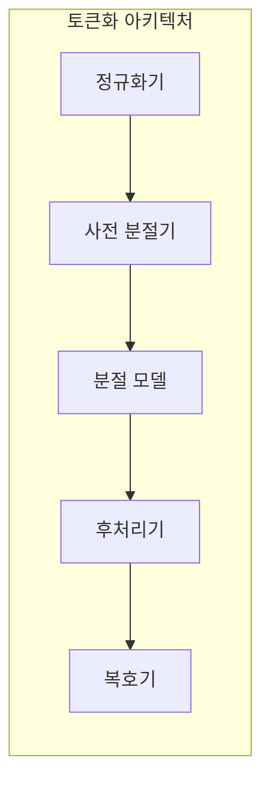
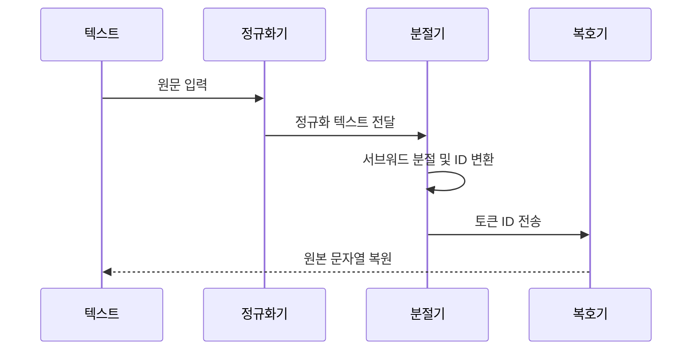

---
sidebar:
  order: 32
  label: "032. Tokenization (토큰화)"
  badge:
    text: "기출 · 50%"
    variant: note
title: "Tokenization (토큰화)"
date: "2026-07-25T01:25:00+09:00"
tags:
  - "cspe-latest_tech"
weight: 32
extra:
  question_no: "032"
  exam_status: "기출"
  exam_history: "135회"
  exam_probability: 50
  exam_note: "입력 단위와 비용·문맥 품질을 결정"
---

## 미리 알고가기

- **어휘(Vocabulary)**: 모델이 이해하고 생성할 수 있는 토큰들의 정의 집합
- **서브워드(Subword)**: 단어보다 작은 의미 단위의 문자열 조각
- **희귀어(Out-of-Vocabulary, OOV)**: 사전에 정의되지 않아 분절이 필요한 낯선 단어
- **바이트 페어 인코딩(Byte Pair Encoding, BPE)**: 빈도가 높은 문자 쌍을 반복해서 병합하는 토큰화 알고리즘
- **스페셜 토큰(Special Token)**: 시퀀스의 시작, 끝, 패딩 등 제어 목적으로 사용되는 특수 ID

## Ⅰ. 개요

- 정의/개념: 문자열을 토큰 ID 열로 바꾸는 과정
- 기존 한계: 원문 문자열은 모델이 처리하는 **정수 토큰열로 직접 사용할 수 없음**

### 쉽게 이해하기 (학습용)
- 글을 모델 조각 번호로 바꾸고 번호를 다시 글로 합침

## Ⅱ. 특징

- 정규화·공백 정책이 원문 보존율을 바꾼다
- 규칙·말뭉치 통계가 분절 경계를 정한다
- 서브워드가 희귀어의 OOV 문제를 줄인다
- 어휘 크기·입력 길이는 지연·메모리와 상충한다
- 토큰·제어 규칙은 모델과 호환돼야 한다

### 쉽게 이해하기 (학습용)
- 사전을 크게 만들면 조각 수는 줄지만 모델 표가 커지고 작은 사전은 문장이 길어짐

## Ⅲ. 아키텍처 및 구성요소

| 설계 요소 | 설명 |
|:---|:---|
| 정규화기 | 유니코드 표준화 및 대소문자·공백 통일 |
| 사전 분절기 | 공백 및 기호 기준 1차 단어 분리 |
| 분절 모델 | BPE 등 서브워드 알고리즘 기반 토큰 매핑 |
| 후처리기 | 문장 시작·끝 등 특수 제어 토큰 추가 |
| 복호기 | 출력 토큰 ID 시퀀스를 원래 문자열로 복원 |

### 쉽게 이해하기 (학습용)
- 표기를 통일하고 기본 경계를 만든 뒤 사전 규칙에 맞는 조각 번호를 찾음

## Ⅳ. 원리 및 절차 흐름도

| 절차 | 설명 |
|:---|:---|
| 원문 입력 | 토큰화 대상이 되는 텍스트 입력 |
| 정규화 텍스트 전달 | 공백 제거 및 유니코드 문자 표준화 수행 |
| 서브워드 분절 | 사전 기반 문자열 쪼개기 및 수치 변환 |
| 토큰 ID 전송 | 모델 연산을 위한 정수 형태의 시퀀스 반환 |
| 원본 문자열 복원 | 디코딩을 통한 토큰 ID의 텍스트 복구 |

### 쉽게 이해하기 (학습용)
- 학습 때와 운영 때 같은 분절 규칙을 써야 모델이 익힌 번호 의미가 유지됨

## Ⅴ. 종류 및 비교

| 판단 기준 | Subword | 단어 단위 | 문자·Byte |
|:---|:---|:---|:---|
| 분절 방식 | 통계적 조각 기반 분할 | 공백 및 형태소 분석 규칙 기반 분리 | 문자 한 글자 또는 바이트 단위 분해 |
| 자원 특성 | 사전 크기와 문장 길이의 적절한 절충 | 사전 크기가 비대해지고 OOV 발생 위험 | 사전 크기는 최소화되나 문장 길이가 급증 |
| 적용 기준 | 대규모 코퍼스의 범용 언어 모델 구성 시 | 사전 크기가 작고 어휘가 제한적인 과업 수행 시 | 낯선 단어가 많고 사전 크기를 최소화할 때 |

> 요약: 서브워드 분절 기법을 통해 어휘 효율과 문맥 가독성 절충

### 쉽게 이해하기 (학습용)
- 단어 통째로, 글자 하나씩, 자주 쓰는 중간 크기 조각으로 나누는 방식의 차이임

## Ⅵ. 실무 사례

1. 한국어 형태소 융합형 토큰화 어휘 사전 구축

### 쉽게 이해하기 (학습용)
- 한국어 특성에 맞는 단어 조각 사전을 만들어 비용을 아낌

## Ⅶ. 결론

- 다양한 언어와 전문용어를 효율적으로 모델 입력으로 표현하기 위해 **어휘 크기·미등록어·토큰 길이·다국어 공정성**을 검토하고, 과업과 데이터에 맞는 토큰화 방식을 선택해야 한다.

### 쉽게 이해하기 (학습용)
- 한글이나 영어 등 언어 특징에 맞춰 단어 쪼개기 방식을 정함
