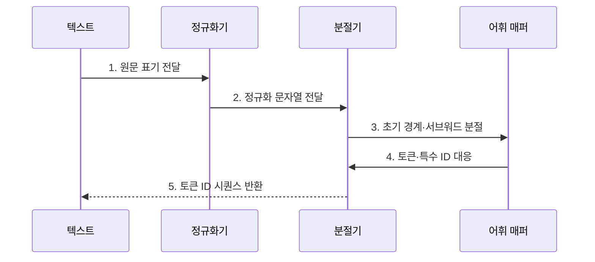

---
sidebar:
  order: 32
  label: "032. Tokenization (토큰화)"
  badge:
    text: "기출 · 50%"
    variant: note
title: "Tokenization (토큰화)"
date: "2026-07-25T01:25:00+09:00"
tags:
  - "notes-latest_tech"
weight: 32
extra:
  question_no: "032"
  source_status: "기출"
  source_history: "135회"
  priority: 50
  priority_note: "입력 단위와 비용·문맥 품질을 결정"
---

## 미리 알고가기

- **어휘(Vocabulary)**: 모델이 이해하고 생성할 수 있는 토큰들의 정의 집합
- **서브워드(Subword)**: 단어보다 작은 의미 단위의 문자열 조각
- **희귀어(Out-of-Vocabulary, OOV)**: 사전에 정의되지 않아 분절이 필요한 낯선 단어
- **바이트 페어 인코딩(Byte Pair Encoding, BPE)**: 빈도가 높은 문자 쌍을 반복해서 병합하는 토큰화 알고리즘
- **스페셜 토큰(Special Token)**: 시퀀스의 시작, 끝, 패딩 등 제어 목적으로 사용되는 특수 ID
- **유니코드 정규화(Unicode Normalization)**: 같은 문자를 여러 코드 조합으로 표현한 문자열을 일관된 형태로 맞추는 처리
- **토큰 ID(Token ID)**: 모델 어휘의 각 토큰에 대응하는 정수 식별자
- **복호(Decoding)**: 토큰 ID 시퀀스를 사람이 읽을 수 있는 문자열로 되돌리는 처리

## Ⅰ. 개요

- 정의/개념: **토큰화**는 문자열을 모델 어휘에 대응하는 토큰 ID 시퀀스로 변환하는 과정이다.
- 배경/필요성: 신경망은 원문 문자열이 아니라 **고정 어휘의 정수 인덱스**를 입력으로 요구

### 쉽게 이해하기 (학습용)
- 글을 모델 조각 번호로 바꾸고 번호를 다시 글로 합침

## Ⅱ. 특징

- 정규화·사전 분절·학습 규칙에 따른 **분절 경계 결정**
- 희귀어를 문자보다 큰 조각으로 표현하는 **미등록어 완화**
- 어휘 크기와 토큰 수 사이의 **표현 공간·문맥 길이 절충**

### 쉽게 이해하기 (학습용)
- 사전을 크게 만들면 조각 수는 줄지만 모델 표가 커지고 작은 사전은 문장이 길어짐

## Ⅲ. 구조 및 구성요소

| 구성요소 | 책임 |
|:---|:---|
| 정규화기 | 유니코드·대소문자·공백의 **표기 정책** 적용 |
| 사전 분절기 | 공백·구두점·언어 규칙으로 **초기 문자열 경계** 생성 |
| 서브워드 모델 | BPE 등 학습 규칙으로 **어휘 조각** 탐색 |
| ID 매퍼 | 조각과 특수 토큰을 **정수 식별자**에 대응 |
| 복호기 | 토큰 ID를 조각으로 변환해 **출력 문자열** 복원 |

### 쉽게 이해하기 (학습용)
- 표기를 통일하고 기본 경계를 만든 뒤 사전 규칙에 맞는 조각 번호를 찾음

## Ⅳ. 흐름도

### 동작 원리

1. **원문 표기 전달**: 입력 문자를 손실 없이 **정규화 대상**으로 설정
2. **정규화 문자열 전달**: 학습·운영에 동일한 유니코드·공백 **표기 정책** 적용
3. **초기 경계·서브워드 분절**: 사전 분절 뒤 어휘에 존재하는 **최장·최적 조각** 탐색
4. **토큰·특수 ID 대응**: 시작·끝 등 제어 기호를 포함해 **정수 ID**로 매핑
5. **토큰 ID 시퀀스 반환**: 원문의 토큰 순서를 보존한 **모델 입력 정수열** 완성

### 쉽게 이해하기 (학습용)
- 학습 때와 운영 때 같은 분절 규칙을 써야 모델이 익힌 번호 의미가 유지됨

## Ⅴ. 종류 및 비교

| 비교 기준 | 단어 단위 | 서브워드 단위 | 문자·바이트 단위 |
|:---|:---|:---|:---|
| 적용 기준 | 제한 어휘·명확한 단어 경계 | 범용·다국어 언어 모델 | 미지 문자열·어휘 최소화 |
| 핵심 특징 | 단어별 **직접 ID 대응** | 빈번 문자열의 **가변 길이 조각화** | 모든 입력의 **기본 단위 분해** |
| 한계 | 큰 어휘·미등록어 발생 | 말뭉치 편향·분절 품질 의존 | 토큰열 증가·문맥 비용 확대 |

### 쉽게 이해하기 (학습용)
- 단어 통째로, 글자 하나씩, 자주 쓰는 중간 크기 조각으로 나누는 방식의 차이임

## Ⅵ. 실무 고려사항 및 대책

| 고려사항 | 대책 | 효과 |
|:---|:---|:---|
| 학습·운영의 **정규화 정책 불일치** | 동일 토크나이저 파일·버전 고정 | 입력 ID의 **재현성 확보** |
| 모델 임베딩과 **어휘 ID 불일치** | 어휘 해시·특수 토큰 ID 검증 | 잘못된 토큰 해석 **방지** |
| 한국어·전문용어의 **과도한 분절** | 언어·도메인별 토큰 수와 복원율 평가 | 문맥 길이·표현 효율 **개선** |
| 사용자 입력의 **특수 토큰 주입** | 제어 토큰 이스케이프·허용 목록 적용 | 프롬프트 경계 **보호** |

### 쉽게 이해하기 (학습용)
- 한국어 특성에 맞는 단어 조각 사전을 만들어 비용을 아낌

## Ⅶ. 결론

- 다양한 언어와 전문용어를 효율적으로 모델 입력으로 표현하기 위해 **어휘 크기·미등록어·토큰 길이·다국어 공정성**을 검토하고, 과업과 데이터에 맞는 토큰화 방식을 선택해야 한다.

### 쉽게 이해하기 (학습용)
- 한글이나 영어 등 언어 특징에 맞춰 단어 쪼개기 방식을 정함
