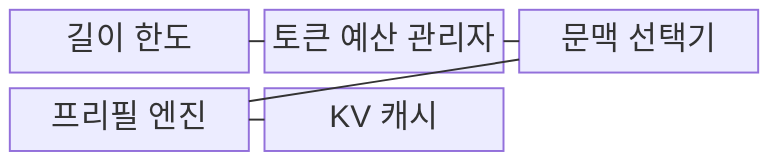
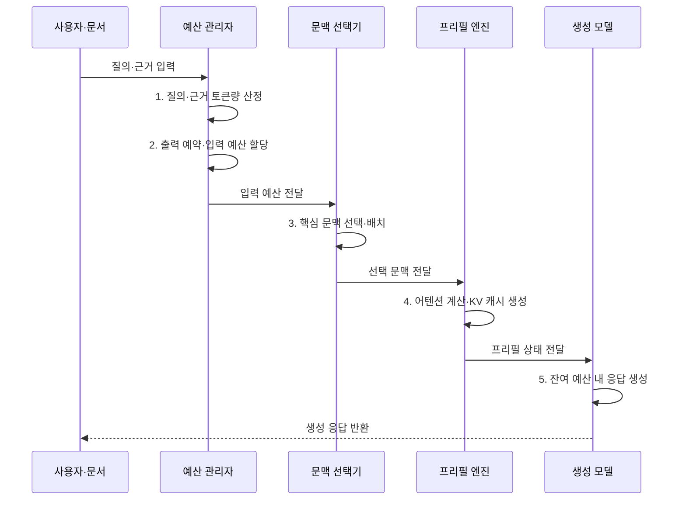

---
sidebar:
  order: 33
  label: "033. Context Window (컨텍스트 윈도우)"
  badge:
    text: "기출 · 50%"
    variant: note
title: "Context Window (컨텍스트 윈도우)"
date: "2026-07-31T08:39:36+09:00"
tags:
  - "notes-latest_tech"
weight: 33
extra:
  question_no: "033"
  source_status: "기출"
  source_history: "138회"
  priority: 50
  priority_note: "장문 처리 한계와 비용 설계가 중요"
---

## 미리 알고가기

- **컨텍스트 윈도우(Context Window)**: 모델이 한 번의 추론에서 참조할 수 있는 입력과 출력 토큰의 최대 범위
- **토큰 예산(Token Budget)**: 컨텍스트 윈도우 안에서 지시·대화·근거 문서·생성 결과에 배분할 수 있는 토큰 수
- **어텐션(Attention)**: 입력 토큰 사이의 관련도를 계산하여 현재 처리에 필요한 문맥을 결합하는 메커니즘
- **프리필(Prefill)**: 입력 토큰 전체의 어텐션을 계산하여 생성에 필요한 키·밸류 벡터를 만드는 단계
- **첫 토큰 지연(Time to First Token, TTFT)**: 요청을 보낸 시점부터 첫 출력 토큰을 받기까지 걸리는 시간
- **키-값 캐시(Key-Value Cache, KV Cache)**: 이전 토큰의 키·밸류 연산 결과를 보관하여 다음 토큰 생성에 재사용하는 메모리
- **그룹 쿼리 어텐션(Grouped-Query Attention, GQA)**: 여러 쿼리 헤드가 키·밸류 헤드를 그룹별로 공유하여 캐시 사용량을 줄이는 구조
- **검색 증강 생성(Retrieval-Augmented Generation, RAG)**: 질의와 관련된 외부 문서 조각을 검색하여 모델 입력에 근거로 제공하는 생성 방식
- **프롬프트 캐싱(Prompt Caching)**: 동일한 프롬프트 접두사의 프리필 연산 결과를 재사용하는 기법

## Ⅰ. 개요

- 정의/개념: **컨텍스트 윈도우**는 한 번의 추론에서 모델이 참조할 수 있는 입력·출력 토큰의 최대 범위
- 배경/필요성: 지시·대화·근거·생성 결과가 동일한 **토큰 예산**을 공유하므로 길이 배분 필요

### 쉽게 이해하기 (학습용)
- 모델의 작업 공간 안에 읽을 자료와 작성할 답변의 자리를 함께 배분함

## Ⅱ. 특징

> 파란 전체 어텐션 선은 토큰 길이의 제곱으로, 붉은 KV 캐시 선은 길이에 비례해 증가하며 두 계열은 절대량이 아닌 증가율 비교다.

- 시스템 지시·대화·검색 문서·출력이 공유하는 **총 토큰 한도**
- 입력 길이에 따라 증가하는 **어텐션 연산·TTFT**
- 생성 길이에 비례해 누적되는 **KV 캐시 메모리**

### 쉽게 이해하기 (학습용)
- 작업 공간을 넓히면 더 많은 자료를 읽지만 계산량과 저장 공간도 함께 증가함

## Ⅲ. 구조 및 구성요소

| 구성요소 | 책임 |
|:---|:---|
| **길이 한도** | **입력·출력 토큰 총량** 정의 |
| **토큰 예산 관리자** | 출력 여유 예약과 **토큰 수 배분** |
| **문맥 선택기** | 지시·근거의 **포함·압축·제외** 결정 |
| **프리필 엔진** | 입력 어텐션과 **키·밸류 벡터** 생성 |
| **KV 캐시** | 이전 키·밸류의 **생성 단계 재사용** |

### 쉽게 이해하기 (학습용)
- 답변 공간을 먼저 예약한 뒤 중요한 자료를 골라 읽고 계산 결과를 저장함

## Ⅳ. 흐름도

1. **질의·근거 토큰량 산정**: 모든 입력을 공통 토큰 단위로 환산해 **총 사용량** 계산
2. **출력 예약·입력 예산 할당**: 최대 길이에서 예상 출력 공간을 먼저 차감해 **입력 상한** 결정
3. **핵심 문맥 선택·배치**: 지시 우선순위와 근거 관련도에 따라 문맥을 **압축·정렬**
4. **어텐션 계산·KV 캐시 생성**: 프리필 결과를 저장하여 후속 생성에서 **키·밸류 재사용**
5. **잔여 예산 내 응답 생성**: 생성 종료 신호 또는 출력 한도까지 **결과 토큰 반환**

### 쉽게 이해하기 (학습용)
- 자료와 답변의 분량을 정하고 중요한 내용을 배치한 뒤 저장된 계산 결과로 답을 생성함

## Ⅴ. 종류 및 비교

| 비교 기준 | 롱 컨텍스트 | RAG | 혼합 방식 |
|:---|:---|:---|:---|
| **적용 기준** | 문서 전체의 **상호 참조 필요** | 대규모 지식의 **일부 근거 탐색** | 전역 문맥·**최신 근거 동시 요구** |
| 핵심 특징 | 원문을 넓은 **윈도우에 직접 배치** | 질의 관련 조각을 **검색 후 주입** | 핵심 원문과 검색 근거의 **선별 결합** |
| **한계** | 프리필·KV 캐시 비용과 **인출 저하** | 검색 누락·**문서 조각 단절** | 예산 배분·**중복 제거 복잡성** |

### 쉽게 이해하기 (학습용)
- 자료 전체를 펼치거나 필요한 부분만 검색하고, 두 방법을 함께 사용할 수도 있음

## Ⅵ. 실무 고려사항 및 대책

| 고려사항 | 대책 | 효과 |
|:---|:---|:---|
| 장문 입력의 **어텐션 계산량 증가** | 관련 문맥 선별·문서 조각 압축·효율형 어텐션 적용 | 프리필 시간·연산량 **절감** |
| 생성 길이에 따른 **KV 캐시 증가** | **GQA·저정밀 캐시**와 출력 상한 적용 | 동시 처리량과 메모리 효율 **향상** |
| 중간 위치 정보의 **인출 정확도 저하** | 중요 지시의 앞·뒤 배치와 위치별 인출 시험 | 장문 근거 누락 **탐지·완화** |
| 입력 과다에 따른 **출력 예산 부족** | 출력 길이 선예약 후 입력 초과분 제거 | 응답 중도 절단 **방지** |
| 반복 접두사의 **프리필 비용** | 정확한 접두사의 **프롬프트 캐싱** 재사용 | 첫 토큰 지연과 비용 **절감** |

### 쉽게 이해하기 (학습용)
- 필요한 자료만 남기고 계산 결과를 재사용하며 답변 분량을 먼저 확보함

## Ⅶ. 결론

- 전체 상호참조는 **롱 컨텍스트**, 일부 근거 검색은 **RAG·혼합 방식** 선택

### 쉽게 이해하기 (학습용)
- 자료의 연결 범위와 비용을 따져 전체 입력과 부분 검색의 조합을 정함
