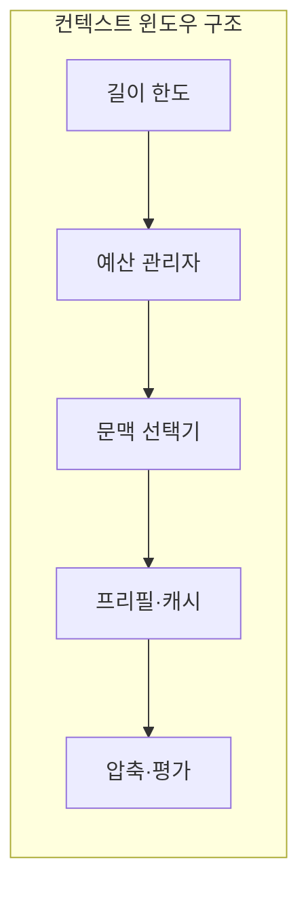
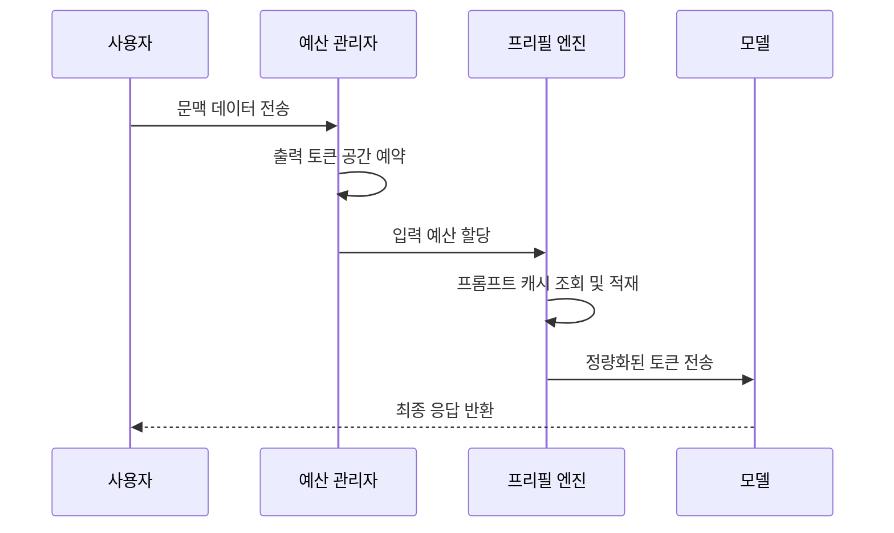

---
sidebar:
  order: 33
  label: "033. Context Window (컨텍스트 윈도우)"
  badge:
    text: "기출 · 50%"
    variant: note
title: "Context Window (컨텍스트 윈도우)"
date: "2026-07-25T01:25:00+09:00"
tags:
  - "cspe-latest_tech"
weight: 33
extra:
  question_no: "033"
  exam_status: "기출"
  exam_history: "138회"
  exam_probability: 50
  exam_note: "장문 처리 한계와 비용 설계가 중요"
---

## 미리 알고가기

- **컨텍스트 윈도우(Context Window)**: 모델이 한 번의 연산으로 처리할 수 있는 최대 토큰 범위
- **프리필(Prefill)**: 입력 토큰들의 키·밸류 벡터를 사전에 연산하여 캐시에 적재하는 단계
- **키-값 캐시(Key-Value Cache, KV Cache)**: 이전 연산 결과를 재사용하기 위해 보관하는 메모리 영역
- **프롬프트 캐싱(Prompt Caching)**: 동일한 프롬프트 접두사에 대한 프리필 연산 결과를 재사용하는 기법
- **바늘 구멍 속 바늘(Needle in a Haystack, NIAH)**: 긴 컨텍스트 내에서 특정 정보를 얼마나 잘 찾아내는지 평가하는 벤치마크

## Ⅰ. 개요

- 정의/개념: 한 번의 추론에서 처리하는 토큰 범위
- 기존 한계: 입력 길이가 증가하면 **어텐션 연산·KV 캐시 메모리 비용**이 급증함

### 쉽게 이해하기 (학습용)
- 모델 작업 책상 크기로 입력과 답을 쓸 여유가 필요함

## Ⅱ. 특징

- 지시·대화·검색 문서·출력이 문맥 한도를 공유한다
- 긴 입력은 프리필·TTFT를 늘린다
- 생성 토큰 증가는 KV 캐시 메모리를 늘린다
- 긴 문맥은 중간 정보 검색 정확도를 낮출 수 있다

### 쉽게 이해하기 (학습용)
- 책상에 자료를 많이 올릴 수 있어도 중간에 묻힌 문서를 제대로 찾는 능력은 별도 문제임

## Ⅲ. 아키텍처 및 구성요소

| 설계 요소 | 설명 |
|:---|:---|
| 길이 한도 | 모델이 수용 가능한 최대 입출력 토큰 범위 |
| 예산 관리자 | 입력 데이터와 출력 여유 공간 비율 제어 |
| 문맥 선택기 | 중요 지시와 핵심 근거 정보 필터링 |
| 프리필·캐시 | 프롬프트 캐싱 및 키-값 데이터 재사용 |
| 압축·평가 | 텍스트 요약 및 위치별 정보 인출 정확도 검증 |

### 쉽게 이해하기 (학습용)
- 한도 안에서 지시와 근거를 넣되 답변이 중간에 잘리지 않도록 출력 공간을 먼저 예약함

## Ⅳ. 원리 및 절차 흐름도

| 절차 | 설명 |
|:---|:---|
| 문맥 데이터 전송 | 질의 및 참조 문서 텍스트 전달 |
| 출력 토큰 예약 | 답변이 도중에 잘리지 않도록 공간 선확보 |
| 입력 예산 할당 | 문맥 압축 및 중요 정보 중심의 토큰화 |
| 프롬프트 캐시 조회 | 동일 접두사 재사용 여부 확인 및 연산 절감 |
| 최종 응답 반환 | 토큰 범위 준수 상태에서 결과값 반환 |

### 쉽게 이해하기 (학습용)
- 중요한 자료를 골라 구역을 표시해 놓고 답이 실제 자료를 사용했는지 확인함

## Ⅴ. 종류 및 비교

| 판단 기준 | Long Context | RAG |
|:---|:---|:---|
| 정보 구성 | 대규모 원본 문서 전체를 입력창에 주입 | 질의 관련 텍스트 조각만 선별하여 문맥 제공 |
| 주요 비용 | 입력 프리필 연산 및 캐시 메모리 점유 비용 | 검색 엔진 색인 생성 및 문서 유사도 검색 비용 |
| 적용 기준 | 전체 문서의 종합적 문맥 분석이 필요할 때 | 참조할 지식 소스가 윈도우 한도를 초과할 때 |

> 요약: 데이터 규모와 연산 비용에 따른 문맥 관리 방식 선택

### 쉽게 이해하기 (학습용)
- 큰 책상에 자료를 모두 펼치는 방식과 자료실에서 필요한 부분만 찾아오는 방식의 차이임

## Ⅵ. 실무 사례

1. RAG 대비 롱 컨텍스트의 규정 문서 요약 비용 분석

### 쉽게 이해하기 (학습용)
- 문서를 전부 읽힐 때와 부분 검색해서 읽힐 때의 가성비 분석

## Ⅶ. 결론

- 장문 입력에서 필요한 문맥을 유지하기 위해 **입력 길이·어텐션 및 KV 캐시 메모리·중요 정보 위치·비용**을 검토하고, 필요한 범위만 컨텍스트 윈도우에 구성해야 한다.

### 쉽게 이해하기 (학습용)
- 컴퓨터 책상의 크기 한계를 극복하기 위해 메모리 재사용 기법을 씀
