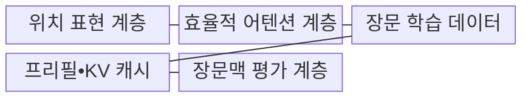
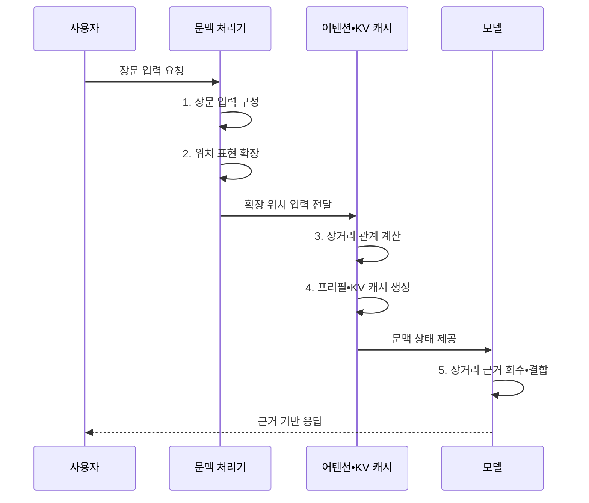

---
sidebar:
  order: 34
  label: "034. Long Context LLM (장문맥 LLM)"
  badge:
    text: "기출 • 50%"
    variant: note
title: "Long Context LLM (장문맥 LLM)"
date: "2026-08-04T14:21:00+09:00"
tags:
  - "notes-latest_tech"
weight: 34
extra:
  question_no: "034"
  source_status: "기출"
  source_history: "138회"
  priority: 50
  priority_note: "장문맥 확장과 품질 저하 대응이 쟁점"
---

## Ⅰ. 개요

핵심 용어

- **장문맥 대규모 언어 모델(Long Context Large Language Model, Long Context LLM)**: 확장된 컨텍스트 윈도우에서 멀리 떨어진 토큰의 관계와 근거를 함께 처리하는 언어 모델이다.
- **장거리 의존성**: 시퀀스에서 멀리 떨어진 정보들이 의미나 판단에 서로 영향을 주는 관계다.

- 정의/개념: 확장된 컨텍스트 윈도우에서 많은 토큰과 장거리 의존성을 한 번에 처리하는 **Long Context LLM**
- 배경/필요성: 문서 분할은 여러 구간에 걸친 **전역 관계•중간 근거 연결** 을 단절

#### 한줄 요약

- 긴 문서를 한 번에 넣는 범위뿐 아니라 멀리 떨어진 근거를 정확히 연결하는 능력까지 갖춘 모델

## Ⅱ. 특징

핵심 용어

- **위치 표현 확장**: 학습한 길이 밖에서도 토큰의 순서와 거리를 해석하도록 위치 규칙을 조정하는 기법이다.
- **회전 위치 임베딩(Rotary Position Embedding, RoPE)**: Q•K 회전으로 상대적 거리를 반영하는 기법이다.
- **희소 어텐션(Sparse Attention)**: 선택된 토큰 관계만 계산하여 비용을 줄이는 방식이다.
- **윈도우 어텐션(Window Attention)**: 일정 범위 안의 토큰 관계만 계산하는 방식이다.
- **유효 문맥 길이**: 최대 입력 한도 중 모델이 실제로 근거를 정확히 회수하고 결합할 수 있는 범위다.

> 파란 전체 어텐션 선은 문맥 길이의 제곱으로 증가하지만 붉은 고정 윈도우 선은 선형 증가하며, 정규화한 가정값이지 실측값은 아니다.

- **위치 표현 확장** 으로 학습 범위를 넘는 토큰 순서 해석
- **희소 어텐션** 으로 선택 관계만 계산
- **윈도우 어텐션** 으로 지역 관계만 계산
- 위치별 근거를 회수•결합하는 **유효 문맥 품질** 확보

#### 한줄 요약

- 더 큰 입력창을 제공해도 중간에 묻힌 근거를 찾아 연결하지 못하면 실제 장문 처리 능력은 낮음

## Ⅲ. 구조 및 구성요소

핵심 용어

- **위치 보간(Position Interpolation)**: 긴 위치 인덱스를 학습된 범위 안으로 비례 압축하여 입력 길이를 확장하는 기법이다.
- **프리필(Prefill)**: 장문 입력의 어텐션 상태를 먼저 계산하는 처리다.
- **키-값 캐시(Key-Value Cache, KV Cache)**: 계산한 상태를 후속 토큰 생성에서 재사용하는 메모리다.

| 구성요소 | 책임 |
|:---|:---|
| **위치 표현 계층** | 보간•스케일링을 통한 확장 위치 인덱스 표현 |
| **효율적 어텐션 계층** | 희소•윈도우 범위 기반 토큰 관계 계산 |
| **장문 학습 데이터** | 멀리 떨어진 근거의 연결 과업 제공 |
| **프리필•KV Cache** | 입력 병렬 처리와 생성 단계 상태 재사용 |
| **장문맥 평가 계층** | 위치별 인출•다중 근거 추론•지연 검증 |

#### 한줄 요약

- 위치 표현부터 관계 계산•상태 저장•근거 평가까지 함께 확장해야 긴 입력을 실제 답변에 활용할 수 있음

## Ⅳ. 흐름도

핵심 용어

- **컨텍스트 윈도우(Context Window)**: 한 번의 추론에서 모델이 입력과 출력으로 처리할 수 있는 최대 토큰 범위다.
- **장거리 근거 회수**: 긴 입력의 여러 위치에서 질문과 관련된 정보를 찾아 생성 문맥에 반영하는 과정이다.

1. **장문 입력 구성**: 지시•원문•출력 여유를 컨텍스트 윈도우에 배치
2. **위치 표현 확장**: **RoPE•위치 보간** 으로 학습 길이 밖 관계 부여
3. **장거리 관계 계산**: 전체 또는 희소•윈도우 범위의 관련 토큰 결합
4. **프리필•KV Cache 생성**: 입력 병렬 처리와 생성 단계 상태 재사용
5. **장거리 근거 회수•결합**: 멀리 떨어진 정보의 인출•결합 결과 검증

#### 한줄 요약

- 긴 입력을 위치에 맞게 배열하고 관련 구간을 연결한 뒤 계산 결과를 재사용해 근거 있는 답을 생성함

## Ⅴ. 종류 및 비교

핵심 용어

- **직접 장문 입력**: 원문 전체를 하나의 넓은 컨텍스트에 넣어 전역 관계를 모델이 직접 처리하는 방식이다.
- **검색 증강 생성(Retrieval-Augmented Generation, RAG)**: 질의와 관련된 외부 문서 조각을 검색해 모델 입력에 근거로 제공하는 방식이다.

- **Long Context LLM 기반 직접 장문 입력** 및 **RAG** 사이를 전역 관계 분석과 선택 검색 기준으로 구분한다.

| Long Context LLM 방식 | 직접 장문 입력 | RAG |
|:---|:---|:---|
| 적용 기준 | 전체 문서의 **전역 관계 분석** | 대규모•갱신 지식의 **선택 검색** |
| 핵심 특징 | 원문 전체의 **단일 문맥 처리** | 관련 문서 조각의 **검색 후 주입** |
| 한계 | 프리필•KV 캐시 비용과 **중간 근거 손실** | 검색 누락•**문서 관계 단절** |

#### 한줄 요약

- 문서 전체를 펼쳐 관계를 찾는 방식과 필요한 부분을 검색해 가져오는 방식의 차이

## Ⅵ. 실무 고려사항 및 대책

핵심 용어

- **건초더미 속 바늘 찾기(Needle in a Haystack, NIAH)**: 긴 문맥의 여러 위치에 숨긴 특정 근거를 얼마나 정확히 회수하는지 확인하는 평가다.
- **접두사 캐싱(Prefix Caching)**: 여러 요청이 공유하는 입력 앞부분의 프리필 결과를 저장해 재사용하는 기법이다.
- **동적 배치(Dynamic Batching)**: 도착 시점과 길이가 다른 요청을 실행 중에 묶어 연산 자원 사용률을 높이는 방식이다.
- **민감정보 마스킹(Data Masking)**: 입력의 개인정보나 비밀값을 제거하거나 대체값으로 가려 노출을 줄이는 보호 기법이다.

| 문제 | 대책 | 효과 |
|:---|:---|:---|
| **이차 어텐션 비용** | **희소•윈도우 어텐션** 과 입력 예산 적용 | 연산량•**메모리 증가 억제** |
| **중간 정보 회수 저하** | 위치별 **NIAH•다중 근거 평가** | **유효 문맥 길이** 검증 |
| **프리필 지연•KV Cache 압박** | **접두사 캐싱•동적 배치** 와 캐시 한도 | 프리필 지연 감소•**동시 처리량 향상** |
| **접근 권한 혼입** | 권한 필터와 **민감정보 마스킹** | 장문 입력의 **정보 노출 방지** |

#### 한줄 요약

- 최대 입력 길이보다 실제 근거 회수율•응답 지연•메모리•문서 권한을 함께 시험해야 함

## Ⅶ. 결론

핵심 용어

- 전역 의존성에는 **직접 장문 입력**, 일부 최신 근거에는 **RAG** 선택

#### 한줄 요약

- 문서 전체의 관계가 필요하면 장문 입력을, 필요한 근거가 일부이면 검색 결합을 선택
