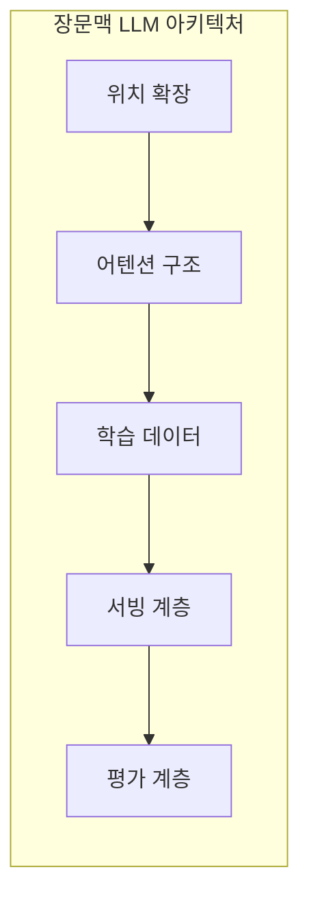
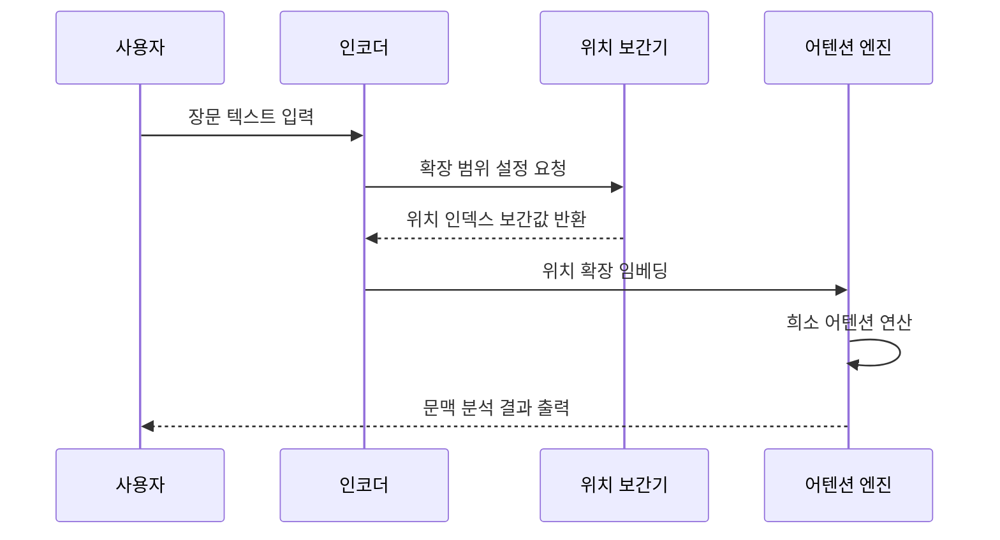

---
sidebar:
  order: 34
  label: "034. Long Context LLM (장문맥 LLM)"
  badge:
    text: "기출 · 50%"
    variant: note
title: "Long Context LLM (장문맥 LLM)"
date: "2026-07-25T01:25:00+09:00"
tags:
  - "cspe-latest_tech"
weight: 34
extra:
  question_no: "034"
  exam_status: "기출"
  exam_history: "138회"
  exam_probability: 50
  exam_note: "장문맥 확장과 품질 저하 대응이 쟁점"
---

## 미리 알고가기

- **장문맥 거대 언어 모델(Long Context LLM)**: 수만 토큰 이상의 긴 입력 시퀀스를 처리할 수 있도록 설계된 모델
- **위치 보간(Position Interpolation)**: 학습 범위를 벗어난 긴 입력에 대해 위치 인덱스를 비례적으로 축소하는 기법
- **희소 어텐션(Sparse Attention)**: 모든 토큰을 비교하지 않고 일부 중요 토큰만 계산하여 연산량을 줄이는 방식
- **프리필(Prefill)**: 입력 토큰들의 캐시(KV Cache)를 미리 생성하여 적재하는 작업
- **키-값 캐시(Key-Value Cache, KV Cache)**: 추론 효율화를 위해 이전 연산의 키와 밸류 값을 보관하는 저장소

## Ⅰ. 개요

- 정의/개념: 긴 토큰 입력을 직접 분석하는 언어 모델
- 기존 한계: 분할 검색만으로는 **다중 문서·코드의 장거리 의존관계**를 놓칠 수 있음

### 쉽게 이해하기 (학습용)
- 책을 많이 펼칠 뿐 아니라 필요한 문장을 찾아 연결함

## Ⅱ. 특징

- 위치 보간·미세조정이 학습 길이 밖을 외삽한다
- 희소·윈도우 어텐션이 장문맥 비용을 줄인다
- 프리필·캐시 병목이 서버 처리량을 낮춘다
- NIAH가 긴 문맥의 정보 인출 정확도를 평가한다

### 쉽게 이해하기 (학습용)
- 책을 많이 올려놓는 능력과 중간 페이지의 근거를 정확히 찾아 추론하는 능력은 다름

## Ⅲ. 아키텍처 및 구성요소

| 설계 요소 | 설명 |
|:---|:---|
| 위치 확장 | RoPE 보간 등으로 확장된 위치 인덱스 제공 |
| 어텐션 구조 | 희소 및 플래시 어텐션 기반 연산 최적화 |
| 학습 데이터 | 긴 의존성을 포함한 장문 말뭉치 데이터 구축 |
| 서빙 계층 | 프롬프트 캐싱 및 동적 페이지드어텐션 적용 |
| 평가 계층 | 위치별 정보 인출 정확도와 지연시간 검증 |

### 쉽게 이해하기 (학습용)
- 위치 표시와 관계 계산, 메모리 저장, 필요한 정보 사용이 모두 맞아야 장문 처리가 됨

## Ⅳ. 원리 및 절차 흐름도

| 절차 | 설명 |
|:---|:---|
| 장문 텍스트 입력 | 수만 토큰 이상의 긴 문장 또는 코드 입력 |
| 확장 범위 설정 | 목표 길이에 맞추어 입력 한계 영역 조율 |
| 위치 인덱스 보간 | 회전 위치 임베딩(RoPE) 인덱스 축소 반환 |
| 위치 확장 임베딩 | 위치 정보가 융합된 입력 벡터를 엔진에 전달 |
| 희소 어텐션 연산 | 중요 토큰 위주의 선별적 유사도 연산 수행 |

### 쉽게 이해하기 (학습용)
- 숨은 문장 찾기만 통과해도 여러 근거를 연결하는 업무까지 잘한다고 볼 수는 없음

## Ⅴ. 종류 및 비교

| 판단 기준 | 직접 입력 | RAG |
|:---|:---|:---|
| 정보 구성 | 문서 원본 전체를 프롬프트에 직접 입력 | 질의와 유사한 텍스트 단락만 추출하여 입력 |
| 핵심 강점 | 누락 없는 완벽한 전역 문맥 정보 참조 가능 | 추론 연산 비용 절감 및 접근 권한 통제 용이 |
| 적용 기준 | 전체 문서의 복합적 흐름 및 전역 관계 분석 시 | 참조할 데이터가 무한하고 최신 정보가 필요할 때 |

> 요약: 분석의 전역성과 운영 비용에 따라 장문맥 기법 선택

### 쉽게 이해하기 (학습용)
- 책 전체를 펼쳐 비교하는 방식과 필요한 페이지를 먼저 찾아 가져오는 방식의 차이임

## Ⅵ. 실무 사례

1. 수만 라인의 소스 코드 분석을 위한 저장소 직접 주입

### 쉽게 이해하기 (학습용)
- 파일 전체를 입력하여 프로그램의 의존성을 한 번에 파악함

## Ⅶ. 결론

- 문서 전체의 장거리 의존관계를 분석하기 위해 **문맥 길이·중요 정보 회수율·추론 지연·비용·접근 권한**을 검토하고, 검색 분할로 의미가 손실되는 업무에 Long Context LLM을 활용해야 한다.

### 쉽게 이해하기 (학습용)
- 긴 문장을 처리하되, 과도한 비용을 막기 위해 계산 최적화를 씀
