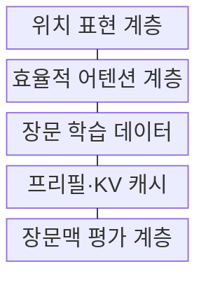
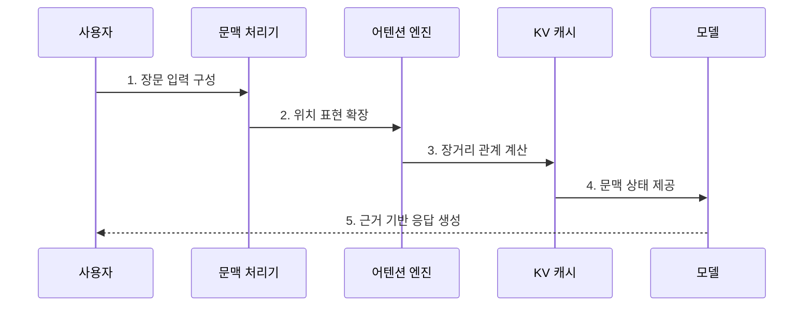

---
sidebar:
  order: 34
  label: "034. Long Context LLM (장문맥 LLM)"
  badge:
    text: "기출 · 50%"
    variant: note
title: "Long Context LLM (장문맥 LLM)"
date: "2026-07-25T01:25:00+09:00"
tags:
  - "notes-latest_tech"
weight: 34
extra:
  question_no: "034"
  source_status: "기출"
  source_history: "138회"
  priority: 50
  priority_note: "장문맥 확장과 품질 저하 대응이 쟁점"
---

## 미리 알고가기

- **장문맥 거대 언어 모델(Long Context LLM)**: 확장된 컨텍스트 윈도우에서 멀리 떨어진 토큰의 관계를 함께 분석하는 언어 모델
- **컨텍스트 윈도우(Context Window)**: 모델이 한 번의 추론에서 입력과 출력으로 처리할 수 있는 최대 토큰 범위
- **어텐션(Attention)**: 각 토큰이 다른 토큰과 얼마나 관련되는지 가중치를 계산해 문맥 정보를 결합하는 연산
- **회전 위치 임베딩(Rotary Position Embedding, RoPE)**: 토큰 위치에 따른 회전 변환을 질의·키 벡터에 적용해 상대적 순서를 표현하는 기법
- **위치 보간(Position Interpolation)**: 긴 입력의 위치 간격을 학습된 위치 범위 안으로 비례 조정하는 확장 기법
- **희소·윈도우 어텐션(Sparse·Window Attention)**: 전체 토큰 쌍 대신 선택된 토큰이나 일정 범위의 토큰 관계만 계산하는 방식
- **프리필(Prefill)**: 입력 토큰을 병렬 처리해 생성에 재사용할 키·값 상태를 미리 계산하는 단계
- **키-값 캐시(Key-Value Cache, KV Cache)**: 이전 토큰의 어텐션 키·값 상태를 저장해 다음 토큰 생성에 재사용하는 메모리 영역
- **NIAH(Needle in a Haystack)**: 긴 문맥의 여러 위치에 숨긴 특정 근거를 얼마나 정확히 회수하는지 확인하는 평가
- **검색 증강 생성(Retrieval-Augmented Generation, RAG)**: 질의와 관련된 외부 문서를 검색해 모델의 입력 문맥으로 제공하는 생성 방식
- **접두사 캐싱(Prefix Caching)**: 여러 요청이 공유하는 입력 앞부분의 프리필 결과를 저장해 다시 사용하는 기법
- **동적 배치(Dynamic Batching)**: 도착 시점과 길이가 다른 요청을 실행 중에 묶어 처리 자원 사용률을 높이는 방식
- **민감정보 마스킹(Data Masking)**: 입력에 포함된 개인정보나 비밀값을 제거하거나 대체값으로 가리는 보호 기법

## Ⅰ. 개요

- 정의/개념: **확장 위치 표현·효율적 어텐션**으로 장거리 토큰 의존성을 처리하는 언어 모델
- 배경/필요성: 문서 분할은 여러 구간에 걸친 **전역 관계·중간 근거**를 단절할 수 있어 긴 입력의 직접 분석 필요

### 쉽게 이해하기 (학습용)

- 긴 문서를 한 번에 넣는 범위뿐 아니라 멀리 떨어진 근거를 정확히 연결하는 능력까지 갖춘 모델

## Ⅱ. 특징

> 파란 전체 어텐션 선은 문맥 길이의 제곱으로 증가하지만 붉은 고정 윈도우 선은 선형 증가하며, 정규화한 가정값이지 실측값은 아니다.

- **위치 표현 확장**으로 학습 범위를 넘는 토큰 순서 해석
- **희소·윈도우 어텐션**으로 전체 어텐션의 이차 비용 완화
- 위치별 근거를 회수·결합하는 **유효 문맥 품질** 확보

### 쉽게 이해하기 (학습용)

- 더 큰 입력창을 제공해도 중간에 묻힌 근거를 찾아 연결하지 못하면 실제 장문 처리 능력은 낮음

## Ⅲ. 구조 및 구성요소

| 구성요소 | 책임 |
|:---|:---|
| **위치 표현 계층** | 보간·스케일링을 통한 확장 위치 인덱스 표현 |
| **효율적 어텐션 계층** | 희소·윈도우 범위 기반 토큰 관계 계산 |
| **장문 학습 데이터** | 멀리 떨어진 근거의 연결 과업 제공 |
| **프리필·KV 캐시** | 입력 병렬 처리와 생성 단계 상태 재사용 |
| **장문맥 평가 계층** | 위치별 인출·다중 근거 추론·지연 검증 |

### 쉽게 이해하기 (학습용)

- 위치 표현부터 관계 계산·상태 저장·근거 평가까지 함께 확장해야 긴 입력을 실제 답변에 활용할 수 있음

## Ⅳ. 흐름도

### 동작 원리

- **1. 장문 입력 구성**: 지시·원문·출력 여유의 문맥 한도 내 배치
- **2. 위치 표현 확장**: 학습 길이를 넘는 토큰에 연속적인 위치 관계 부여
- **3. 장거리 관계 계산**: 전체 또는 제한된 참조 범위에서 관련 토큰 결합
- **4. 문맥 상태 제공**: 프리필 결과의 키·값 상태 저장과 생성 단계 재사용
- **5. 근거 기반 응답 생성**: 멀리 떨어진 정보의 회수·결합 결과 검증

### 쉽게 이해하기 (학습용)

- 긴 입력을 위치에 맞게 배열하고 관련 구간을 연결한 뒤 계산 결과를 재사용해 근거 있는 답을 생성함

## Ⅴ. 종류 및 비교

| Long Context LLM 방식 | 직접 장문 입력 | RAG |
|:---|:---|:---|
| **적용 기준** | 전체 문서의 전역 관계 분석 | 대규모·갱신 지식의 선택 검색 |
| **핵심 특징** | 원문 전체를 단일 문맥으로 처리 | 질의 관련 문서 조각만 문맥에 구성 |
| **한계** | 프리필·KV 캐시 비용과 중간 근거 손실 | 검색 누락과 문서 분할에 따른 관계 단절 |

### 쉽게 이해하기 (학습용)

- 문서 전체를 펼쳐 관계를 찾는 방식과 필요한 부분을 검색해 가져오는 방식의 차이

## Ⅵ. 실무 고려사항 및 대책

| 고려사항 | 대책 | 효과 |
|:---|:---|:---|
| **이차 어텐션 비용** | 희소·윈도우 어텐션과 입력 예산 적용 | 연산량·메모리 증가 억제 |
| **중간 정보 회수 저하** | 위치별 NIAH와 다중 근거 평가 수행 | 유효 문맥 길이 검증 |
| **프리필 지연·KV 캐시 압박** | 접두사 캐싱·동적 배치·캐시 한도 운영 | 초기 응답 지연과 동시성 절충 |
| **접근 권한 혼입** | 문서별 권한 필터와 민감정보 마스킹 | 장문 입력의 정보 노출 방지 |

### 쉽게 이해하기 (학습용)

- 최대 입력 길이보다 실제 근거 회수율·응답 지연·메모리·문서 권한을 함께 시험해야 함

## Ⅶ. 결론

- **문서 전역 의존성·유효 정보 회수율**을 기준으로 직접 장문 입력과 검색 결합을 선택하는 장문맥 설계

### 쉽게 이해하기 (학습용)

- 문서 전체의 관계가 필요하면 장문 입력을, 필요한 근거가 일부이면 검색 결합을 선택
