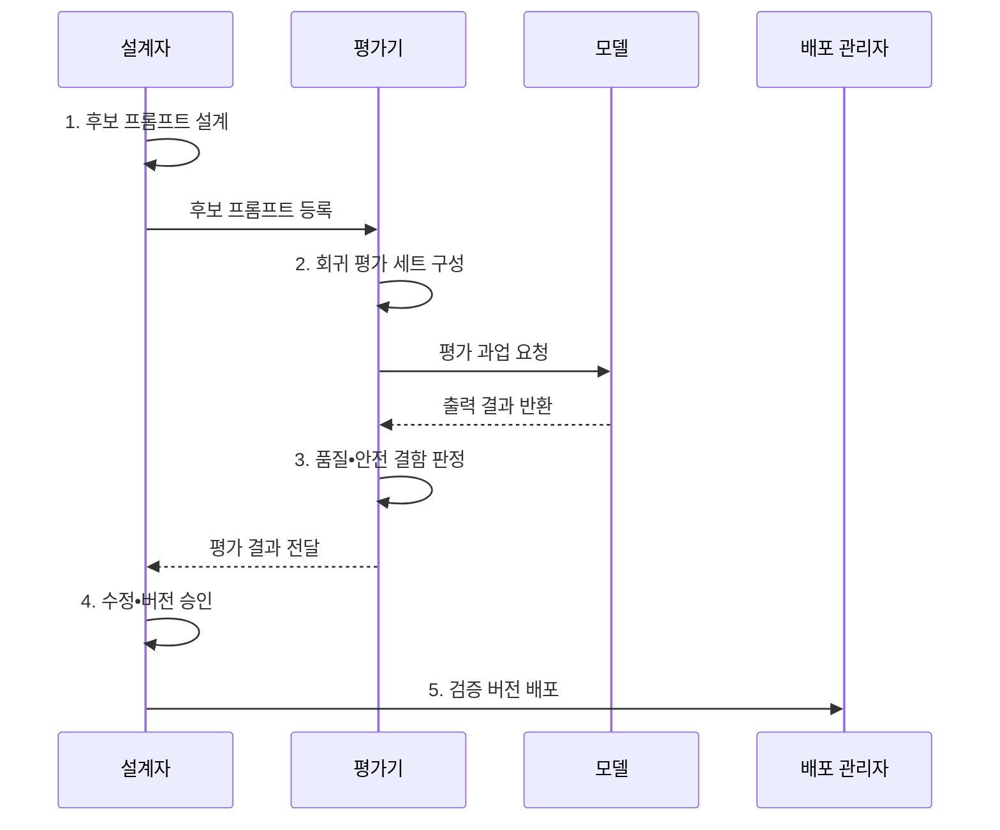

---
sidebar:
  order: 35
  label: "035. Prompt Engineering (프롬프트 엔지니어링)"
  badge:
    text: "기출 • 70%"
    variant: note
title: "Prompt Engineering (프롬프트 엔지니어링)"
date: "2026-08-04T14:26:00+09:00"
tags:
  - "notes-latest_tech"
weight: 35
extra:
  question_no: "035"
  source_status: "기출"
  source_history: "135회, 137회, 138회"
  priority: 70
  priority_note: "생성 품질•안전 통제를 묻는 반복 주제"
---

## Ⅰ. 개요

핵심 용어

- **프롬프트 엔지니어링(Prompt Engineering)**: 모델이 의도한 과업을 수행하도록 지시•문맥•예시•출력 형식을 설계하고 평가로 검증하는 기법이다.
- **출력 계약(Output Contract)**: 모델 응답이 따라야 할 필드•자료형•근거•오류 처리 규칙이다.

- 정의/개념: 지시•문맥•예시•출력 계약을 설계하고 평가해 원하는 모델 행동을 유도하는 **프롬프트 엔지니어링**
- 배경/필요성: 모호한 입력은 동일 과업에서도 **정확성•형식•안전성 편차** 유발

#### 한줄 요약

- 모델이 해야 할 일과 참고할 자료, 지켜야 할 조건, 결과 형식을 명확히 적고 실제 실패 사례로 검증하는 과정

## Ⅱ. 특징

핵심 용어

- **시스템 지시(System Instruction)**: 모델의 역할•행동 범위•우선 규칙을 사용자 입력보다 높은 권한으로 설정하는 지시다.
- **제로샷(Zero-shot)**: 예시 없이 지시만 제공하여 과업을 수행하는 방식이다.
- **퓨샷(Few-shot)**: 소수의 입출력 예시로 기대 응답 패턴을 제공하는 방식이다.
- **도구 호출(Tool Calling)**: 모델이 검색•계산•외부 기능을 정해진 구조로 요청하도록 연결하는 방식이다.
- **프롬프트 주입(Prompt Injection)**: 비신뢰 데이터에 숨은 악성 지시로 상위 지시와 통제를 우회하려는 공격이다.

- **시스템 지시**: 모델의 행동 범위와 우선 규칙 명시
- **역할**: 모델이 맡을 전문 책임 정의
- **목표**: 모델이 달성할 과업과 성공 조건 명시
- **제약**: 금지 사항과 권한 범위 제한
- **제로샷**: 예시 없이 지시만으로 수행
- **퓨샷**: 소수 예시로 기대 패턴 제공
- **도구 호출**: 외부 기능 요청을 구조화
- 고정 평가 세트를 통한 **품질 회귀•프롬프트 주입** 검증

#### 한줄 요약

- 좋은 문구를 한 번 찾는 작업이 아니라 입력 조건과 실패 결과를 반복 비교해 안정된 지시를 만드는 작업

## Ⅲ. 구조 및 구성요소

핵심 용어

- **성공 조건**: 모델 결과가 과업을 완료했다고 판정할 수 있도록 관찰•검증 가능하게 정의한 기준이다.
- **역할•목표**: 모델이 맡을 역할과 달성할 과업•성공 조건을 명확히 한 지시 요소이다.
- **지시•제약**: 수행 절차와 금지 사항•권한•범위를 명시하여 행동 경계를 정하는 요소이다.
- **문맥•예시**: 판단에 필요한 근거와 입력•출력 사례를 제공하여 과업 해석을 구체화하는 요소이다.
- **문맥 경계**: 신뢰 지시와 참조용 외부 데이터를 구분하여 데이터가 명령으로 해석되지 않게 하는 경계다.
- **프롬프트 버전**: 지시•예시•출력 계약과 호환 모델의 변경 상태를 재현할 수 있게 식별한 값이다.

| 구성요소 | 책임 |
|:---|:---|
| **역할•목표** | 수행 대상과 **성공 조건** 명시 |
| **지시•제약** | 허용 행동•금지 조건•**우선순위** 정의 |
| **문맥•예시** | 참조 데이터 경계와 **기대 응답 패턴** 제공 |
| **출력 계약** | 필드•자료형•근거•**오류 형식** 지정 |
| **평가•버전** | 품질•안전 **회귀 검증** 과 이력 관리 |

#### 한줄 요약

- 무엇을 할지부터 참고 자료와 결과 형식, 변경 검증까지 하나의 버전으로 묶어 관리함

## Ⅳ. 흐름도

핵심 용어

- **회귀 평가(Regression Evaluation)**: 프롬프트나 모델 변경 뒤 기존 과업의 품질 저하 여부를 고정 평가 세트로 확인하는 절차다.
- **공격 입력**: 프롬프트 인젝션이나 경계 우회를 시도하여 안전 통제의 실패 여부를 시험하는 입력이다.

1. **후보 프롬프트 설계**: 목표•지시•예시•출력 계약의 단일 버전 구성
2. **회귀 평가 세트 구성**: 정상•경계•공격 입력과 성공 기준 고정
3. **품질•안전 결함 판정**: 기준 버전 대비 회귀와 프롬프트 주입 취약성 식별
4. **수정•버전 승인**: 결함을 보완한 프롬프트 조합과 변경 이력 확정
5. **검증 버전 배포**: 승인된 프롬프트•모델•출력 계약 조합 배포

#### 한줄 요약

- 후보 지시를 정상•예외•공격 입력으로 시험하고 이전 버전보다 나빠지지 않은 조합만 배포함

## Ⅴ. 종류 및 비교

핵심 용어

- **미세조정(Fine-Tuning)**: 도메인 데이터로 사전학습 모델의 가중치를 추가 갱신하여 반복 행동을 내재화한다.

| 모델 적응 방식 | 프롬프트 엔지니어링 | 미세조정 |
|:---|:---|:---|
| 적용 기준 | 과업 지시•형식의 **빠른 변경** | 반복되는 **도메인 행동 내재화** |
| 핵심 특징 | 가중치 없이 **입력 시점 행동 유도** | 학습 데이터로 **모델 가중치 갱신** |
| 한계 | 입력 토큰 증가•**지시 민감성** | 학습 비용•**데이터•모델 회귀** |

#### 한줄 요약

- 요청마다 행동을 안내하는 방식과 반복 학습으로 모델 자체의 행동을 바꾸는 방식의 차이

## Ⅵ. 실무 고려사항 및 대책

핵심 용어

- **업무 규칙 검증**: 출력 구조가 유효한지와 별개로 값의 의미와 업무 제약을 충족하는지 확인하는 절차다.
- **도구 권한 제한**: 모델이 요청할 수 있는 자원•행동•인자를 최소 범위로 제한하여 오판의 피해를 줄이는 통제다.

| 문제 | 대책 | 효과 |
|:---|:---|:---|
| **지시 모호성** | 성공 기준•금지 조건•**출력 예시** 명시 | **응답 편차 감소** |
| **정형 출력 의미 오류** | 출력 계약과 **업무 규칙 검증** 분리 | 구조•내용 오류의 **동시 탐지** |
| **프롬프트 주입** | 비신뢰 경계와 **도구 권한 제한** | 악성 입력의 **행동 전이 억제** |
| **모델 변경 회귀** | 고정 평가 세트와 **버전 회귀 시험** | 배포 전 **품질 저하 탐지** |

#### 한줄 요약

- 형식에 맞는 결과도 내용은 틀릴 수 있으므로 구조•의미•안전을 각각 검사해야 함

## Ⅶ. 결론

핵심 용어

- 변경 잦은 과업은 **프롬프트**, 반복 행동 내재화는 **미세조정** 선택

#### 한줄 요약

- 빠른 변경은 프롬프트로 처리하고 반복되는 행동은 미세조정을 검토하되 둘 다 고정 평가로 검증
