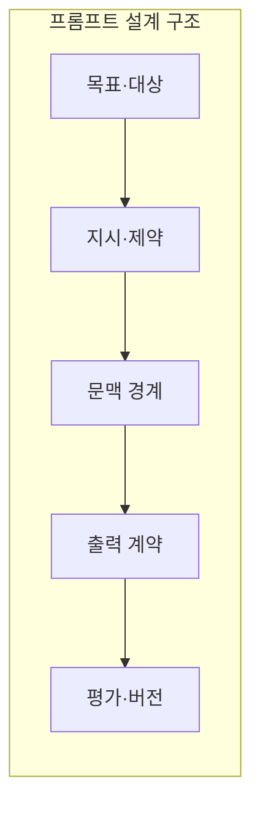
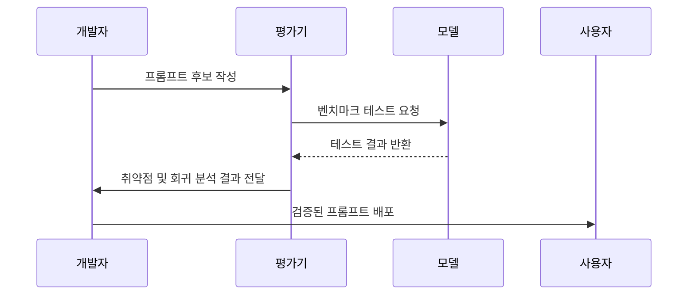

---
sidebar:
  order: 35
  label: "035. Prompt Engineering (프롬프트 엔지니어링)"
  badge:
    text: "기출 · 70%"
    variant: note
title: "Prompt Engineering (프롬프트 엔지니어링)"
date: "2026-07-25T01:25:00+09:00"
tags:
  - "cspe-latest_tech"
weight: 35
extra:
  question_no: "035"
  exam_status: "기출"
  exam_history: "135회, 137회, 138회"
  exam_probability: 70
  exam_note: "생성 품질·안전 통제를 묻는 반복 주제"
---

## 미리 알고가기

- **프롬프트 엔지니어링(Prompt Engineering)**: 거대 언어 모델로부터 원하는 응답을 얻기 위해 입력값(프롬프트)을 설계하고 최적화하는 기술
- **미세조정(Fine-Tuning)**: 특정 도메인 데이터셋을 사용해 사전학습된 모델의 파라미터 가중치를 추가로 업데이트하는 과정
- **제로샷·퓨샷(Zero-shot·Few-shot)**: 예시 없이(Zero-shot) 또는 소수의 예시를 제공하여(Few-shot) 과업을 수행하게 하는 프롬프트 기법
- **프롬프트 인젝션(Prompt Injection)**: 모델의 원래 지시사항을 무시하고 공격자의 악의적인 지시를 실행하도록 입력값을 주입하는 보안 위협
- **트레이스(Trace)**: LLM 애플리케이션의 입력, 중간 연산, 출력 등 처리 과정을 추적하는 로깅 기술

## Ⅰ. 개요

- 정의/개념: 응답 품질을 위한 입력 지시 설계
- **배경/필요성**: 가중치 변경 없이 과업 성능 개선

### 쉽게 이해하기 (학습용)
- 목적·자료·조건·형식을 적고 잘 작동하는지 검증함

## Ⅱ. 특징

- 역할·입력 경계·출력 형식·제약을 명시한다
- 과업 난도에 맞춰 예시·도구 기법을 조합한다
- 정형 출력도 스키마·의미를 함께 검증한다
- 고정 평가셋이 모델 변경 회귀를 탐지한다

### 쉽게 이해하기 (학습용)
- 형식이 맞는 JSON도 금액이나 사실이 틀릴 수 있어 구조 검사와 내용 검사를 나눠야 함

## Ⅲ. 아키텍처 및 구성요소

| 설계 요소 | 설명 |
|:---|:---|
| 목표·대상 | 수행할 과업 정의와 성공 판단 기준 수립 |
| 지시·제약 | 모델이 준수해야 할 행동 범위 및 금지 사항 |
| 문맥 경계 | 시스템 지시와 외부 참조 데이터 영역의 구분 |
| 출력 계약 | 사례(Few-shot) 및 JSON 등의 형식 지정 |
| 평가·버전 | 프롬프트 버전 관리와 회귀 테스트 셋 운영 |

### 쉽게 이해하기 (학습용)
- 지시와 참고자료, 사용자가 넣은 데이터를 구역별로 표시하면 모델과 검증기가 처리하기 쉬움

## Ⅳ. 원리 및 절차 흐름도

| 절차 | 설명 |
|:---|:---|
| 프롬프트 후보 작성 | 목표 과업에 맞추어 지시문 및 예시 구성 |
| 벤치마크 테스트 | 평가 데이터셋 기반으로 모델 출력 생성 |
| 테스트 결과 반환 | 각 프롬프트별 성능 메트릭 집계 |
| 회귀 분석 결과 전달 | 성능 하락 여부 및 프롬프트 인젝션 취약점 검증 |
| 검증 프롬프트 배포 | 버전 고정 상태에서 실 서비스 환경에 배포 |

### 쉽게 이해하기 (학습용)
- 좋은 문구를 한 번 찾는 일이 아니라 실제 실패 사례로 계속 검증하고 수정하는 과정임

## Ⅴ. 종류 및 비교

| 판단 기준 | 프롬프트 엔지니어링 | Fine-tuning |
|:---|:---|:---|
| 변경 대상 | 입력 프롬프트의 지시어 및 예시(Few-shot) | 도메인 학습 데이터를 통한 모델의 가중치 파라미터 |
| 핵심 특성 | 요청 시점의 토큰 비용 증가 및 가벼운 시도 | 초기 학습 비용은 크나 장기적 토큰 절약 가능 |
| 적용 기준 | 추가 데이터 학습 없이 빠른 과업 정의가 필요할 때 | 특정 어조나 출력 스타일을 모델에 내재화할 때 |

> 요약: 학습 자원과 서빙 비용을 고려해 프롬프트와 파인튜닝 절충

### 쉽게 이해하기 (학습용)
- 요청서로 행동을 안내하는 방식과 반복 훈련으로 모델 행동을 바꾸는 방식의 차이임

## Ⅵ. 실무 사례

1. JSON 출력 시 스키마 정의 및 필수 키 검증 필터 적용

### 쉽게 이해하기 (학습용)
- 모델이 규칙에 맞춰 글을 쓰도록 입력과 검증 장치를 둠

## Ⅶ. 결론

- 출력 품질 제어를 위해 지시 명확성·회귀 위험을 검토하여 **프롬프트 엔지니어링** 활용

### 쉽게 이해하기 (학습용)
- 모델의 출력을 믿기 전에 지속적으로 실패를 잡아내는 체계를 운영함
