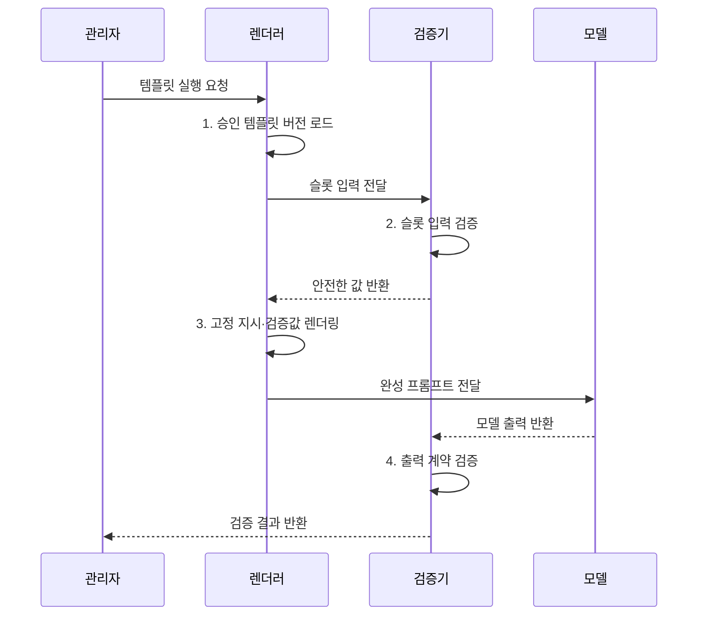

---
sidebar:
  order: 36
  label: "036. Prompt Template (프롬프트 템플릿)"
  badge:
    text: "기출 · 40%"
    variant: note
title: "Prompt Template (프롬프트 템플릿)"
date: "2026-08-02T08:59:00+09:00"
tags:
  - "notes-latest_tech"
weight: 36
extra:
  question_no: "036"
  source_status: "기출"
  source_history: "135회"
  priority: 40
  priority_note: "템플릿은 프롬프트 설계의 세부 기법"
---

## Ⅰ. 개요

핵심 용어

- **프롬프트 템플릿(Prompt Template)**: 고정 지시와 검증된 변수값, 출력 계약을 결합해 반복 호출에 재사용하는 프롬프트 서식이다.
- **재현성**: 같은 템플릿·모델·입력 조합에서 일관된 처리 조건과 결과 형식을 다시 구성할 수 있는 성질이다.

- 정의/개념: 고정 지시·검증된 입력 슬롯·출력 계약을 결합해 같은 작업에 반복 사용하는 **프롬프트 템플릿**
- 배경/필요성: 요청마다 직접 작성하면 지시·입력 검증·결과 형식이 달라져 **결과 재현 곤란**

#### 한줄 요약

- 공통 지시는 고정하고 검사한 업무값만 정해진 자리에 넣어 같은 형식의 요청을 만드는 서식

## Ⅱ. 특징

핵심 용어

- **정적 블록(Static Block)**: 실행마다 바뀌지 않는 역할·목표·제약 문구다.
- **변수 슬롯(Variable Slot)**: 실행 시 업무값이 들어가도록 이름·자료형·제약이 정의된 자리다.
- **회귀 검증(Regression Test)**: 템플릿·모델·출력 계약 변경 뒤 기존 과업의 품질 저하 여부를 확인하는 시험이다.

- **정적 블록·변수 슬롯** 분리를 통한 공통 지시 재사용
- 자료형·길이·허용값 기반 **슬롯 검증·안전 결합**
- 템플릿·모델·출력 계약의 **통합 버전 관리·회귀 검증**

#### 한줄 요약

- 서식을 재사용하되 각 빈칸의 값과 결과 형식, 함께 쓰는 모델 버전까지 하나의 조합으로 검사함

## Ⅲ. 구조 및 구성요소

핵심 용어

- **렌더러(Renderer)**: 검증한 변수값을 지정 슬롯에 결합하여 완성 프롬프트를 만드는 구성요소다.
- **정적 지시 블록**: 반복 작업에 공통으로 적용할 역할·목표·절차·제약을 고정한 부분이다.
- **변수 명세**: 각 입력 슬롯의 이름·자료형·필수 여부·허용 범위와 이스케이프 규칙을 정한 계약이다.
- **이스케이프(Escaping)**: 따옴표·줄바꿈 같은 제어 문자가 템플릿 구조를 바꾸지 않도록 안전한 표현으로 변환하는 처리다.
- **출력 계약(Output Contract)**: 모델 응답의 필드·자료형·근거·오류 처리 규칙을 정의한 계약이다.
- **버전 저장소**: 템플릿·호환 모델·평가 결과의 변경 이력을 보존해 실행을 재현하는 저장소이다.

| 구성요소 | 책임 |
|:---|:---|
| **정적 지시 블록** | 역할·목표·제약의 **공통 문구** 유지 |
| **변수 명세** | 자료형·필수 여부·**길이·권한** 정의 |
| **검증·렌더러** | 입력 검사·**이스케이프** 후 슬롯 결합 |
| **출력 계약** | 필드·자료형·**오류·근거 규칙** 명시 |
| **버전 저장소** | 호환 조합과 **승인 이력** 관리 |

#### 한줄 요약

- 고정 문구와 입력 규칙을 렌더러가 결합하고 결과 형식과 호환 버전을 저장소에서 함께 관리함

## Ⅳ. 흐름도

핵심 용어

- **슬롯 검증**: 변수값의 자료형·길이·허용값·접근 권한을 렌더링 전에 판정하는 절차다.
- **호환 조합**: 함께 검증된 템플릿·모델·출력 계약의 버전 묶음이다.

1. **승인 템플릿 버전 로드**: 지시·변수·출력 계약의 호환 조합 호출
2. **슬롯 입력 검증**: 자료형·길이·허용값·접근 권한 판정
3. **고정 지시·검증값 렌더링**: 이스케이프 후 지정 슬롯 결합
4. **출력 계약 검증**: 응답 구조와 업무 규칙 충족 여부 판정

#### 한줄 요약

- 승인 서식을 고르고 빈칸을 검사한 뒤 안전하게 결합해 호출하고 결과 형식과 내용까지 확인함

## Ⅴ. 종류 및 비교

핵심 용어

- **임시 프롬프트**: 일회성 탐색을 위해 요청마다 지시를 직접 구성하는 방식이다.
- **프롬프트 템플릿**: 반복 업무의 공통 지시와 검증 슬롯을 재사용하여 입력과 출력 형식을 일관되게 만드는 방식이다.

| 프롬프트 작성 방식 | 임시 프롬프트 | 프롬프트 템플릿 |
|:---|:---|:---|
| 적용 기준 | **일회성 탐색·실험** | 반복 업무·**공통 출력 형식** |
| 핵심 특징 | 요청마다 **지시 직접 구성** | **고정 블록·검증 슬롯** 재사용 |
| 한계 | 작성자별 편차·**재현성 부족** | 슬롯 경계·**버전 호환성 관리** |

#### 한줄 요약

- 한 번 쓰는 자유 요청은 빠르지만 반복 업무에는 검증된 공용 서식이 더 일관됨

## Ⅵ. 실무 고려사항 및 대책

핵심 용어

- **구분자(Delimiter)**: 지시와 외부 데이터를 서로 다른 영역으로 표시하여 경계를 명확히 하는 기호다.
- **프롬프트 주입(Prompt Injection)**: 외부 입력의 지시가 고정 지시를 무시하거나 우회하도록 모델을 유도하는 공격이다.
- **슬롯 입력 오염**: 검증되지 않은 변수값이 제어 문자나 지시를 포함하여 템플릿의 의도와 구조를 바꾸는 문제다.

| 문제 | 대책 | 효과 |
|:---|:---|:---|
| **슬롯 입력 오염** | 자료형·허용값 검증과 **이스케이프** | 형식 오류·**제어 문자 주입 억제** |
| **지시·데이터 경계 혼동** | **구분자·비신뢰 데이터 표식** 적용 | **프롬프트 주입** 방지 |
| **버전 조합 불일치** | 템플릿·모델·**출력 계약 버전** 고정 | **배포 재현성 확보** |
| **출력 의미 오류** | 출력 계약 후 **업무 규칙 검증** | 의미 오류의 **탐지 강화** |

#### 한줄 요약

- 빈칸값뿐 아니라 서식·모델·결과 형식의 조합이 맞는지 함께 검증해야 같은 결과를 재현할 수 있음

## Ⅶ. 결론

핵심 용어

- **임시 프롬프트 선택 기준**: 재사용 필요가 없는 일회성 탐색·실험에서 빠르게 지시를 구성할 때 사용한다.
- **템플릿 선택 기준**: 반복 업무에서 공통 출력 형식과 입력 검증, 버전 재현성이 필요할 때 사용한다.

- 일회성 탐색은 **임시 프롬프트**, 반복·정형 업무는 **템플릿** 선택

#### 한줄 요약

- 반복 업무에는 검증된 서식을 적용하고 외부 입력과 버전 조합을 배포 전 확인
