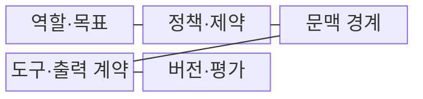
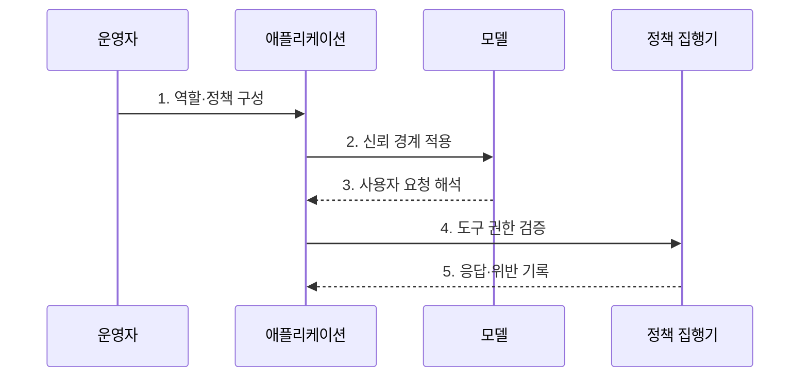

---
sidebar:
  order: 37
  label: "037. System Prompt (시스템 프롬프트)"
  badge:
    text: "기출 · 50%"
    variant: note
title: "System Prompt (시스템 프롬프트)"
date: "2026-07-27T23:59:59+09:00"
tags:
  - "notes-latest_tech"
weight: 37
extra:
  question_no: "037"
  source_status: "기출"
  source_history: "137회, 138회"
  priority: 50
  priority_note: "최상위 지시와 보안 경계가 중요"
---

## 미리 알고가기

- **시스템 프롬프트(System Prompt)**: 관리자가 상담원 책상에 공통 업무 지침을 놓듯 모델의 역할·정책·출력 방식을 모든 요청보다 먼저 설정하는 상위 지시
- **사용자 프롬프트(User Prompt)**: 사용자가 현재 처리할 과업·질문·데이터를 전달하는 요청별 입력
- **지시 계층(Instruction Hierarchy)**: 서로 충돌하는 지시를 메시지의 권한 순서에 따라 해석하는 우선순위 체계
- **신뢰 경계(Trust Boundary)**: 운영자가 작성한 지시와 외부에서 들어온 비신뢰 데이터를 구분하는 논리적 경계
- **프롬프트 인젝션(Prompt Injection)**: 외부 입력에 악성 지시를 섞어 모델의 기존 지시를 무시하거나 우회하도록 유도하는 공격
- **프롬프트 유출(Prompt Leakage)**: 숨겨 둔 시스템 지시나 민감한 문맥이 응답으로 노출되는 현상
- **신원·접근 관리(Identity and Access Management, IAM)**: 모델 밖에서 사용자와 도구의 접근 권한을 검증하고 집행하는 체계
- **회귀 시험(Regression Test)**: 프롬프트나 모델을 변경한 뒤 기존 정책 위반이 다시 발생하지 않는지 반복 확인하는 시험

## Ⅰ. 개요

- 정의/개념: **모델 역할·정책·출력 계약**을 설정하는 상위 지시
- 배경/필요성: 요청별 입력과 분리된 **공통 행동 경계** 설정 필요

### 쉽게 이해하기 (학습용)

- 상담원이 손님 요청을 받기 전에 회사 업무 지침을 먼저 읽듯, 시스템 프롬프트는 모델의 공통 역할과 금지 행동을 사용자 요청보다 앞서 정함

## Ⅱ. 특징

- **지시 계층**에 따른 하위 입력의 충돌 조정
- 비신뢰 데이터와 지시를 분리하는 **문맥 경계**
- 모델 지시와 **IAM·도구 권한**의 외부 집행 분리

### 쉽게 이해하기 (학습용)

- 사내 규정 안내문이 시스템 프롬프트라면 출입문 잠금장치는 IAM이므로, 문구가 행동을 안내해도 실제 권한은 별도 장치가 막아야 함

## Ⅲ. 구조 및 구성요소

| 구성요소 | 책임 |
|:---|:---|
| **역할·목표** | 모델의 **업무 범위·대상 사용자** 정의 |
| **정책·제약** | **금지·거부·안전 기준** 명시 |
| **문맥 경계** | **신뢰 지시·비신뢰 데이터** 구분 |
| **도구·출력 계약** | 허용 도구와 **출력 스키마** 제한 |
| **버전·평가** | 프롬프트·모델·**평가셋 추적** |

### 쉽게 이해하기 (학습용)

- 업무 설명서의 역할·금지 규정·자료 구역·사용 도구·개정 이력이 각각 구성요소에 대응해 하나의 모델 행동 계약을 이룸

## Ⅳ. 흐름도

1. **역할·정책 구성**: 서비스 공통 **행동 계약** 확정
2. **신뢰 경계 적용**: 지시와 외부 데이터의 **권한 분리**
3. **사용자 요청 해석**: 지시 계층에 따른 **충돌 해소**
4. **도구 권한 검증**: 모델 밖 **IAM·승인 정책** 집행
5. **응답·위반 기록**: 유출·우회 징후의 **회귀 탐지**

### 쉽게 이해하기 (학습용)

- 운영자가 규정을 등록하면 애플리케이션이 지시와 자료를 나누고, 모델의 요청 해석 뒤 정책 집행기가 실제 도구 권한을 확인해 결과를 기록함

## Ⅴ. 종류 및 비교

| 프롬프트 구분 | 시스템 프롬프트 | 사용자 프롬프트 |
|:---|:---|:---|
| 적용 기준 | **서비스 공통 지시** | **요청별 가변 지시** |
| 핵심 특징 | 상위 **역할·정책** 설정 | 현재 **과업·데이터** 전달 |
| 한계 | **유출·우회** 가능 | 상위 정책 변경 불가 |

### 쉽게 이해하기 (학습용)

- 시스템 프롬프트는 모든 상담에 적용되는 회사 규정이고 사용자 프롬프트는 지금 접수한 민원이지만, 둘 다 모델 안에서 처리되는 텍스트임

## Ⅵ. 실무 고려사항 및 대책

| 고려사항 | 대책 | 효과 |
|:---|:---|:---|
| 프롬프트 인젝션 | **비신뢰 입력**을 데이터 영역으로 격리 | **상위 지시 변조** 차단 |
| 비밀 유출 | 프롬프트에서 비밀 제거·**외부 저장소** 사용 | **원문 노출 범위** 축소 |
| 권한 우회 | **IAM·도구 허용 목록**과 승인 적용 | **위험 실행** 차단 |
| 변경 회귀 | 버전 고정·**공격 평가셋** 회귀 시험 | 정책 위반 조기 발견 |

### 쉽게 이해하기 (학습용)

- 안내문에 금고 비밀번호를 적지 않고 출입 권한은 잠금장치가 확인하며, 문구를 바꿀 때마다 공격 질문으로 다시 시험해야 함

## Ⅶ. 결론

- **지시 계층·문맥 경계**로 행동을 정하고 **IAM·도구 정책**으로 권한을 집행하는 이중 통제 선택

### 쉽게 이해하기 (학습용)

- 모델에는 행동 지침을 주고 실제 문을 여는 권한은 외부 통제에 맡겨야 지시 우회가 곧 위험 실행으로 이어지지 않음
