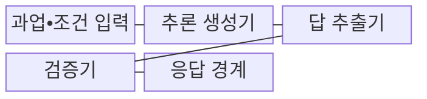
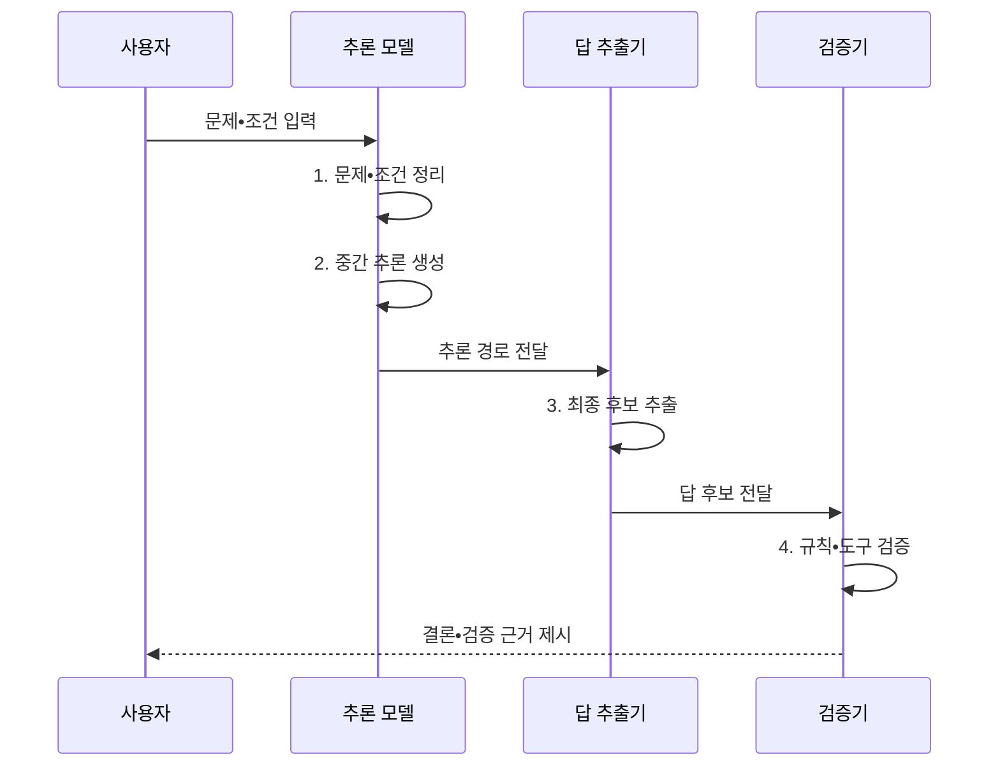

---
sidebar:
  order: 38
  label: "038. Chain-of-Thought (단계 추론)"
  badge:
    text: "기출 • 60%"
    variant: note
title: "Chain-of-Thought (단계 추론)"
date: "2026-08-04T14:42:00+09:00"
tags:
  - "notes-latest_tech"
weight: 38
extra:
  question_no: "038"
  source_status: "기출"
  source_history: "138회"
  priority: 60
  priority_note: "단계 추론과 오류 전파 분석이 핵심"
---

## Ⅰ. 개요

핵심 용어

- **사고 사슬(Chain-of-Thought, CoT)**: 복합 문제의 중간 추론 단계를 순서대로 생성하여 최종 답을 도출하는 방식이다.
- **순차 추론(Sequential Reasoning)**: 앞 단계의 부분 결과를 다음 단계의 입력으로 이어 답을 만드는 과정이다.

- 정의/개념: 복합 문제를 중간 추론 단계로 분해하고 단계 결과를 연결해 최종 답을 도출하는 **CoT**
- 배경/필요성: 직접 응답만으로는 **조건 누락•중간 오류 위치 식별 곤란**

#### 한줄 요약

- 어려운 계산의 답만 적지 않고 중간 식을 차례로 남기면 어느 단계에서 조건이나 계산이 틀렸는지 확인할 수 있음

## Ⅱ. 특징

핵심 용어

- **자기 일관성(Self-Consistency)**: 여러 추론 경로를 생성하고 반복해서 나온 답이나 합의 결과를 선택하는 기법이다.
- **비충실성(Unfaithfulness)**: 모델이 생성한 설명이 실제 답을 선택한 내부 근거와 일치한다고 보장할 수 없는 성질이다.
- **오류 전파**: 중간 단계의 잘못된 부분 결과가 뒤 단계의 입력으로 이어져 최종 답까지 왜곡하는 현상이다.

- 부분 문제를 잇는 **순차 추론** 으로 복합 조건 분해
- **자기 일관성**: 여러 추론 경로의 합의 답 선택
- **오류 보정**: 검증기로 잘못된 부분 결과 차단
- 생성 설명과 실제 판단 근거가 다를 수 있는 **비충실성**

#### 한줄 요약

- 풀이 노트가 길어도 실제로 답을 고른 근거와 다를 수 있으므로, 중간 단계를 읽는 것과 정답을 검산하는 일을 구분해야 함

## Ⅲ. 구조 및 구성요소

핵심 용어

- **답 추출기**: 생성된 추론 설명에서 최종 답 후보를 분리해 검증기로 전달하는 구성요소다.
- **검증기(Verifier)**: 규칙•계산기•검색 결과로 후보 답의 타당성을 별도로 확인하는 장치다.
- **응답 경계**: 내부 추론 전체 대신 검증된 결론과 필요한 근거만 사용자에게 노출하는 경계다.

| 구성요소 | 책임 |
|:---|:---|
| **과업•조건 입력** | 목표•제약•**성공 기준** 제공 |
| **추론 생성기** | 순서화된 **중간 단계** 생성 |
| **답 추출기** | 추론에서 **최종 후보** 분리 |
| **검증기** | 규칙•계산•검색 기반 **후보 확인** |
| **응답 경계** | 검증된 **결론•근거** 만 노출 |

#### 한줄 요약

- 문제지가 조건을 주고 풀이자가 중간 식을 만든 뒤 답만 골라 검산기에 넘기며, 응답 경계는 확인된 결론과 근거만 밖으로 내보냄

## Ⅳ. 흐름도

핵심 용어

- **조건 정리**: 목표•제약•성공 기준을 명시하여 추론에서 빠지는 조건을 줄이는 단계다.
- **독립 교차 확인**: 생성한 설명을 그대로 믿지 않고 계산•검색•규칙 같은 별도 수단으로 답 후보를 검증하는 절차다.

1. **문제•조건 정리**: 목표•제약 명시로 **조건 누락** 방지
2. **중간 추론 생성**: 부분 결과를 잇는 **단계 경로** 구성
3. **최종 후보 추출**: 추론 설명과 **답 후보** 분리
4. **규칙•도구 검증**: 계산•검색 기반 **독립 교차 확인**

#### 한줄 요약

- 문제 조건을 적고 중간 풀이를 만든 다음 답 후보만 떼어 계산기나 자료로 검산해 확인된 결론을 제시하는 순서임

## Ⅴ. 종류 및 비교

핵심 용어

- **직접 응답**: 중간 추론을 생성하지 않고 입력에서 바로 답을 만드는 방식이다.

| 응답 방식 | 직접 응답 | 사고 사슬 |
|:---|:---|:---|
| 적용 기준 | **단순•저위험 과업** | **다단계•검증 가능 과업** |
| 핵심 특징 | 중간 단계 없이 **답 생성** | **중간 추론** 후 답 추출 |
| 한계 | **복합 조건 누락** | 토큰 비용•**비충실성** |

#### 한줄 요약

- 단순 질문은 바로 답하는 편이 효율적이고 여러 조건을 잇는 문제는 중간 풀이와 검산을 두는 편이 오류를 찾기 쉬움

## Ⅵ. 실무 고려사항 및 대책

핵심 용어

- **토큰 예산**: 추론과 응답 생성에 사용할 수 있는 토큰 수의 상한이다.
- **조기 종료(Early Stopping)**: 충분한 품질을 얻거나 예산 한계에 도달하면 추가 추론을 멈추는 제어다.
- **경로 편향**: 초기 접근이나 하나의 추론 경로에 과도하게 의존하여 다른 해법과 오류 가능성을 놓치는 현상이다.

| 문제 | 대책 | 효과 |
|:---|:---|:---|
| **그럴듯한 중간 오류** | 계산기•규칙•검색 기반 **독립 검증** | **오답 전파** 감소 |
| **민감정보 노출** | 결론과 **검증 근거** 만 공개 | **정보 노출** 축소 |
| **토큰•지연 증가** | **토큰 예산•조기 종료** 적용 | **응답 비용** 통제 |
| **경로 편향** | 다중 경로•**자기 일관성** 비교 | **단일 경로 의존** 완화 |

#### 한줄 요약

- 풀이를 길게 쓰게 하기보다 계산기로 검산하고 필요한 근거만 공개하며, 쉬운 문제는 일찍 멈춰 시간과 비용을 아껴야 함

## Ⅶ. 결론

핵심 용어

- **외부 검증**: 생성 설명의 비충실성을 통제하도록 규칙•계산•검색으로 답 후보를 별도 확인하는 절차다.

- **과업 난도•검증 가능성** 으로 CoT 적용 여부를 정하고 **외부 검증** 으로 생성 설명의 비충실성 통제

#### 한줄 요약

- 복잡하고 검산 가능한 문제에만 중간 풀이를 사용하고, 풀이의 말솜씨가 아니라 별도 검사 결과로 답을 믿어야 함
