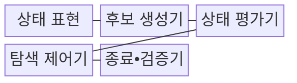
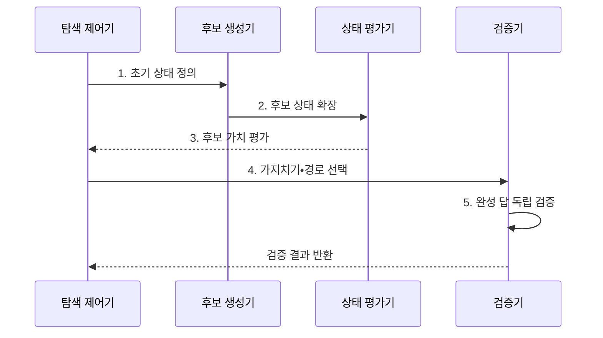

---
sidebar:
  order: 39
  label: "039. Tree-of-Thought (탐색 추론)"
  badge:
    text: "기출 • 50%"
    variant: note
title: "Tree-of-Thought (탐색 추론)"
date: "2026-08-04T14:48:00+09:00"
tags: ["notes-latest_tech"]
weight: 39
extra:
  question_no: "039"
  source_status: "기출"
  source_history: "138회"
  priority: 50
  priority_note: "다중 경로 탐색은 추론 확장 기법"
---

## Ⅰ. 개요

핵심 용어

- **사고 트리(Tree of Thoughts, ToT)**: 여러 사고 상태를 분기•평가•가지치기하며 대안 해법을 탐색하는 방식이다.
- **사고 상태(Thought State)**: 부분 해•제약 조건•남은 목표를 함께 표현한 탐색 시점의 상태다.

- 정의/개념: 여러 사고 상태를 탐색 트리로 분기하고 후보를 평가•가지치기해 해법을 찾는 **ToT**
- 배경/필요성: 단일 경로는 **초기 선택 오류•대안 누락의 회복 곤란**

#### 한줄 요약

- 한 길만 끝까지 가는 대신 여러 갈림길을 후보로 남겨 두면 막힌 길에서 돌아와 다른 해법을 계속 찾을 수 있음

## Ⅱ. 특징

핵심 용어

- **너비 우선 탐색(Breadth-First Search, BFS)**: 같은 깊이의 후보 상태를 먼저 탐색하여 다양한 대안을 유지하는 방식이다.
- **깊이 우선 탐색(Depth-First Search, DFS)**: 한 후보 경로를 깊게 탐색한 뒤 막히면 이전 분기로 돌아오는 방식이다.
- **빔 탐색(Beam Search)**: 각 깊이에서 평가 점수가 높은 후보를 정해진 폭만큼 유지하는 방식이다.
- **백트래킹(Backtracking)**: 현재 경로가 막혔을 때 저장한 이전 분기로 돌아가 다른 후보를 선택하는 동작이다.

- 복수 사고 상태의 **분기•평가•가지치기**
- **BFS**: 같은 깊이의 후보를 우선 탐색
- **DFS**: 한 후보 경로를 깊게 탐색
- **빔 탐색**: 점수가 높은 후보를 정해진 폭만큼 유지
- **백트래킹**: 실패 시 저장한 이전 분기로 복귀

#### 한줄 요약

- 미로의 갈림길을 여러 개 열어 두되 탐색 폭과 깊이를 제한하고, 막힌 길에서는 저장한 갈림길로 돌아가야 탐색이 끝없이 커지지 않음

## Ⅲ. 구조 및 구성요소

핵심 용어

- **후보 생성기**: 현재 사고 상태에서 가능한 다음 부분 해나 행동 분기를 생성하는 구성요소다.
- **상태 평가기(State Evaluator)**: 후보의 목표 기여도와 제약 위반 정도를 점수화하는 장치다.
- **탐색 제어기**: 탐색 방식•빔 폭•최대 깊이•예산을 적용하여 유지할 후보를 관리한다.

| 구성요소 | 책임 |
|:---|:---|
| **상태 표현** | 부분 해•제약•**잔여 목표** 보존 |
| **후보 생성기** | 현재 상태별 **다음 분기** 생성 |
| **상태 평가기** | 후보 가치•**제약 위반** 점수화 |
| **탐색 제어기** | **BFS•DFS•빔 탐색 예산 관리** |
| **종료•검증기** | 완성 후보의 **정답•근거** 확인 |

#### 한줄 요약

- 미로 지도는 상태를 기록하고 길잡이는 후보 길을 만들며 심사표가 길의 가치를 매긴 뒤, 탐색 제어기와 검증기가 남길 길과 최종 출구를 결정함

## Ⅳ. 흐름도

핵심 용어

- **가지치기(Pruning)**: 평가 기준에 미달한 후보 분기를 탐색 대상에서 제거하여 비용을 줄이는 동작이다.
- **유지 집합**: 평가와 탐색 예산을 통과하여 다음 깊이에서 계속 확장할 후보들의 집합이다.
- **독립 검증**: 탐색 점수와 다른 규칙•시뮬레이터로 완성 답의 실제 타당성을 확인하는 절차다.

1. **초기 상태 정의**: 목표•제약•**종료 조건** 고정
2. **후보 상태 확장**: 현재 상태별 **다음 사고** 생성
3. **후보 가치 평가**: 가치와 **제약 위반** 점수화
4. **가지치기•경로 선택**: 탐색 방식•예산으로 **유지 집합** 결정
5. **완성 답 독립 검증**: 탐색 점수와 **정답 판정** 분리

#### 한줄 요약

- 출발 조건에서 후보 길을 만들고 점수를 매겨 낮은 길을 버린 뒤, 남은 길의 완성 답을 탐색 점수와 다른 기준으로 다시 확인함

## Ⅴ. 종류 및 비교

핵심 용어

- **사고 사슬(Chain-of-Thought, CoT)**: 하나의 중간 추론 경로를 순서대로 이어 답을 생성하는 방식이다.

| 추론 방식 | 사고 사슬 | 사고 트리 |
|:---|:---|:---|
| 적용 기준 | **단일 풀이** 로 충분 | 대안 비교•**오류 회복** 필요 |
| 핵심 특징 | **선형 중간 경로** 생성 | 분기•평가•**가지치기** |
| 한계 | 초기 오류 회복 제한 | **평가•탐색 비용** 증가 |

#### 한줄 요약

- 사고 사슬은 한 풀이를 이어 가고 사고 트리는 여러 풀이를 비교하므로, 대안 회복의 이득이 탐색 비용보다 클 때 트리가 적합함

## Ⅵ. 실무 고려사항 및 대책

핵심 용어

- **분기 폭발**: 깊이마다 후보가 늘어나 탐색 상태와 연산 비용이 기하급수적으로 증가하는 현상이다.
- **평가기 편향**: 상태 평가기가 특정 형태의 후보에 일관되게 잘못된 점수를 부여해 유망한 경로를 제거하는 문제다.
- **종료 조건**: 성공•정체•최대 깊이•예산 소진으로 탐색을 끝낼 시점을 정한 기준이다.

| 문제 | 대책 | 효과 |
|:---|:---|:---|
| **분기 폭발** | **빔 폭•최대 깊이** 와 예산 상한 | **탐색 비용** 제한 |
| **평가기 편향** | 규칙•시뮬레이터 기반 **교차 검증** | 유망 경로의 **오제거 완화** |
| **국소 점수 과적합** | 완성 답 **독립 검증** | **고득점 오답** 차단 |
| **종료 불명확** | 성공•정체•**예산 소진** 조건 | **무한 탐색 방지** |

#### 한줄 요약

- 길을 너무 많이 열지 않도록 폭과 깊이를 정하고, 심사표가 좋은 점수를 준 출구도 실제 목적지인지 별도로 확인해야 함

## Ⅶ. 결론

핵심 용어

- **빔 폭•깊이**: 각 단계에서 유지할 후보 수와 최대 탐색 단계를 제한하여 비용을 통제하는 값이다.

- **대안 가치•평가기 신뢰도** 가 충분하면 ToT를 적용하고 **빔 폭•깊이** 로 통제

#### 한줄 요약

- 여러 길을 볼 가치와 길을 고르는 기준이 충분할 때만 사고 트리를 쓰고, 탐색 범위와 멈출 조건을 먼저 정해야 함
