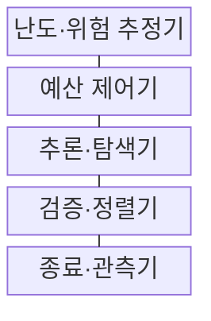
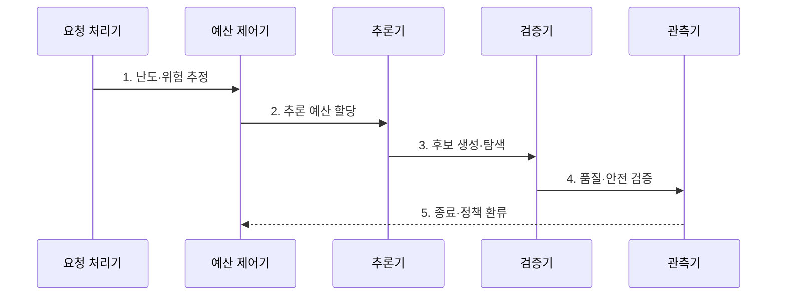

---
sidebar:
  order: 40
  label: "040. Test-Time Compute (테스트 타임 컴퓨트)"
  badge:
    text: "기출 · 70%"
    variant: note
title: "Test-Time Compute (테스트 타임 컴퓨트)"
date: "2026-07-27T23:59:59+09:00"
tags: ["notes-latest_tech"]
weight: 40
extra:
  question_no: "040"
  source_status: "기출"
  source_history: "138회"
  priority: 70
  priority_note: "추론 예산 확대가 최신 모델 경쟁축"
---

## 미리 알고가기

- **테스트 시점 연산(Test-Time Compute)**: 시험에서 쉬운 문제는 즉답하고 어려운 문제에는 풀이·검산 시간을 더 쓰듯 요청별 추론 예산을 조절하는 접근
- **추론 예산(Inference Budget)**: 한 요청에서 사용할 토큰·후보·도구 호출·시간의 상한
- **한계효용(Marginal Utility)**: 연산을 한 단위 더 투입할 때 추가로 얻는 품질 이득
- **조기 종료(Early Stopping)**: 품질이 충분하거나 추가 이득이 작아지면 남은 연산을 중단하는 제어
- **서비스 수준 목표(Service Level Objective, SLO)**: 지연·가용성처럼 서비스가 달성해야 할 운영 목표
- **P95(95th Percentile)**: 전체 요청 중 95%가 이 값 이하에 포함되는 지연 경계
- **처리량(Throughput)**: 단위 시간에 처리할 수 있는 요청 수
- **검증기(Verifier)**: 규칙·모델·실행 환경으로 후보 답의 품질과 안전성을 평가하는 장치

## Ⅰ. 개요

- 정의/개념: 추론 시 **생성·탐색·검증 예산**을 늘려 답의 품질을 높이는 접근
- 배경/필요성: 고정 예산의 문제별 **품질·지연·비용** 조정 한계

### 쉽게 이해하기 (학습용)

- 모든 문제에 같은 시간을 쓰지 않고 어려운 문제에 풀이와 검산 시간을 더 배정하면 모델을 다시 학습하지 않고도 답의 품질을 높일 수 있음

## Ⅱ. 특징

> 파란 품질 곡선의 기울기가 예산 증가와 함께 완만해져 추가 연산의 이득이 줄어들며, 정규화한 개념 좌표이지 실측값은 아니다.

- 토큰·후보·검증 횟수의 **추론 예산 확장**
- 난도·위험별 **동적 예산 배정·조기 종료**
- 추가 연산의 **품질 한계효용**과 지연·비용 상충

### 쉽게 이해하기 (학습용)

- 검산 시간을 늘릴수록 새로 고치는 답은 줄지만 대기 줄은 길어지므로, 문제 난도에 따라 계산을 더 할 지점과 멈출 지점을 정해야 함

## Ⅲ. 구조 및 구성요소

| 구성요소 | 책임 |
|:---|:---|
| **난도·위험 추정기** | 복잡도·불확실성·**영향도** 산정 |
| **예산 제어기** | 토큰·후보·시간·**비용 상한** 할당 |
| **추론·탐색기** | 전략별 **복수 후보** 생성 |
| **검증·정렬기** | 품질·안전 기준으로 **후보 평가** |
| **종료·관측기** | 통과·정체·초과 판정과 **결과 기록** |

### 쉽게 이해하기 (학습용)

- 문제의 난도와 위험을 재는 계기가 계산 시간표를 정하고, 풀이자와 검산기가 후보를 평가하면 관측기가 더 풀지 멈출지 결정함

## Ⅳ. 흐름도

### 동작 원리

1. **난도·위험 추정**: 복잡도·불확실성·**영향도** 산정
2. **추론 예산 할당**: 토큰·시간·후보의 **상한 설정**
3. **후보 생성·탐색**: 과업별 **추론 전략** 선택
4. **품질·안전 검증**: 임계값·제약 기반 **후보 판정**
5. **종료·정책 환류**: 통과·정체·초과 기록과 **예산 보정**

### 쉽게 이해하기 (학습용)

- 문제 난도에 맞춰 풀이 시간을 배정하고 후보를 검산한 뒤, 품질이 충분하거나 시간이 다 되면 멈춘 기록으로 다음 배정 기준을 고침

## Ⅴ. 종류 및 비교

| 연산 확장 시점 | 학습 시점 연산 | 테스트 시점 연산 |
|:---|:---|:---|
| 적용 기준 | 반복 능력 **내재화** | 요청별 **가변 난도** 대응 |
| 핵심 특징 | 가중치 학습에 **연산 투자** | 생성·탐색·**검증 투자** |
| 한계 | 재학습 비용·주기 | 요청 지연·비용·**처리량 감소** |

### 쉽게 이해하기 (학습용)

- 학습 시점 연산은 시험 전에 실력을 키우는 공부이고 테스트 시점 연산은 문제마다 풀이 시간을 조절하는 방식임

## Ⅵ. 실무 고려사항 및 대책

| 고려사항 | 대책 | 효과 |
|:---|:---|:---|
| 난도 오판 | 불확실성·영향도 기반 **예산 등급화** | 고난도 예산 부족 완화 |
| 한계효용 감소 | 품질 증가 정체 시 **조기 종료** | 불필요 연산 절감 |
| 꼬리 지연 증가 | **P95 SLO·시간 상한** 적용 | 전체 처리량 보호 |
| 검증기 오류 | 규칙·환경 실행 기반 **교차 확인** | 고비용 오답 선택 방지 |

### 쉽게 이해하기 (학습용)

- 어려운 문제에 시간을 더 주되 품질이 멈추면 계산을 끝내고, 느린 일부 요청이 전체 대기 줄을 막지 않도록 시간 상한을 둬야 함

## Ⅶ. 결론

- **난도·위험·한계효용**으로 추론 예산을 배분하고 **P95 SLO·종료 임계값** 안에서 추가 연산 결정

### 쉽게 이해하기 (학습용)

- 더 오래 생각하게 하는 것보다 추가 검산의 이득이 비용보다 큰 문제에만 계산 예산을 쓰고 정해진 지연 안에서 멈추는 판단이 중요함
