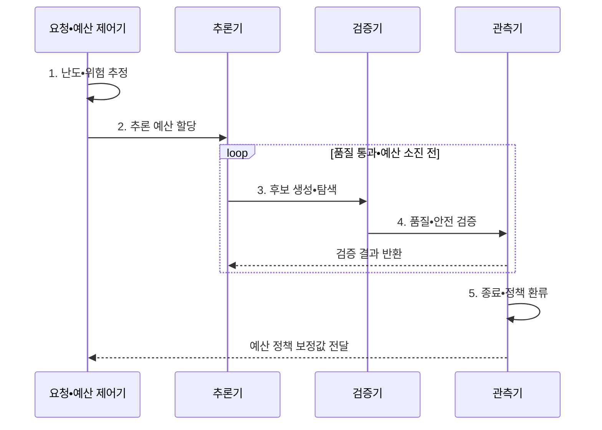

---
sidebar:
  order: 40
  label: "040. Test-Time Compute (테스트 타임 컴퓨트)"
  badge:
    text: "기출 • 70%"
    variant: note
title: "Test-Time Compute (테스트 타임 컴퓨트)"
date: "2026-08-04T13:44:13+09:00"
tags: ["notes-latest_tech"]
weight: 40
extra:
  question_no: "040"
  source_status: "기출"
  source_history: "138회"
  priority: 70
  priority_note: "추론 예산 확대가 최신 모델 경쟁축"
---

## Ⅰ. 개요

핵심 용어

- **테스트 시점 연산(Test-Time Compute)**: 요청 난도와 위험에 따라 생성•탐색•검증에 사용할 추론 자원을 조절하는 접근이다.
- **추론 예산(Inference Budget)**: 한 요청에서 사용할 토큰•후보•도구 호출•시간의 상한이다.

- 정의/개념: 모델 추론 중 생성•탐색•검증에 가변 연산 예산을 배분해 답의 품질을 높이는 **테스트 시점 연산**
- 배경/필요성: 고정 예산의 문제별 **품질•지연•비용** 조정 한계

#### 한줄 요약

- 모든 문제에 같은 시간을 쓰지 않고 어려운 문제에 풀이와 검산 시간을 더 배정하면 모델을 다시 학습하지 않고도 답의 품질을 높일 수 있음

## Ⅱ. 특징

핵심 용어

- **한계효용(Marginal Utility)**: 연산을 한 단위 더 투입할 때 추가로 얻는 품질 이득이다.
- **동적 예산 배정**: 요청의 난도•불확실성•영향도에 따라 서로 다른 추론 예산을 할당하는 방식이다.
- **조기 종료(Early Stopping)**: 품질이 충분하거나 추가 이득이 작아지면 남은 연산을 중단하는 제어다.

> 파란 품질 곡선의 기울기가 예산 증가와 함께 완만해져 추가 연산의 이득이 줄어들며, 정규화한 개념 좌표이지 실측값은 아니다.

- 토큰•후보•검증 횟수의 **추론 예산 확장**
- **동적 예산 배정**: 난도•위험별 추론 자원 할당
- **조기 종료**: 품질 정체나 예산 한계에서 연산 중단
- 추가 연산은 **품질 한계효용** 이 감소하고 지연•비용은 증가

#### 한줄 요약

- 검산 시간을 늘릴수록 새로 고치는 답은 줄지만 대기 줄은 길어지므로, 문제 난도에 따라 계산을 더 할 지점과 멈출 지점을 정해야 함

## Ⅲ. 구조 및 구성요소

핵심 용어

- **난도•위험 추정기**: 과업 복잡도•불확실성•오류 영향도를 평가하여 필요한 연산 수준을 정하는 구성요소다.
- **예산 제어기**: 요청별 토큰•시간•후보 수•도구 호출 상한을 정하고 집행하는 구성요소다.
- **추론•탐색기**: 배정된 예산 안에서 후보 풀이를 생성•분기•수정하는 구성요소다.
- **검증기(Verifier)**: 규칙•모델•실행 환경으로 후보 답의 품질과 안전성을 판정하는 장치다.
- **종료•관측기**: 품질 통과•개선 정체•예산 초과를 판정하고 실행 결과를 기록한다.

| 구성요소 | 책임 |
|:---|:---|
| **난도•위험 추정기** | 복잡도•불확실성•**영향도** 산정 |
| **예산 제어기** | 토큰•후보•시간•**비용 상한** 할당 |
| **추론•탐색기** | 전략별 **복수 후보** 생성 |
| **검증•정렬기** | 품질•안전 기준으로 **후보 평가** |
| **종료•관측기** | 통과•정체•초과 판정과 **결과 기록** |

#### 한줄 요약

- 문제의 난도와 위험을 재는 계기가 계산 시간표를 정하고, 풀이자와 검산기가 후보를 평가하면 관측기가 더 풀지 멈출지 결정함

## Ⅳ. 흐름도

핵심 용어

- **예산 등급**: 난도와 위험 범위별로 허용할 토큰•시간•후보•도구 호출 상한을 묶은 정책이다.
- **정책 환류**: 실제 품질•비용•지연 기록을 이용해 다음 요청의 예산 배정 기준을 보정하는 과정이다.

1. **난도•위험 추정**: 복잡도•불확실성•**영향도** 산정
2. **추론 예산 할당**: 토큰•시간•후보의 **상한 설정**
3. **후보 생성•탐색**: 과업별 **추론 전략** 선택
4. **품질•안전 검증**: 임계값•제약 기반 **후보 판정**
5. **종료•정책 환류**: 통과•정체•초과 기록과 **예산 보정**

#### 한줄 요약

- 문제 난도에 맞춰 풀이 시간을 배정하고 후보를 검산한 뒤, 품질이 충분하거나 시간이 다 되면 멈춘 기록으로 다음 배정 기준을 고침

## Ⅴ. 종류 및 비교

핵심 용어

- **학습 시점 연산**: 모델 가중치에 반복 능력을 내재화하도록 학습 과정에 연산을 투자한다.

| 연산 확장 시점 | 학습 시점 연산 | 테스트 시점 연산 |
|:---|:---|:---|
| 적용 기준 | 반복 능력 **내재화** | 요청별 **가변 난도** 대응 |
| 핵심 특징 | 가중치 학습에 **연산 투자** | 생성•탐색•**검증 투자** |
| 한계 | 재학습 비용•주기 | 요청 지연•비용•**처리량 감소** |

#### 한줄 요약

- 학습 시점 연산은 시험 전에 실력을 키우는 공부이고 테스트 시점 연산은 문제마다 풀이 시간을 조절하는 방식임

## Ⅵ. 실무 고려사항 및 대책

핵심 용어

- **서비스 수준 목표(Service Level Objective, SLO)**: 지연•가용성•처리량처럼 서비스가 달성해야 할 운영 목표다.
- **95백분위 지연(95th Percentile Latency, P95 Latency)**: 전체 요청의 95%가 이 값 이하에서 완료되는 꼬리 지연 경계다.
- **처리량(Throughput)**: 시스템이 단위 시간에 처리할 수 있는 요청 수다.

| 문제 | 대책 | 효과 |
|:---|:---|:---|
| **난도 오판** | 불확실성•영향도 기반 **예산 등급화** | 고난도 **예산 부족 완화** |
| **한계효용 감소** | 품질 증가 정체 시 **조기 종료** | **불필요 연산 절감** |
| **꼬리 지연 증가** | **P95 지연•SLO•시간 상한** 적용 | **전체 처리량 보호** |
| **검증기 오류** | 규칙•환경 실행 기반 **교차 확인** | 고비용 **오답 선택 방지** |

#### 한줄 요약

- 어려운 문제에 시간을 더 주되 품질이 멈추면 계산을 끝내고, 느린 일부 요청이 전체 대기 줄을 막지 않도록 시간 상한을 둬야 함

## Ⅶ. 결론

핵심 용어

- **위험 기반 예산 배정**: 오류 영향과 불확실성이 큰 문제에만 추가 추론•검증 자원을 집중한다.
- **한계효용 종료**: 추가 품질 이득이 비용보다 작아지거나 P95 지연 SLO에 도달하면 추론을 멈춘다.

- **난도•위험** 으로 예산을 배분하고 **P95 지연•SLO** 안에서 한계효용 기준 종료

#### 한줄 요약

- 더 오래 생각하게 하는 것보다 추가 검산의 이득이 비용보다 큰 문제에만 계산 예산을 쓰고 정해진 지연 안에서 멈추는 판단이 중요함
