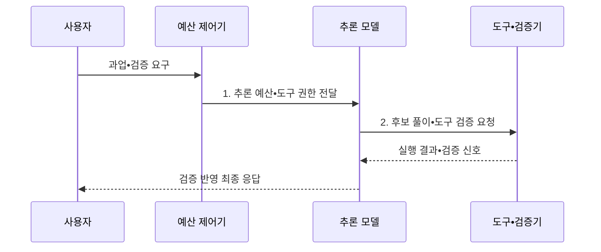

---
sidebar:
  order: 41
  label: "041. Reasoning LLM (추론 특화 LLM)"
  badge:
    text: "기출 • 80%"
    variant: note
title: "Reasoning LLM (추론 특화 LLM)"
date: "2026-08-04T14:58:00+09:00"
tags:
  - "notes-latest_tech"
weight: 41
extra:
  question_no: "041"
  source_status: "기출"
  source_history: "138회"
  priority: 80
  priority_note: "추론 모델 구조•학습이 최신 출제축"
---

## Ⅰ. 개요

핵심 용어

- **추론 특화 대규모 언어 모델(Reasoning Large Language Model, Reasoning LLM)**: 후학습과 테스트 시점 연산으로 복합 문제를 여러 단계로 해결하고 결과를 검증하는 능력을 강화한 모델이다.
- **후학습(Post-training)**: 사전학습 모델의 응답 행동을 과업 예시•선호•보상으로 추가 조정하는 학습 단계다.

- 정의/개념: 후학습과 테스트 시점 연산으로 다단계 문제 해결•검증 능력을 강화한 **Reasoning LLM**
- 배경/필요성: 즉시 생성 중심 모델은 복합 문제의 **단계별 해결•도구 결과 검증** 에 취약

#### 한줄 요약
- 문제 난도에 따라 풀이 시간과 도구를 배정하고 검증을 통과한 답을 선택함

## Ⅱ. 특징

핵심 용어

- **지도 미세조정(Supervised Fine-Tuning, SFT)**: 정답과 풀이 예시를 학습하여 응답 형식과 문제 해결 행동을 조정하는 방법이다.
- **검증 가능 보상 강화학습(Reinforcement Learning with Verifiable Rewards, RLVR)**: 정답•코드 실행처럼 자동 판정 가능한 결과를 보상으로 사용해 해결 정책을 개선하는 학습이다.
- **테스트 시점 연산(Test-Time Compute, TTC)**: 요청 처리 중 추론 토큰•시간•도구 사용량을 추가 배정하는 방식이다.

- **SFT**: 정답•풀이 예시로 응답 행동 조정
- **RLVR**: 자동 판정 가능한 보상으로 해결 정책 강화
- **TTC**: 요청 난도에 따라 추론 예산 조절
- 정답•코드 실행•도구 결과를 활용한 **검증 가능 출력 선택**

#### 한줄 요약
- 모든 질문을 오래 처리하지 않고 검증 이득이 큰 문제에 추론 자원을 집중함

## Ⅲ. 구조 및 구성요소

핵심 용어

- **기반 모델**: 언어•코드•지식의 사전학습 표현을 후학습과 추론 계층에 제공하는 모델이다.
- **추론 후학습**: 풀이•검증 데이터와 보상으로 다단계 문제 해결 정책을 강화하는 학습 단계이다.
- **예산 제어기**: 요청 난도에 따라 토큰•시간•도구 사용의 상한을 배정하는 구성요소다.
- **검증기(Verifier)**: 계산•실행•검색 결과와 형식 규칙으로 후보 답의 타당성을 판정한다.
- **응답 통제**: 검증 결과•정책•출력 계약을 적용해 최종 답변의 공개 범위와 형식을 결정하는 계층이다.

| 구성요소 | 책임 |
|:---|:---|
| 기반 모델 | 언어•코드•지식의 **사전학습 표현 제공** |
| 추론 후학습 | **SFT•RLVR 기반 문제 해결 정책 조정** |
| 예산 제어기 | 난도별 토큰•시간•도구 **사용 상한 배정** |
| 도구•검증기 | 계산•실행•검색 결과의 **정확성 판정** |
| 응답 통제 | 검증 결과와 안전 정책에 따른 **최종 출력 선택** |

#### 한줄 요약
- 기반 모델에 추론 훈련, 자원 조절, 도구 검증, 출력 통제를 연결함

## Ⅳ. 흐름도

핵심 용어

- **도구 권한**: 모델이 문제 해결 중 요청할 수 있는 외부 기능•자원•인자의 허용 범위다.
- **검증 신호**: 후보 풀이의 계산•코드•검색 결과가 기준을 통과했는지 모델에 돌려주는 정보다.

1. **추론 예산•도구 권한 전달**: 품질 이득•비용 한도별 **사용 자원** 설정
2. **후보 풀이•도구 검증 요청**: 단계별 해결안의 **외부 실행 검증**

#### 한줄 요약
- 문제를 분류해 자원을 정하고 도구로 확인한 결과를 답에 반영함

## Ⅴ. 종류 및 비교

핵심 용어

- **일반 대화 대규모 언어 모델(General Conversational Large Language Model, General Conversational LLM)**: 낮은 테스트 시점 연산으로 단순•지연 민감 요청에 즉시 응답하는 모델이다.

| 비교 기준 | 일반 대화 LLM | 추론 특화 LLM |
|:---|:---|:---|
| 적용 기준 | 단순•지연 민감 응답 | 복합•검증 가능 과업 |
| 핵심 특징 | 낮은 시험 시점 연산의 **즉시 생성** | 가변 연산 기반 **다단계 해결•검증** |
| 한계 | 복합 추론•도구 오류 | 높은 지연•연산 비용 |

#### 한줄 요약
- 빠른 응답과 더 많은 계산을 사용한 검증형 응답의 차이임

## Ⅵ. 실무 고려사항 및 대책

핵심 용어

- **모델 라우팅**: 과업 난도와 지연•비용 기준으로 일반 모델과 추론 모델 중 처리 경로를 선택하는 방식이다.
- **중간 결과 검증**: 장기 추론의 부분 계산과 도구 결과를 단계별로 확인하여 오류 누적을 줄이는 절차다.
- **격리 실행**: 모델이 만든 코드나 도구 요청을 제한된 환경에서 실행하여 부작용 범위를 줄이는 통제다.

| 문제 | 대책 | 효과 |
|:---|:---|:---|
| 단순 요청의 **과도한 추론 비용** | 난도 분류 후 일반•추론 모델 라우팅 | 지연•비용 **절감** |
| 장기 추론의 **오류 누적** | 중간 결과 검증•실행 가능한 도구 연결 | 최종 답안의 **정확성 향상** |
| 도구 호출의 **권한•부작용 위험** | 최소 권한•인자 검증•격리 실행 적용 | 비인가 작업과 피해 **방지** |

#### 한줄 요약
- 추론 자원과 도구 권한을 제한하고 실제 업무 문제로 효과를 검증함

## Ⅶ. 결론

핵심 용어

- 단순•지연 민감 요청에는 **일반 대화 LLM**, 복합•검증 가능 과업에는 **Reasoning LLM** 선택

#### 한줄 요약
- 검증 이득이 비용보다 큰 복합 문제에만 추론 모델을 적용함
