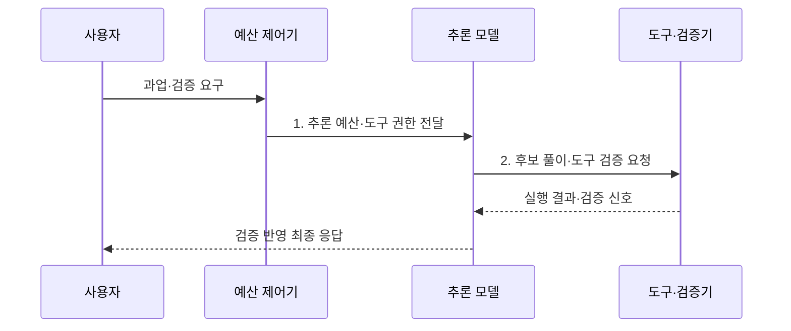

---
sidebar:
  order: 41
  label: "041. Reasoning LLM (추론 특화 LLM)"
  badge:
    text: "기출 · 80%"
    variant: note
title: "Reasoning LLM (추론 특화 LLM)"
date: "2026-07-31T08:34:13+09:00"
tags:
  - "notes-latest_tech"
weight: 41
extra:
  question_no: "041"
  source_status: "기출"
  source_history: "138회"
  priority: 80
  priority_note: "추론 모델 구조·학습이 최신 출제축"
---

## 미리 알고가기

- **추론 특화 대규모 언어모델(Reasoning Large Language Model)**: 복합 문제를 여러 단계로 해결하고 결과를 검증하도록 후학습한 언어 모델
- **강화학습(Reinforcement Learning, RL)**: 모델의 응답에 부여한 보상을 기준으로 문제 해결 정책을 개선하는 학습법
- **검증 가능 보상 강화학습(Reinforcement Learning with Verifiable Rewards, RLVR)**: 정답·코드 실행처럼 자동 판정 가능한 결과를 보상으로 사용하는 강화학습
- **지도 미세조정(Supervised Fine-Tuning, SFT)**: 정답과 풀이 예시를 학습하여 응답 형식과 행동을 조정하는 방법
- **시험 시점 연산(Test-Time Compute, TTC)**: 학습이 끝난 모델이 요청을 처리할 때 추론 토큰·시간·도구 사용량을 추가로 배정하는 방식
- **검증기(Verifier)**: 계산 결과·코드 실행·형식 규칙을 검사하여 후보 답안의 타당성을 판정하는 구성요소

## Ⅰ. 개요

- 정의/개념: **추론 특화 LLM**은 후학습과 시험 시점 연산으로 다단계 문제 해결·검증 능력을 강화한 언어 모델
- 배경/필요성: 즉시 생성 중심 모델은 복합 문제의 **단계별 해결·도구 결과 검증**에 취약

### 쉽게 이해하기 (학습용)
- 문제 난도에 따라 풀이 시간과 도구를 배정하고 검증을 통과한 답을 선택함

## Ⅱ. 특징

- SFT·RLVR 후학습에 의한 **다단계 문제 해결 정책 강화**
- 요청 난도에 따른 **시험 시점 연산 예산 조절**
- 정답·코드 실행·도구 결과를 활용한 **검증 가능 출력 선택**

### 쉽게 이해하기 (학습용)
- 모든 질문을 오래 처리하지 않고 검증 이득이 큰 문제에 추론 자원을 집중함

## Ⅲ. 구조 및 구성요소

| 구성요소 | 책임 |
|:---|:---|
| 기반 모델 | 언어·코드·지식의 **사전학습 표현 제공** |
| 추론 후학습 | SFT·RLVR로 **문제 해결 정책 조정** |
| 예산 제어기 | 난도별 토큰·시간·도구 **사용 상한 배정** |
| 도구·검증기 | 계산·실행·검색 결과의 **정확성 판정** |
| 응답 통제 | 검증 결과와 안전 정책에 따른 **최종 출력 선택** |

### 쉽게 이해하기 (학습용)
- 기반 모델에 추론 훈련, 자원 조절, 도구 검증, 출력 통제를 연결함

## Ⅳ. 흐름도

1. **추론 예산·도구 권한 전달**: 품질 이득·비용 한도별 **사용 자원** 설정
2. **후보 풀이·도구 검증 요청**: 단계별 해결안의 **외부 실행 검증**

### 쉽게 이해하기 (학습용)
- 문제를 분류해 자원을 정하고 도구로 확인한 결과를 답에 반영함

## Ⅴ. 종류 및 비교

| 비교 기준 | 일반 대화 LLM | 추론 특화 LLM |
|:---|:---|:---|
| 적용 기준 | 단순·지연 민감 응답 | 복합·검증 가능 과업 |
| 핵심 특징 | 낮은 시험 시점 연산의 **즉시 생성** | 가변 연산 기반 **다단계 해결·검증** |
| 한계 | 복합 추론·도구 오류 | 높은 지연·연산 비용 |

### 쉽게 이해하기 (학습용)
- 빠른 응답과 더 많은 계산을 사용한 검증형 응답의 차이임

## Ⅵ. 실무 고려사항 및 대책

| 고려사항 | 대책 | 효과 |
|:---|:---|:---|
| 단순 요청의 **과도한 추론 비용** | 난도 분류 후 일반·추론 모델 라우팅 | 지연·비용 **절감** |
| 장기 추론의 **오류 누적** | 중간 결과 검증·실행 가능한 도구 연결 | 최종 답안의 **정확성 향상** |
| 도구 호출의 **권한·부작용 위험** | 최소 권한·인자 검증·격리 실행 적용 | 비인가 작업과 피해 **방지** |

### 쉽게 이해하기 (학습용)
- 추론 자원과 도구 권한을 제한하고 실제 업무 문제로 효과를 검증함

## Ⅶ. 결론

- 단순·지연 민감 요청은 **일반 LLM**, 복합·검증 가능 과업은 **추론 LLM** 선택

### 쉽게 이해하기 (학습용)
- 검증 이득이 비용보다 큰 복합 문제에만 추론 모델을 적용함
