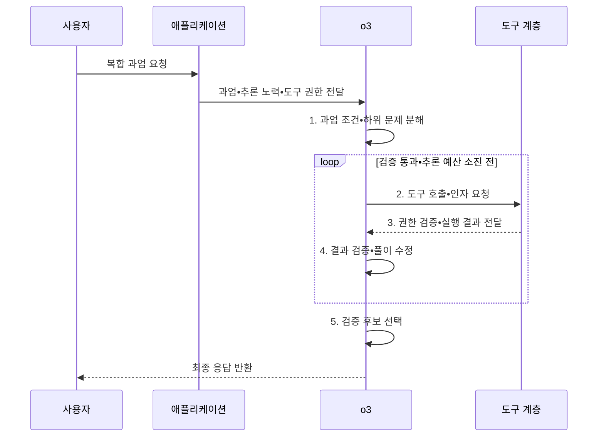

---
sidebar:
  order: 42
  label: "042. o3 추론 모델 (o3 Reasoning Model)"
  badge:
    text: "기출 • 40%"
    variant: note
title: "o3 추론 모델 (o3 Reasoning Model)"
date: "2026-08-05T02:09:36+09:00"
tags:
  - "notes-latest_tech"
weight: 42
extra:
  question_no: "042"
  source_status: "기출"
  source_history: "138회"
  priority: 40
  priority_note: "특정 모델보다 추론 모델 원리가 중요"
---

## Ⅰ. 개요

<details>
<summary>핵심 용어</summary>

- **o3 추론 모델(o3 Reasoning Model)**: 복합 수학•과학•코딩 과업에서 테스트 시점 연산과 도구 사용을 결합한 OpenAI 추론 모델 사례다.
- **테스트 시점 연산(Test-Time Compute)**: 요청 처리 중 풀이•탐색•검증에 추가 토큰과 시간을 투입하는 방식이다.

</details>

- 정의/개념: 테스트 시점 연산과 도구 사용으로 복합 과업 해결을 강화한 **OpenAI o3 추론 모델**
- 배경/필요성: 일반 생성 모델은 수학•코드•과학의 **다단계 추론과 도구 결과 결합** 에 한계

#### 한줄 요약
- o3는 복합 과업용 추론 모델 사례이며 현재 모델 선택은 최신 지원 문서를 따로 확인함

## Ⅱ. 특징

<details>
<summary>핵심 용어</summary>

- **추론 노력(Reasoning Effort)**: 요청별로 내부 추론에 사용할 연산 수준을 조절하는 설정이다.
- **도구 호출(Tool Calling)**: 모델이 문제 해결에 필요한 외부 기능과 인자를 애플리케이션에 요청하는 방식이다.
- **후속 모델(Successor Model)**: 기존 모델의 역할을 이어받아 현재 권장 경로가 된 새 모델이다.

</details>

- 추론 노력 설정에 따른 **품질•지연•비용 조절**
- 도구 실행 결과를 후속 판단에 반영하는 **추론•도구 결합**
- 역사적 모델 성능과 현재 **API 지원•후속 모델** 을 구분하는 수명주기 판단

#### 한줄 요약
- 출시 당시의 특성과 현재 가장 적합한 모델인지는 서로 다른 판단임

## Ⅲ. 구조 및 구성요소

<details>
<summary>핵심 용어</summary>

- **응용 프로그래밍 인터페이스(Application Programming Interface, API)**: 애플리케이션이 모델과 도구를 호출하고 결과를 받는 접점이다.
- **OpenAI o3 모델**: 테스트 시점 연산과 도구 사용을 결합하여 복합 문제를 해결하도록 후학습된 추론 모델이다.
- **도구 계층**: 웹•파일•코드•함수 실행 결과를 모델에 제공하되 실제 권한은 애플리케이션이 통제하는 계층이다.
- **평가•통제**: 정확도•지연•비용•권한•안전 기준으로 모델 도입 적합성을 검증한다.

</details>

```text
                   [애플리케이션]
                         |
                     [o3 모델]
                         |
                    [추론 노력]
                         |
                    [도구 계층]
                         |
                    [평가•통제]
```

선의 의미: 애플리케이션이 o3 모델과 추론 노력의 범위를 관리하고, 도구 계층 및 평가•통제가 외부 실행과 도입 기준의 경계를 형성한다.

| 구성요소 | 책임 |
|:---|:---|
| 애플리케이션 | 요청 분류와 모델•도구 **호출 흐름 통제** |
| o3 모델 | 복합 과업의 **분석•추론•도구 요청** |
| 추론 노력 | 과업별 내부 연산의 **품질•비용 수준 설정** |
| 도구 계층 | 웹•파일•코드•함수의 **외부 실행 결과 제공** |
| 평가•통제 | 권한•정확도•지연•안전의 **도입 기준 검증** |

#### 한줄 요약
- 모델이 도구를 요청하더라도 실제 권한과 실행은 애플리케이션이 통제함

## Ⅳ. 흐름도

<details>
<summary>핵심 용어</summary>

- **추론 예산**: 한 요청의 풀이•탐색•검증에 사용할 토큰과 시간의 상한이다.
- **검증 신호**: 도구 실행과 규칙 판정 결과를 다음 추론에 반영하는 정보다.

</details>



1. **과업 조건•하위 문제 분해**: 목표•제약을 단계별 **해결 단위** 로 분리
2. **도구 호출•인자 요청**: 계산•검색•코드 실행의 **도구 입력** 구성
3. **권한 검증•실행 결과 전달**: 허용 범위에서 실행하고 **검증 신호** 제공
4. **결과 검증•풀이 수정**: 오류를 반영해 후보 풀이와 도구 요청 보정
5. **검증 후보 선택**: 정확성•안전 기준을 통과한 최종 답 선택

#### 한줄 요약
- 문제를 나누고 도구 결과를 검증하며 풀이를 고친 뒤 통과한 답을 반환함

## Ⅴ. 종류 및 비교

<details>
<summary>핵심 용어</summary>

- **일반 생성 모델**: 낮은 지연으로 단순 생성 과업을 처리하지만 다단계 검증에는 한계가 있는 모델이다.
- **현행 후속 추론 모델**: 신규 복합 과업에 현재 지원되는 추론 기능과 도구 경로를 제공하는 모델이다.

</details>

| 비교 기준 | 일반 생성 모델 | o3 | 현행 후속 추론 모델 |
|:---|:---|:---|:---|
| 적용 기준 | 단순•지연 민감 생성 | o3 호환•재현이 필요한 기존 업무 | 신규 복합 과업 도입 |
| 핵심 특징 | 낮은 지연의 **즉시 생성** | 복합 과업의 **추론•도구 결합** | 후속 세대의 **현재 지원 경로** |
| 한계 | 다단계 추론 오류 | 후속 모델 등장에 따른 전환 필요 | 재평가•마이그레이션 비용 |

#### 한줄 요약
- 기존 o3 업무의 유지와 신규 업무의 후속 모델 선택을 구분함

## Ⅵ. 실무 고려사항 및 대책

<details>
<summary>핵심 용어</summary>

- **모델 수명주기**: 출시•지원•후속 전환•폐기 단계를 공식 정보로 추적하는 관리 과정이다.
- **최소 권한**: 도구 실행에 필요한 자원•행동•인자만 허용하여 모델 오판의 피해를 제한하는 원칙이다.

</details>

| 문제 | 대책 | 효과 |
|:---|:---|:---|
| o3의 **후속 모델 전환 상태** | 공식 모델 문서 확인 후 신규•기존 경로 분리 | 폐기 예정 모델의 **신규 종속 방지** |
| 추론 노력 증가의 **지연•비용 상승** | 과업 난도별 연산 수준•사용량 상한 설정 | 품질•비용 **균형 유지** |
| 도구 실행의 **권한•부작용** | 최소 권한•인자 검증•격리 실행 적용 | 비인가 작업 **방지** |

#### 한줄 요약
- 모델 이름보다 현재 지원 여부와 실제 업무의 품질•비용을 확인함

## Ⅶ. 결론

<details>
<summary>핵심 용어</summary>

- **고정 스냅샷**: 기존 o3 업무의 호환성과 재현성을 유지하도록 검증된 특정 버전을 고정해 사용하는 방식이다.
- **후속 모델 우선 평가**: 신규 과업에서는 최신 공식 지원 모델을 같은 업무 평가셋으로 먼저 비교하는 원칙이다.

</details>

- 기존 o3 호환 업무에는 **고정 스냅샷**, 신규 복합 과업에는 공식 후속 모델인 **GPT-5 계열** 우선 평가

#### 한줄 요약
- 과거 성능 기록과 현재 선택 가능한 최적 경로를 분리해 판단함
