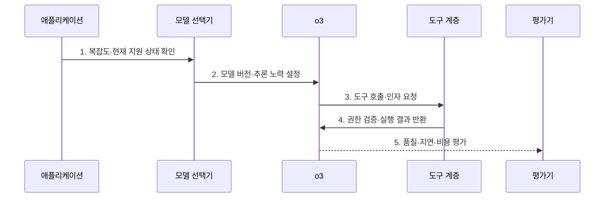

---
sidebar:
  order: 42
  label: "042. o3 추론 모델 (o3 Reasoning Model)"
  badge:
    text: "기출 · 40%"
    variant: note
title: "o3 추론 모델 (o3 Reasoning Model)"
date: "2026-07-31T11:50:56+09:00"
tags:
  - "notes-latest_tech"
weight: 42
extra:
  question_no: "042"
  source_status: "기출"
  source_history: "138회"
  priority: 40
  priority_note: "특정 모델보다 추론 모델 원리가 중요"
---

## 미리 알고가기

- **o3 추론 모델(o3 Reasoning Model)**: OpenAI가 복합 수학·과학·코딩 과업을 위해 제공한 추론 모델 계열의 역사적 사례
- **추론 노력(Reasoning Effort)**: 요청별로 내부 추론에 사용할 연산 수준을 조절하는 설정
- **도구 호출(Tool Calling)**: 모델이 문제 해결에 필요한 외부 기능과 인자를 애플리케이션에 요청하는 방식
- **응용 프로그래밍 인터페이스(Application Programming Interface, API)**: 애플리케이션이 모델과 도구를 호출하는 접점
- **후속 모델(Successor Model)**: 기존 모델의 역할을 이어받아 현재 권장 경로가 된 새 모델
- **핵심 판단**: o3의 역사적 추론 특성과 현재 API 지원 여부·후속 모델 권장을 분리하여 판단

## Ⅰ. 개요

- 정의/개념: **o3**는 시험 시점 연산과 도구 사용으로 복합 과업 해결을 강화한 OpenAI 추론 모델
- 배경/필요성: 일반 생성 모델은 수학·코드·과학의 **다단계 추론과 도구 결과 결합**에 한계

### 쉽게 이해하기 (학습용)
- o3는 복합 과업용 추론 모델 사례이며 현재 모델 선택은 최신 지원 문서를 따로 확인함

## Ⅱ. 특징

- 추론 노력 설정에 따른 **품질·지연·비용 조절**
- 도구 실행 결과를 후속 판단에 반영하는 **추론·도구 결합**
- 역사적 모델 성능과 현재 **API 지원·후속 모델**을 구분하는 수명주기 판단

### 쉽게 이해하기 (학습용)
- 출시 당시의 특성과 현재 가장 적합한 모델인지는 서로 다른 판단임

## Ⅲ. 구조 및 구성요소

| 구성요소 | 책임 |
|:---|:---|
| 애플리케이션 | 요청 분류와 모델·도구 **호출 흐름 통제** |
| o3 모델 | 복합 과업의 **분석·추론·도구 요청** |
| 추론 노력 | 과업별 내부 연산의 **품질·비용 수준 설정** |
| 도구 계층 | 웹·파일·코드·함수의 **외부 실행 결과 제공** |
| 평가·통제 | 권한·정확도·지연·안전의 **도입 기준 검증** |

### 쉽게 이해하기 (학습용)
- 모델이 도구를 요청하더라도 실제 권한과 실행은 애플리케이션이 통제함

## Ⅳ. 흐름도

1. **복잡도·현재 지원 상태 확인**: 과업 요구와 공식 문서의 **지원·후속 모델 정보** 대조
2. **모델 버전·추론 노력 설정**: 재현 가능한 버전과 **연산 수준** 고정
3. **도구 호출·인자 요청**: 추론에 필요한 기능과 **입력 인자** 구성
4. **권한 검증·실행 결과 반환**: 애플리케이션이 실행 범위를 통제하고 **검증 결과** 제공
5. **품질·지연·비용 평가**: 현업 평가셋에서 o3와 현행 후보의 **도입 효과 비교**

### 쉽게 이해하기 (학습용)
- 공식 지원 상태를 확인하고 같은 업무에서 최신 후보와 비교한 뒤 선택함

## Ⅴ. 종류 및 비교

| 비교 기준 | 일반 생성 모델 | o3 | 현행 후속 추론 모델 |
|:---|:---|:---|:---|
| 적용 기준 | 단순·지연 민감 생성 | o3 호환·재현이 필요한 기존 업무 | 신규 복합 과업 도입 |
| 핵심 특징 | 낮은 지연의 **즉시 생성** | 복합 과업의 **추론·도구 결합** | 후속 세대의 **현재 지원 경로** |
| 한계 | 다단계 추론 오류 | 후속 모델 등장에 따른 전환 필요 | 재평가·마이그레이션 비용 |

### 쉽게 이해하기 (학습용)
- 기존 o3 업무의 유지와 신규 업무의 후속 모델 선택을 구분함

## Ⅵ. 실무 고려사항 및 대책

| 고려사항 | 대책 | 효과 |
|:---|:---|:---|
| o3의 **후속 모델 전환 상태** | 공식 모델 문서 확인 후 신규·기존 경로 분리 | 폐기 예정 모델의 **신규 종속 방지** |
| 추론 노력 증가의 **지연·비용 상승** | 과업 난도별 연산 수준·사용량 상한 설정 | 품질·비용 **균형 유지** |
| 도구 실행의 **권한·부작용** | 최소 권한·인자 검증·격리 실행 적용 | 비인가 작업 **방지** |

### 쉽게 이해하기 (학습용)
- 모델 이름보다 현재 지원 여부와 실제 업무의 품질·비용을 확인함

## Ⅶ. 결론

- 기존 o3 호환 업무는 **고정 스냅샷**, 신규 복합 과업은 **GPT-5.6 계열** 우선 평가

### 쉽게 이해하기 (학습용)
- 과거 성능 기록과 현재 선택 가능한 최적 경로를 분리해 판단함
