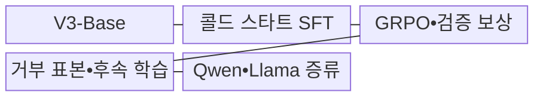
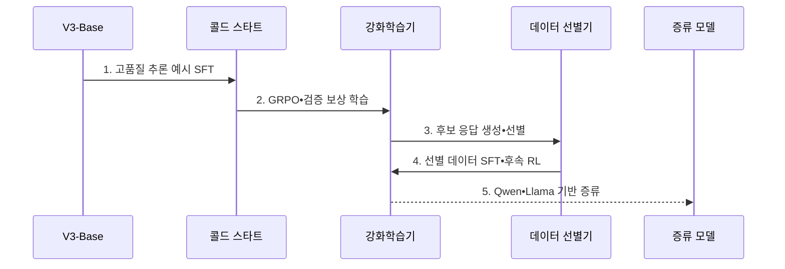

---
sidebar:
  order: 43
  label: "043. DeepSeek-R1 추론 모델 (DeepSeek-R1)"
  badge:
    text: "기출 • 50%"
    variant: note
title: "DeepSeek-R1 추론 모델 (DeepSeek-R1)"
date: "2026-08-04T15:09:00+09:00"
tags:
  - "notes-latest_tech"
weight: 43
extra:
  question_no: "043"
  source_status: "기출"
  source_history: "138회"
  priority: 50
  priority_note: "효율적 추론 학습 사례로 비교 가치"
---

## Ⅰ. 개요

핵심 용어

- **DeepSeek-R1**: DeepSeek-V3-Base에 콜드 스타트 데이터와 다단계 강화학습을 적용한 추론 언어 모델이다.
- **DeepSeek-V3-Base**: R1-Zero와 R1 후학습의 출발점이 된 기반 모델이다.
- **강화학습(Reinforcement Learning, RL)**: 보상 신호로 문제 해결 정책을 개선하는 학습 방식이다.
- **지도 미세조정(Supervised Fine-Tuning, SFT)**: 정답•풀이 예시로 응답 행동을 조정하는 학습 방식이다.

- 정의/개념: DeepSeek-V3-Base에 콜드 스타트•다단계 RL을 적용한 **DeepSeek-R1 추론 언어 모델**
- 배경/필요성: 추론 예시 중심 SFT만으로는 정답을 탐색•검증하는 **자발적 해결 정책 확장** 에 한계

#### 한줄 요약
- 기반 모델에 초기 풀이 예시와 정답 보상을 단계적으로 적용해 추론 행동을 강화함

## Ⅱ. 특징

핵심 용어

- **DeepSeek-R1-Zero**: 선행 지도 미세조정 없이 대규모 강화학습을 적용해 추론 행동의 출현을 실험한 모델이다.
- **콜드 스타트(Cold Start)**: 강화학습 전에 소량의 고품질 추론 예시로 응답 형식과 초기 행동을 안내하는 단계다.
- **지식 증류(Knowledge Distillation)**: 큰 모델이 생성한 지식•응답을 작은 기반 모델에 학습시켜 능력을 이전하는 방법이다.

- R1-Zero의 선행 SFT 없는 **대규모 RL 추론 행동 실험**
- R1의 콜드 스타트와 다단계 학습을 결합한 **가독성•추론 성능 보완**
- R1 생성 데이터를 Qwen•Llama 기반 모델에 이전한 **증류 모델 제공**

#### 한줄 요약
- 실험형 R1-Zero, 다단계 후학습 R1, 소형 증류 모델의 차이를 구분함

## Ⅲ. 구조 및 구성요소

핵심 용어

- **그룹 상대 정책 최적화(Group Relative Policy Optimization, GRPO)**: 후보 응답 그룹의 상대 보상을 이용해 정책을 갱신하는 강화학습 기법이다.
- **거부 표본 추출(Rejection Sampling)**: 생성 후보 중 정확성•품질 기준을 통과한 응답만 후속 학습 데이터로 선별하는 방법이다.

| 구성요소 | 책임 |
|:---|:---|
| V3-Base | R1 계열 후학습의 **기반 표현 제공** |
| 콜드 스타트 SFT | 고품질 예시로 **초기 추론 형식 안내** |
| GRPO•검증 보상 | **GRPO•검증 보상 기반 추론 정책 강화** |
| 거부 표본•후속 학습 | **거부 표본 추출** 로 양질 응답을 선별하고 추론•일반 능력 보완 |
| Qwen•Llama 증류 | R1 생성 데이터의 **소형 기반 모델 이전** |

#### 한줄 요약
- 기반 모델에서 추론 행동을 강화하고 선별한 결과를 작은 모델에도 학습시킴

## Ⅳ. 흐름도

핵심 용어

- **검증 보상**: 정답 판정이나 코드 실행처럼 자동 확인 가능한 결과로 추론 정책에 부여하는 보상이다.
- **후속 강화학습**: 선별 데이터 SFT 이후 추론과 일반 능력의 균형을 조정하는 추가 학습 단계다.

1. **고품질 추론 예시 SFT**: 콜드 스타트 데이터로 **가독성•응답 형식** 설정
2. **GRPO•검증 보상 학습**: 정답 판정과 상대 보상으로 **추론 정책** 강화
3. **후보 응답 생성•선별**: 정확성•가독성 기준을 통과한 **학습 데이터** 구성
4. **선별 데이터 SFT•후속 RL**: 추론과 일반 과업 데이터를 결합해 **최종 R1** 조정
5. **Qwen•Llama 기반 증류**: R1 생성 데이터로 작은 기반 모델의 **추론 능력 이전**

#### 한줄 요약
- 예시 학습, 보상 탐색, 데이터 선별, 후속 학습, 소형 모델 이전 순서임

## Ⅴ. 종류 및 비교

핵심 용어

- **증류 모델**: R1 생성 데이터를 Qwen•Llama 기반 소형 모델에 학습시켜 제한 자원 배포를 지원한다.

| 비교 기준 | R1-Zero | R1 | 증류 모델 |
|:---|:---|:---|:---|
| 적용 기준 | 순수 RL 추론 연구 | 일반 추론 활용 | 제한 자원 배포 |
| 핵심 특징 | 선행 SFT 없는 **대규모 RL** | 콜드 스타트•**다단계 RL** | Qwen•Llama 기반 **추론 데이터 증류** |
| 한계 | 가독성•언어 혼용 | 긴 추론의 지연•비용 | 기반 크기별 성능 차이 |

#### 한줄 요약
- 같은 R1 계열이라도 학습 단계와 기반 모델, 배포 자원이 다름

## Ⅵ. 실무 고려사항 및 대책

핵심 용어

- **모델 식별자(Model Identifier, Model ID)**: 원본•증류 여부와 기반•크기•체크포인트를 구분하는 정확한 값이다.
- **양자화**: 모델 가중치를 낮은 비트로 표현하여 메모리와 연산량을 줄이는 배포 기법이다.

| 문제 | 대책 | 효과 |
|:---|:---|:---|
| 변형별 **기반•크기 혼동** | 정확한 **Model ID•파라미터•체크포인트 확인** | 성능•자원 비교의 **정합성 확보** |
| R1 원본•증류 모델의 **추론 자원 차이** | 변형별 출력 상한•양자화•동시성 시험 | 배포 자원에 맞는 **모델 선택** |

#### 한줄 요약
- 이름만 보지 않고 모델 변형•크기•라이선스•실제 업무 성능을 함께 확인함

## Ⅶ. 결론

핵심 용어

- 순수 RL 연구에는 **R1-Zero**, 범용 추론에는 **R1**, 제한 자원 배포에는 **증류 모델** 선택

#### 한줄 요약
- 연구 목적과 실제 배포 목적에 맞는 R1 계열 모델을 정확히 선택함
