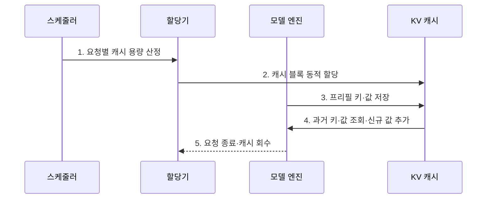

---
sidebar:
  order: 44
  label: "044. KV Cache 최적화 (KV Cache Optimization)"
  badge:
    text: "기출 · 60%"
    variant: note
title: "KV Cache 최적화 (KV Cache Optimization)"
date: "2026-08-02T09:02:00+09:00"
tags:
  - "notes-latest_tech"
weight: 44
extra:
  question_no: "044"
  source_status: "기출"
  source_history: "138회"
  priority: 60
  priority_note: "메모리 병목 완화가 장문 추론의 핵심"
---

## Ⅰ. 개요

핵심 용어

- **키-값 캐시(Key-Value Cache, KV Cache)**: 이전 토큰의 K·V 벡터를 저장하여 다음 토큰의 어텐션에서 재사용하는 메모리다.
- **자기회귀 생성(Autoregressive Generation)**: 앞서 생성한 토큰을 문맥에 포함해 다음 토큰을 하나씩 만드는 방식이다.

- 정의/개념: **KV 캐시 최적화**는 키·값 재사용으로 디코드 연산을 줄이고 저장·회수로 메모리를 관리하는 기법
- 배경/필요성: 자기회귀 생성은 과거 키·값의 반복 계산 또는 장문·동시 요청의 **캐시 메모리 증가** 유발

#### 한줄 요약
- 이전 계산을 저장해 다시 계산하지 않되, 저장 공간이 부족하지 않도록 크기와 수명을 관리함

## Ⅱ. 특징

핵심 용어

- **키-값 헤드(KV Head)**: 어텐션에서 토큰별 K·V 벡터를 생성하고 캐시에 저장하는 헤드다.
- **캐시 용량**: 모델 층·KV 헤드·토큰·배치 수·수치 정밀도에 비례해 필요한 메모리 크기다.
- **디코드 재계산 제거**: 저장한 과거 K·V를 재사용하여 매 토큰 생성 때 이전 문맥을 다시 계산하지 않는 효과다.

> 문맥이 길어질수록 세 선은 비례 증가하지만 KV 헤드를 공유하는 GQA·MQA의 기울기가 MHA보다 작으며, 32층·BF16 가정의 이론값이다.

- 과거 키·값 재사용에 의한 **디코드 재계산 제거**
- 층·KV 헤드·토큰·배치·정밀도에 비례하는 **캐시 용량**
- GQA·MQA·양자화·페이징으로 **캐시 용량 감소**, 공유·저정밀 **정확도 검증**

#### 한줄 요약
- 생성 속도를 높이는 저장 공간이 문맥과 사용자 수에 따라 계속 커짐

## Ⅲ. 구조 및 구성요소

핵심 용어

- **블록 할당기**: 요청별 캐시 공간을 작은 블록 단위로 동적 배정하고 종료 후 반납하는 구성요소다.
- **접두사 공유**: 여러 요청의 동일 입력 앞부분에 대한 K·V 캐시를 함께 참조하여 중복 저장과 계산을 줄이는 방식이다.
- **오프로딩(Offloading)**: 캐시 일부를 GPU 메모리에서 CPU 메모리 같은 하위 계층으로 이동하는 방법이다.

| 구성요소 | 책임 |
|:---|:---|
| 캐시 레이아웃 | 층·요청·KV 헤드·토큰별 **저장 형상 정의** |
| 블록 할당기 | 요청별 캐시 공간의 **동적 할당·반납** |
| 압축 계층 | KV 공유·양자화로 **표현 용량 축소** |
| 재사용·회수 | 공통 접두사 공유와 종료 캐시의 **수명 관리** |
| 스케줄러 | 메모리 여유에 따른 **요청 수용·선점·오프로딩** |

#### 한줄 요약
- 캐시를 배치하고 압축하며 여러 요청이 공유하거나 반납하도록 조정함

## Ⅳ. 흐름도

핵심 용어

- **프리필 캐시**: 입력 토큰 전체를 병렬 처리하여 생성 전에 구성한 초기 K·V 상태다.
- **캐시 회수**: 요청 종료나 선점 뒤 더 이상 참조하지 않는 블록을 반납하여 가용 메모리를 복원하는 과정이다.

1. **요청별 캐시 용량 산정**: 문맥 길이·층·KV 헤드·정밀도로 **예상 메모리** 계산
2. **캐시 블록 동적 할당**: 가용 메모리에서 요청에 필요한 **저장 영역** 배정
3. **프리필 키·값 저장**: 입력 토큰별 키·값을 계산해 **초기 캐시** 구성
4. **과거 키·값 조회·신규 값 추가**: 디코드마다 기존 값을 재사용하고 **새 토큰 캐시** 확장
5. **요청 종료·캐시 회수**: 참조가 끝난 블록을 반납해 **가용 메모리** 복원

#### 한줄 요약
- 요청 전에 공간을 잡고 토큰마다 값을 추가한 뒤 생성이 끝나면 반납함

## Ⅴ. 종류 및 비교

핵심 용어

- **MHA 캐시**: 쿼리 헤드마다 독립 K·V를 저장하여 표현력은 높지만 캐시 용량이 크다.
- **GQA·MQA 캐시**: 쿼리 그룹 또는 전체가 K·V 헤드를 공유하여 캐시와 대역폭을 줄인다.
- **양자화 KV 캐시**: K·V를 낮은 비트로 저장하여 장문·고동시성의 메모리 사용을 추가로 줄인다.

| 비교 기준 | MHA 캐시 | GQA·MQA 캐시 | 양자화 KV 캐시 |
|:---|:---|:---|:---|
| 적용 기준 | 표현력 우선 | 생성 메모리·대역폭 절감 | 장문·고동시성 추가 압축 |
| 핵심 특징 | 헤드별 **독립 키·값 저장** | 키·값 헤드의 **그룹·전체 공유** | 낮은 비트의 **키·값 표현** |
| 한계 | 최대 캐시 용량 | 공유에 따른 품질 저하 가능 | 양자화 오차·변환 비용 |

#### 한줄 요약
- 키·값을 덜 공유하거나 더 압축할수록 메모리는 줄지만 품질 검증이 중요해짐

## Ⅵ. 실무 고려사항 및 대책

핵심 용어

- **메모리 단편화**: 남은 총공간은 충분해도 작은 빈 영역으로 흩어져 새 요청의 연속 공간을 배정하기 어려운 현상이다.
- **페이징(Paging)**: 고정 크기 블록으로 캐시를 비연속 할당하여 단편화를 줄이는 방식이다.
- **오프로딩 지연**: GPU와 하위 메모리 계층 사이의 캐시 이동 때문에 토큰 생성이 늦어지는 현상이다.

| 문제 | 대책 | 효과 |
|:---|:---|:---|
| 장문·동시 요청의 **캐시 메모리 고갈** | 요청별 길이 상한·동적 수용 제어 | 메모리 부족 **방지** |
| 캐시 블록의 **단편화** | 고정 크기 페이징·빈 블록 회수 | 메모리 활용률 **향상** |
| 저정밀 캐시의 **정확도 저하** | 층·채널별 양자화와 품질 회귀 시험 | 압축 품질 **검증** |
| GPU 캐시 부족의 **오프로딩 지연** | 계층별 대역폭 측정·재계산과 비용 비교 | 지연 급증 **완화** |

#### 한줄 요약
- 압축·이동·회수로 공간을 아끼되 품질과 전송 지연을 함께 측정함

## Ⅶ. 결론

핵심 용어

- **GQA·MQA**: K·V 헤드의 중복을 공유로 줄여 캐시 용량과 대역폭을 절감한다.
- **페이징**: 캐시 블록을 동적 배정·회수하여 단편화를 완화한다.
- **양자화·오프로딩**: GPU 용량이 부족할 때 정밀도를 낮추거나 하위 메모리로 이동해 수용량을 늘린다.

- 헤드 중복은 **GQA·MQA**, 단편화는 **페이징**, 용량 부족은 양자화·오프로딩 적용

#### 한줄 요약
- 재계산 절감 이득과 캐시 메모리 비용을 함께 관리함
