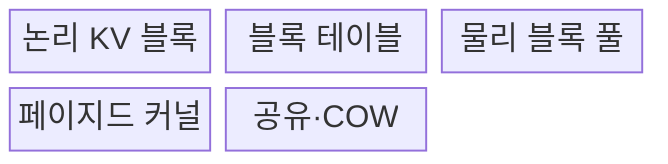
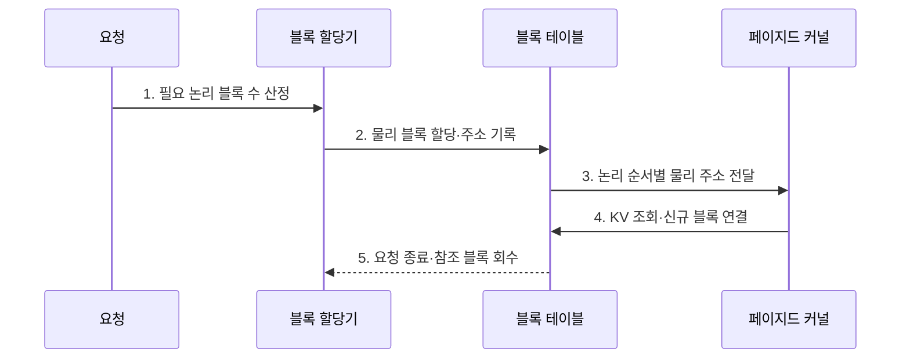

---
sidebar:
  order: 45
  label: "045. PagedAttention (페이지드 어텐션)"
  badge:
    text: "기출 · 50%"
    variant: note
title: "PagedAttention (페이지드 어텐션)"
date: "2026-07-30T11:04:43+09:00"
tags:
  - "notes-latest_tech"
weight: 45
extra:
  question_no: "045"
  source_status: "기출"
  source_history: "138회"
  priority: 50
  priority_note: "KV 캐시 페이지 관리가 서빙 핵심"
---

## 미리 알고가기

- **페이지드 어텐션(PagedAttention)**: KV 캐시를 고정 크기의 비연속 물리 블록에 저장하고 논리 순서를 표로 연결하는 메모리 관리 기법
- **키-값 캐시(Key-Value Cache, KV Cache)**: 이전 토큰의 키·값 벡터를 저장하여 다음 토큰 생성에 재사용하는 메모리
- **논리 블록(Logical Block)**: 토큰 순서에 따라 모델이 바라보는 연속적인 KV 캐시 단위
- **물리 블록(Physical Block)**: GPU 메모리 풀에서 실제로 할당되는 고정 크기 저장 단위
- **블록 테이블(Block Table)**: 논리 블록 번호를 실제 물리 블록 주소에 대응시키는 표
- **쓰기 시 복사(Copy-on-Write, COW)**: 여러 요청이 공유한 블록을 수정할 때 해당 요청의 사본만 만드는 방식
- **내부 단편화(Internal Fragmentation)**: 마지막 블록의 사용하지 않는 공간처럼 할당 단위 내부에서 발생하는 메모리 낭비

## Ⅰ. 개요

- 정의/개념: **PagedAttention**은 KV 캐시를 고정 크기 비연속 블록에 할당하고 블록 테이블로 논리 순서를 복원하는 기법
- 배경/필요성: 연속 KV 공간 예약은 가변 길이 요청에서 **메모리 단편화·과다 예약**을 유발

### 쉽게 이해하기 (학습용)
- 큰 연속 공간을 미리 잡지 않고 작은 빈 블록을 받아 순서표로 연결함

## Ⅱ. 특징

- 논리 KV 순서와 비연속 물리 블록을 연결하는 **주소 매핑**
- 고정 블록의 동적 할당·회수에 의한 **단편화·과예약 완화**
- 공통 접두사·빔 탐색 블록의 **공유·쓰기 시 복사**

### 쉽게 이해하기 (학습용)
- 여러 요청이 앞부분을 공유하고 내용이 갈라질 때 필요한 블록만 복사함

## Ⅲ. 구조 및 구성요소

| 구성요소 | 책임 |
|:---|:---|
| 논리 KV 블록 | 시퀀스 순서에 따른 **캐시 주소 공간 제공** |
| 블록 테이블 | 논리 번호와 물리 블록의 **주소 대응** |
| 물리 블록 풀 | GPU 고정 크기 블록의 **할당·반납 관리** |
| 페이지드 커널 | 비연속 블록을 조회하여 **어텐션 연산 수행** |
| 공유·COW | 접두사 참조 공유와 분기 시 **선택적 복사** |

### 쉽게 이해하기 (학습용)
- 논리 순서는 유지하면서 실제 메모리의 떨어진 빈 블록을 찾아 사용함

## Ⅳ. 흐름도

### 동작 원리

1. **필요 논리 블록 수 산정**: 현재·예상 토큰 수를 블록 크기로 나눠 **할당량** 결정
2. **물리 블록 할당·주소 기록**: 가용 블록을 선택해 논리 번호와 **매핑 관계** 저장
3. **논리 순서별 물리 주소 전달**: 커널이 토큰 순서대로 읽을 **비연속 주소 목록** 제공
4. **KV 조회·신규 블록 연결**: 기존 캐시를 읽고 블록이 차면 **새 물리 블록** 추가
5. **요청 종료·참조 블록 회수**: 공유 참조가 없는 블록을 풀에 반납해 **재사용 가능 상태** 전환

### 쉽게 이해하기 (학습용)
- 블록이 차면 새 빈 블록을 순서표에 연결하고 요청이 끝나면 반납함

## Ⅴ. 종류 및 비교

| 비교 기준 | 연속 KV 할당 | PagedAttention |
|:---|:---|:---|
| 적용 기준 | 고정 길이·낮은 동시성 | 가변 길이·높은 동시성 |
| 핵심 특징 | 요청별 **연속 최대 공간 예약** | 고정 크기 **비연속 블록 매핑** |
| 한계 | 단편화·과다 예약 | 블록 테이블 조회·전용 커널 필요 |

### 쉽게 이해하기 (학습용)
- 큰 연속 자리를 비우는 방식과 작은 빈자리를 표로 연결하는 방식의 차이임

## Ⅵ. 실무 고려사항 및 대책

| 고려사항 | 대책 | 효과 |
|:---|:---|:---|
| 큰 블록의 **내부 단편화** | 요청 길이 분포별 블록 크기 시험 | 남는 공간 **감소** |
| 작은 블록의 **주소 조회 증가** | 커널 처리량과 메모리 효율 공동 측정 | 블록 크기 **최적화** |
| 공유 블록의 **참조 오류** | 참조 횟수·COW 원자성 검증 | 조기 회수·데이터 오염 **방지** |

### 쉽게 이해하기 (학습용)
- 블록을 너무 크거나 작게 만들지 않고 공유·회수 상태를 정확히 관리함

## Ⅶ. 결론

- 요청 길이 분포·동시성·블록 조회 비용을 기준으로 **블록 크기·공유·회수·선점 정책**을 결정해야 한다.

### 쉽게 이해하기 (학습용)
- 메모리 절감과 블록 관리 비용이 균형을 이루는 크기를 선택함
