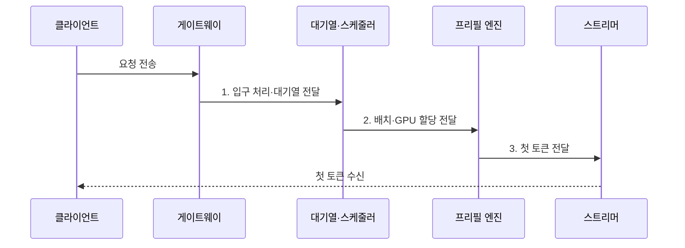

---
sidebar:
  order: 46
  label: "046. TTFT (최초 토큰 지연)"
  badge:
    text: "기출 · 40%"
    variant: note
title: "TTFT (최초 토큰 지연)"
date: "2026-08-02T09:06:00+09:00"
tags:
  - "notes-latest_tech"
weight: 46
extra:
  question_no: "046"
  source_status: "기출"
  source_history: "138회"
  priority: 40
  priority_note: "최초 응답 지연은 서빙 품질 지표"
---

## Ⅰ. 개요

핵심 용어

- **최초 토큰 지연(Time to First Token, TTFT)**: 요청을 보낸 시점부터 첫 출력 토큰을 받을 때까지 걸린 시간이다.
- **초기 반응성**: 사용자가 요청한 뒤 응답이 시작되기까지 체감하는 서비스 속성이다.

- 정의/개념: 요청 전송부터 첫 출력 토큰 수신까지의 초기 응답 지연인 **최초 토큰 지연(Time to First Token, TTFT)**
- 배경/필요성: 전체 응답 시간만으로는 **대기열·프리필·첫 전송 병목** 의 분리 곤란

#### 한줄 요약
- 질문을 보낸 뒤 화면에 첫 답변 조각이 나타날 때까지 기다린 시간임

## Ⅱ. 특징

핵심 용어

- **백분위수(Percentile)**: 측정값을 작은 순서로 배열했을 때 특정 비율이 그 값 이하에 놓이는 지점이다.
- **95백분위 최초 토큰 지연(95th Percentile Time to First Token, p95 TTFT)**: 전체 요청의 95%가 이 값 이하에서 첫 토큰을 받는 꼬리 지연 경계다.
- **서비스 수준 목표(Service Level Objective, SLO)**: 서비스가 달성해야 하는 지연·가용성 같은 내부 운영 목표다.

- `TTFT = 첫 토큰 수신 시각 - 요청 전송 시각`의 **최초 토큰 지연(Time to First Token, TTFT) 종단 간 측정**
- 네트워크·대기열·프리필·첫 전송을 합산하는 **구간 지연 지표**
- 평균과 95·99백분위(p95·p99)를 병행하는 **초기 반응성 서비스 수준 목표(Service Level Objective, SLO)**

#### 한줄 요약
- 첫 토큰이 늦는 원인은 모델 계산뿐 아니라 접수·대기·전송에도 있을 수 있음

## Ⅲ. 구조 및 구성요소

핵심 용어

- **프리필(Prefill)**: 입력 토큰 전체의 어텐션을 계산하여 생성에 필요한 K·V 상태를 만드는 단계다.
- **요청 대기열**: 실행 자원이 배정되기 전 요청이 부하와 우선순위에 따라 기다리는 영역이다.
- **스트리머**: 생성된 첫 토큰을 직렬화해 전송하고 클라이언트 수신 경계와 연결하는 구성요소다.

| 구성요소 | 책임 |
|:---|:---|
| 클라이언트 | 요청 전송과 첫 토큰 수신의 **종단 시각 기록** |
| 응용 프로그래밍 인터페이스 게이트웨이(Application Programming Interface Gateway, API Gateway) | 연결·인증·라우팅의 **입구 처리 시간 형성** |
| 요청 대기열 | 부하·우선순위에 따른 **배치 대기 시간 형성** |
| 프리필 엔진 | 입력 어텐션과 초기 **키-값 캐시(Key-Value Cache, KV Cache) 기반 첫 토큰 준비** |
| 스트리머 | 첫 토큰 직렬화·전송과 **수신 경계 연결** |

#### 한줄 요약
- 접수·대기·입력 계산·첫 전송 중 어느 구간이 느린지 따로 기록함

## Ⅳ. 흐름도

핵심 용어

- **측정 경계**: TTFT 시작을 클라이언트 송신, 종료를 첫 토큰 수신으로 일관되게 정한 시점 기준이다.
- **구간 지연**: 입구 처리·대기·프리필·첫 전송처럼 전체 TTFT를 구성하는 단계별 소요 시간이다.

1. **입구 처리·대기열 전달**: 인증·라우팅 후 **대기 상태** 전환
2. **배치·그래픽 처리장치(Graphics Processing Unit, GPU) 할당 전달**: 실행 배치와 **연산 자원** 배정
3. **첫 토큰 전달**: 프리필 결과의 **첫 출력 토큰** 제공

#### 한줄 요약
- 같은 시작·종료 지점을 정한 뒤 구간별 시간을 더해 실제 병목을 찾음

## Ⅴ. 종류 및 비교

핵심 용어

- **최초 토큰 지연(Time to First Token, TTFT)**: 요청부터 첫 토큰 수신까지의 초기 지연을 측정한다.
- **토큰당 출력 지연(Time per Output Token, TPOT)**: 첫 토큰 이후 출력 토큰 하나를 생성하는 평균 시간을 측정한다.
- **종단 간 지연**: 요청 전송부터 마지막 토큰 수신까지 전체 완료 시간을 측정한다.

| 비교 기준 | TTFT | TPOT | 종단 간 지연 |
|:---|:---|:---|:---|
| 적용 기준 | 초기 반응성 관리 | 스트리밍 지속 속도 관리 | 전체 완료 시간 관리 |
| 핵심 특징 | 요청부터 **첫 토큰 수신** | 첫 토큰 뒤 **토큰당 평균 시간** | 요청부터 **마지막 토큰 수신** |
| 한계 | 지속 생성 속도 미반영 | 초기 대기시간 미반영 | 단계별 병목 구분 곤란 |

#### 한줄 요약
- 답이 시작되는 시간, 이어지는 속도, 전체 답이 끝나는 시간을 나눠 측정함

## Ⅵ. 실무 고려사항 및 대책

핵심 용어

- **프롬프트 캐시(Prompt Cache)**: 동일 입력 접두사의 프리필 결과를 저장하여 반복 요청에서 재사용하는 캐시다.
- **꼬리 지연**: 평균보다 크게 늦은 일부 요청에서 발생하며 p95·p99로 관찰하는 지연이다.
- **우선순위 큐**: 요청 중요도와 지연 목표에 따라 GPU 배정 순서를 다르게 관리하는 대기열이다.

| 문제 | 대책 | 효과 |
|:---|:---|:---|
| 입력 길이 증가의 **프리필 지연** | 길이 구간별 **서비스 수준 목표(Service Level Objective, SLO)·프롬프트 축약** 적용 | 초기 응답 지연 **관리** |
| 배치 대기의 **꼬리 지연 증가** | 우선순위 큐·최대 대기시간 설정 | p95·p99 지연 **완화** |
| 시스템별 **측정 경계 불일치** | 클라이언트 송신·수신 기준 통일 | 지표 비교 가능성 **확보** |

#### 한줄 요약
- 긴 입력과 혼잡한 대기를 나누어 측정하고 같은 기준으로 비교함

## Ⅶ. 결론

핵심 용어

- **스케줄링 개선**: TTFT 병목이 대기열에 있을 때 우선순위와 최대 대기시간을 조정하는 대책이다.
- **입력 축약·캐싱**: 병목이 프리필에 있을 때 입력 토큰을 줄이거나 동일 접두사 계산을 재사용하는 대책이다.

- 95백분위(95th Percentile, p95) 초과가 대기열이면 **스케줄링**, 프리필이면 **입력 축약·프롬프트 캐시** 적용

#### 한줄 요약
- 평균만 보지 않고 가장 늦은 요청이 어느 구간에서 지연되는지 찾아 개선함
