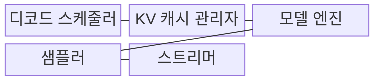
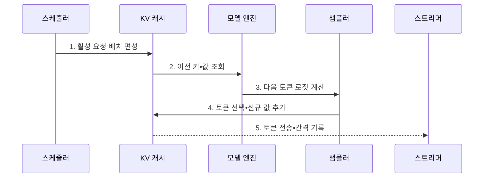

---
sidebar:
  order: 47
  label: "047. TPOT (토큰당 출력 지연)"
  badge:
    text: "기출 • 40%"
    variant: note
title: "TPOT (토큰당 출력 지연)"
date: "2026-08-03T08:48:47+09:00"
tags:
  - "notes-latest_tech"
weight: 47
extra:
  question_no: "047"
  source_status: "기출"
  source_history: "138회"
  priority: 40
  priority_note: "토큰 생성 지연은 서빙 품질 지표"
---

## Ⅰ. 개요

핵심 용어

- **토큰당 출력 지연(Time per Output Token, TPOT)**: 첫 토큰 이후 출력 토큰 하나를 생성하는 평균 시간이다.
- **디코드 지속 속도**: 첫 응답 이후 토큰이 연속해서 생성•전송되는 속도다.

- 정의/개념: 첫 토큰 이후 출력 토큰 하나를 생성하는 평균 지연인 **토큰당 출력 지연(Time per Output Token, TPOT)**
- 배경/필요성: 최초 토큰 지연(Time to First Token, TTFT)만으로는 스트리밍 시작 후 **디코드 지속 속도** 의 평가 곤란

#### 한줄 요약
- 답이 시작된 뒤 다음 토큰들이 얼마나 빠르게 이어지는지 나타냄

## Ⅱ. 특징

핵심 용어

- **키-값 캐시(Key-Value Cache, KV Cache)**: 이전 토큰의 키(Key, K)•밸류(Value, V)를 저장하여 다음 토큰 생성에 재사용하는 메모리다.
- **동적 배치(Dynamic Batching)**: 실행 중인 요청을 도착 시점과 상태에 따라 배치에 추가•제거하는 방식이다.
- **메모리 대역폭**: 단위 시간에 메모리와 연산 장치 사이에서 전송할 수 있는 데이터 양이다.

- `TPOT = (마지막 토큰 수신 시각 - 첫 토큰 수신 시각) / (출력 토큰 수 - 1)`의 **평균 토큰 간 지연**
- 단일 연속 생성에서 `출력 속도 ≈ 1000 / TPOT(ms/token)`인 **지연•속도 역관계**
- 키-값 캐시(Key-Value Cache, KV Cache) 대역폭이 낮거나 배치•동시성이 크면 **디코드 지연 증가**

#### 한줄 요약
- TPOT가 작을수록 첫 답 뒤의 문장이 더 빠르게 이어짐

## Ⅲ. 구조 및 구성요소

핵심 용어

- **디코드 스케줄러**: 활성 요청을 동적 배치로 편성하여 다음 토큰의 실행 순서를 정한다.
- **키-값 캐시 관리자(Key-Value Cache Manager, KV Cache Manager)**: 활성 요청의 과거 키•값 상태를 할당•조회•회수하여 디코드 반복 계산을 줄인다.
- **모델 엔진**: 현재 토큰과 키-값 캐시로 다음 토큰 후보의 로짓을 계산하는 추론 실행부이다.
- **로짓(Logit)**: 다음 토큰 후보마다 모델이 계산한 정규화 전 점수다.
- **샘플러(Sampler)**: 로짓 분포와 생성 설정을 바탕으로 다음 토큰을 선택한다.
- **스트리머(Streamer)**: 선택한 토큰을 클라이언트에 순차 전송하고 토큰 간 도착 시간을 측정하는 구성요소이다.

| 구성요소 | 책임 |
|:---|:---|
| 디코드 스케줄러 | 활성 요청의 **동적 배치 편성** |
| 키-값 캐시 관리자(Key-Value Cache Manager, KV Cache Manager) | 과거 키•값 조회와 **신규 값 추가** |
| 모델 엔진 | 다음 토큰 후보의 **로짓 계산** |
| 샘플러 | 로짓과 생성 설정에 따른 **다음 토큰 선택** |
| 스트리머 | 토큰 전송과 **수신 시각 기록** |

#### 한줄 요약
- 과거 계산을 읽어 다음 토큰을 고르고 전송한 뒤 새 계산값을 저장함

## Ⅳ. 흐름도

핵심 용어

- **토큰 간 지연**: 연속한 두 출력 토큰의 수신 시각 차이로 측정한 생성 간격이다.
- **신규 키-값 추가(New Key-Value Addition, New KV Addition)**: 선택한 토큰의 K•V를 캐시에 덧붙여 다음 디코드 단계에서 재사용하는 과정이다.

1. **활성 요청 배치 편성**: 실행 가능한 요청을 묶어 **디코드 순서** 결정
2. **이전 키•값 조회**: 각 요청의 과거 문맥에 해당하는 **캐시 데이터** 전달
3. **다음 토큰 로짓 계산**: 모델 계층을 실행해 후보별 **생성 점수** 산출
4. **토큰 선택•신규 값 추가**: 다음 토큰을 확정하고 해당 토큰의 **키•값 캐시** 확장
5. **토큰 전송•간격 기록**: 수신 시각 차이로 **토큰 간 밀리초 지연** 측정

#### 한줄 요약
- 같은 과정을 토큰마다 반복하며 전송 간격을 기록함

## Ⅴ. 종류 및 비교

핵심 용어

- **최초 토큰 지연(Time to First Token, TTFT)**: 요청부터 첫 토큰까지 초기 반응성을 측정한다.
- **토큰당 출력 지연(Time per Output Token, TPOT)**: 첫 토큰 뒤 개별 스트리밍 생성 속도를 측정한다.
- **처리량**: 서버가 단위 시간에 처리한 전체 요청이나 토큰의 양을 측정한다.

| 비교 기준 | TTFT | TPOT | 처리량 |
|:---|:---|:---|:---|
| 적용 기준 | 초기 반응성 관리 | 개별 스트리밍 속도 관리 | 서버 전체 자원 효율 관리 |
| 핵심 특징 | 첫 응답의 **초기 지연** | 출력 토큰당 **평균 생성 지연** | 단위 시간의 **전체 처리량** |
| 한계 | 지속 생성 속도 미반영 | 초기 대기•완료 시간 미반영 | 개별 사용자 지연 미반영 |

#### 한줄 요약
- 시작 속도와 한 요청의 이어쓰기 속도, 서버 전체 생산량은 서로 다른 목표임

## Ⅵ. 실무 고려사항 및 대책

핵심 용어

- **대역폭 병목**: KV 캐시를 읽는 속도가 연산 속도를 따라가지 못해 디코드가 지연되는 상태다.
- **배치 상한**: 서버 효율을 높이면서 개별 요청의 꼬리 지연을 제한하도록 동시에 처리할 요청 수를 제한한 값이다.
- **95백분위 토큰 간격(95th Percentile Inter-token Latency, p95 Inter-token Latency)**: 전체 토큰 간 지연의 95%가 이하에 놓이는 경계로 불규칙한 정지를 드러낸다.

| 문제 | 대책 | 효과 |
|:---|:---|:---|
| 키-값 캐시(Key-Value Cache, KV Cache) 읽기의 **메모리 대역폭 병목** | 키•값 헤드 공유•저정밀 캐시•캐시 배치 최적화 | 토큰 간 지연 **절감** |
| 과대 동적 배치의 **개별 지연 증가** | 지연 목표별 배치 상한 설정 | 꼬리 지연 **완화** |
| 불규칙한 **토큰 간 정지** | 토큰별 시각과 **95백분위(95th Percentile, p95) 간격 계측** | 평균값의 병목 은폐 **방지** |

#### 한줄 요약
- 큰 배치의 서버 효율과 한 사용자의 토큰 간 지연을 함께 측정함

## Ⅶ. 결론

핵심 용어

- **키-값 공유•양자화(Key-Value Sharing and Quantization, KV Sharing and Quantization)**: 대역폭 병목일 때 캐시 데이터량을 줄여 토큰당 출력 지연(Time per Output Token, TPOT)을 개선한다.
- **동시 요청 상한**: 과대 배치가 병목일 때 한 번에 디코드할 요청 수를 줄여 꼬리 지연을 완화한다.

- 95백분위 토큰당 출력 지연(95th Percentile Time per Output Token, p95 TPOT)의 원인이 대역폭이면 **키-값 공유•양자화(Key-Value Sharing and Quantization, KV Sharing and Quantization)**, 배치면 **동시 요청 상한** 적용

#### 한줄 요약
- 답이 이어지는 체감 속도와 서버 효율을 함께 맞춤
