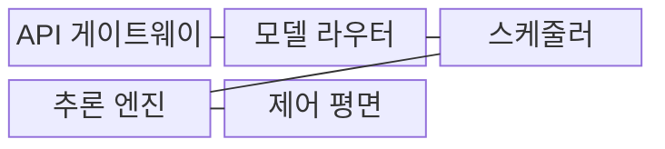
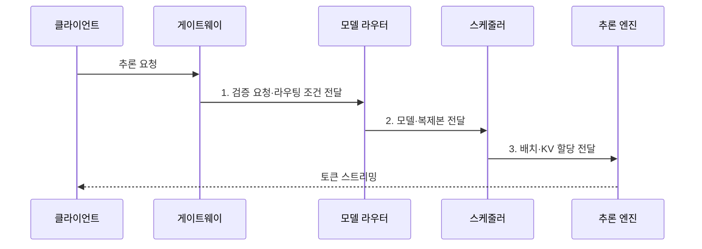

---
sidebar:
  order: 48
  label: "048. LLM Serving (LLM 서빙)"
  badge:
    text: "미출 · 70%"
    variant: note
title: "LLM Serving (LLM 서빙)"
date: "2026-08-02T09:06:00+09:00"
tags:
  - "notes-latest_tech"
weight: 48
extra:
  question_no: "048"
  source_status: "미출"
  source_history: ""
  priority: 70
  priority_note: "지연·처리량·비용을 통합 설계하는 주제"
---

## Ⅰ. 개요

핵심 용어

- **대규모 언어 모델 서빙(Large Language Model Serving, LLM Serving)**: 언어 모델 추론을 다중 요청에 제공하며 자원·지연·품질을 통제하는 운영 체계다.
- **서비스 목표**: 요청 처리에서 달성해야 할 품질·지연·처리량·비용 기준이다.

- 정의/개념: 언어 모델 추론을 다중 요청에 제공하며 자원·지연·품질을 통제하는 **대규모 언어 모델 서빙(Large Language Model Serving, LLM Serving)**
- 배경/필요성: 가변 길이·동시 요청은 **그래픽 처리장치(Graphics Processing Unit, GPU) 메모리와 지연 변동**을 유발하여 단순 모델 배포만으로 서비스 목표 보장 곤란

#### 한줄 요약
- 여러 사용자의 요청을 접수·배정·계산·감시하여 모델을 안정적으로 제공함

## Ⅱ. 특징

핵심 용어

- **연속 배치(Continuous Batching)**: 완료 요청을 배치에서 제거하고 새 요청을 실행 중인 배치에 추가하는 방식이다.
- **프리필(Prefill)**: 입력 전체를 처리해 생성에 필요한 키-값 캐시(Key-Value Cache, KV Cache)를 만드는 단계다.
- **디코드(Decode)**: 저장된 키-값(Key-Value, KV)을 이용해 다음 출력 토큰을 반복 생성하는 단계다.

- 가변 길이 요청을 실행 중 재편하는 **연속·동적 배치**
- 프리필·디코드의 자원 특성을 반영한 **요청 스케줄링**
- 양자화·병렬화·**키-값 캐시(Key-Value Cache, KV Cache) 관리 기반 지연 감소·처리량 향상**

#### 한줄 요약
- 여러 요청을 묶고 나누는 방식이 사용자 지연과 서버 처리량을 함께 바꿈

## Ⅲ. 구조 및 구성요소

핵심 용어

- **모델 라우터**: 과업과 부하에 따라 사용할 모델과 복제본을 선택한다.
- **스케줄러**: 연속 배치와 KV 메모리를 고려하여 실행 순서를 관리한다.
- **제어 평면**: 모델 배포·확장·관측·장애 복구 정책을 관리하는 운영 계층이다.

| 구성요소 | 책임 |
|:---|:---|
| 응용 프로그래밍 인터페이스 게이트웨이(Application Programming Interface Gateway, API Gateway) | 인증·할당량·스트리밍의 **요청 경계 통제** |
| 모델 라우터 | 과업·부하에 따른 **모델·복제본 선택** |
| 스케줄러 | 연속 배치와 **키-값(Key-Value, KV) 메모리 기반 실행 순서 관리** |
| 추론 엔진 | 양자화·병렬화 기반 **프리필·디코드 실행** |
| 제어 평면 | 배포·확장·관측·장애 복구의 **운영 정책 관리** |

#### 한줄 요약
- 요청을 적합한 모델 작업자에게 배정하고 실행 상태를 중앙에서 관리함

## Ⅳ. 흐름도

핵심 용어

- **할당량(Quota)**: 사용자나 서비스가 일정 시간 동안 사용할 수 있는 요청·토큰·자원의 상한이다.
- **복제본(Replica)**: 동일 모델을 독립 실행하여 요청을 분산 처리하는 인스턴스다.

1. **검증 요청·라우팅 조건 전달**: 권한·할당량·입력 형식의 **검증 결과** 제공
2. **모델·복제본 전달**: 과업·부하에 맞는 **모델 인스턴스** 선택
3. **배치·키-값(Key-Value, KV) 할당 전달**: 길이·우선순위별 **실행 순서·캐시** 배정

#### 한줄 요약
- 요청을 검사해 빈 작업자에게 보내고 토큰을 생성하며 속도와 오류를 기록함

## Ⅴ. 종류 및 비교

핵심 용어

- **오프라인 추론**: 즉시 응답 없이 대량 데이터를 고정 배치로 처리하여 비용과 처리량을 최적화한다.
- **온라인 서빙**: 대화형 요청을 동적 배치로 처리하여 최초 토큰 지연(Time to First Token, TTFT)과 토큰당 출력 지연(Time per Output Token, TPOT)을 관리한다.
- **비동기 배치 응용 프로그래밍 인터페이스(Asynchronous Batch Application Programming Interface, Asynchronous Batch API)**: 완료 시점이 유연한 대량 요청을 작업 큐에 넣고 나중에 결과를 제공한다.

| 비교 기준 | 오프라인 추론 | 온라인 서빙 | 비동기 배치 API |
|:---|:---|:---|:---|
| 적용 기준 | 대량 데이터 일괄 처리 | 대화형 실시간 응답 | 완료 시점이 유연한 대량 요청 |
| 핵심 특징 | 처리량·비용 중심 **고정 배치** | TTFT·TPOT 중심 **동적 배치** | 작업 큐 기반 **비동기 완료** |
| 한계 | 즉시 응답 불가 | 높은 상시 자원·운영 복잡성 | 결과 대기·작업 상태 관리 |

#### 한줄 요약
- 즉시 답이 필요한지, 완료를 기다려도 되는지에 따라 실행 방식을 선택함

## Ⅵ. 실무 고려사항 및 대책

핵심 용어

- **유효 처리량(Goodput)**: 품질·지연 목표를 모두 만족하면서 처리한 유효 요청이나 토큰의 양이다.
- **페이지드 캐시**: 키-값 캐시(Key-Value Cache, KV Cache)를 고정 크기 비연속 블록으로 나눠 동적 할당·회수하는 방식이다.
- **회로 차단(Circuit Breaker)**: 장애가 반복되는 복제본의 요청을 일시 중단해 실패 확산을 막는다.
- **그림자 트래픽·카나리 배포**: 새 모델을 응답에 반영하지 않고 비교한 뒤 일부 요청부터 단계적으로 적용하는 검증 방식이다.

| 문제 | 대책 | 효과 |
|:---|:---|:---|
| 요청 길이 편차의 **배치 비효율** | 연속 배치·길이 인지 스케줄링 | 그래픽 처리장치(Graphics Processing Unit, GPU) 활용률 **향상** |
| 키-값 캐시(Key-Value Cache, KV Cache)의 **단편화·고갈** | 페이지드 캐시·요청별 길이 상한 | 메모리 부족 **방지** |
| 지연·품질 서비스 수준 목표(Service Level Objective, SLO) 미달의 **유효 처리량 감소** | 최초 토큰 지연(Time to First Token, TTFT)·토큰당 출력 지연(Time per Output Token, TPOT)·품질 공동 계측 | 병목별 자원 배정으로 **유효 처리량(Goodput) 향상** |
| 반복 장애 복제본의 **실패 확산** | **회로 차단**으로 장애 복제본 자동 제외 | 연쇄 장애 **방지** |
| 신규 모델의 **품질 회귀** | **그림자 트래픽·카나리 배포** 단계 적용 | 배포 위험 **완화** |

#### 한줄 요약
- 빠른 응답뿐 아니라 메모리 부족, 장애, 모델 갱신까지 운영 경로로 관리함

## Ⅶ. 결론

핵심 용어

- **온라인 동적 배치**: 즉시 스트리밍 응답이 필요한 요청을 지연 목표에 맞춰 실행 중 재편한다.
- **비동기 응용 프로그래밍 인터페이스(Asynchronous Application Programming Interface, Asynchronous API)**: 완료 시점이 유연한 대량 요청을 작업 큐로 처리한다.
- **오프라인 추론**: 즉시성이 필요 없는 대량 데이터를 비용·처리량 중심으로 일괄 처리한다.

- 실시간에는 **온라인 동적 배치**, 완료 유연 작업에는 **비동기 응용 프로그래밍 인터페이스(Asynchronous Application Programming Interface, Asynchronous API)**, 대량 처리에는 **오프라인 추론** 선택

#### 한줄 요약
- 답의 품질과 속도·서버 효율·비용을 함께 유지하는 구조를 선택함
