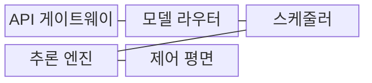
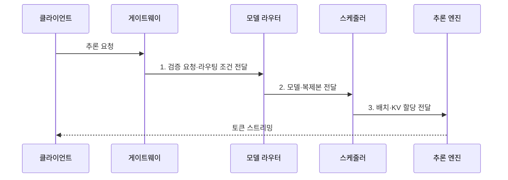

---
sidebar:
  order: 48
  label: "048. LLM Serving (LLM 서빙)"
  badge:
    text: "미출 · 70%"
    variant: note
title: "LLM Serving (LLM 서빙)"
date: "2026-07-31T08:36:48+09:00"
tags:
  - "notes-latest_tech"
weight: 48
extra:
  question_no: "048"
  source_status: "미출"
  source_history: ""
  priority: 70
  priority_note: "지연·처리량·비용을 통합 설계하는 주제"
---

## 미리 알고가기

- **LLM 서빙(Large Language Model Serving)**: 언어 모델 추론을 다중 요청에 제공하며 자원·지연·품질을 통제하는 운영 체계
- **연속 배치(Continuous Batching)**: 생성이 끝난 요청을 배치에서 제거하고 새 요청을 실행 중인 배치에 추가하는 방식
- **프리필(Prefill)**: 입력 토큰 전체를 처리하여 생성에 필요한 키·값 캐시를 만드는 단계
- **디코드(Decode)**: 저장된 키·값을 이용하여 다음 출력 토큰을 반복 생성하는 단계
- **키-값 캐시(Key-Value Cache, KV Cache)**: 이전 토큰의 키·값 벡터를 저장하여 후속 생성에 재사용하는 메모리
- **최초 토큰 지연(Time to First Token, TTFT)**: 요청부터 첫 출력 토큰을 받을 때까지의 시간
- **토큰당 출력 지연(Time per Output Token, TPOT)**: 첫 토큰 이후 출력 토큰 하나를 생성하는 평균 시간
- **유효 처리량(Goodput)**: 품질·지연 목표를 만족하면서 처리한 유효 요청 또는 토큰의 양
- **페이지드 캐시(Paged Cache)**: KV 캐시를 고정 크기 비연속 블록으로 나누어 할당·회수하는 방식
- **회로 차단(Circuit Breaker)**: 장애가 반복되는 복제본으로의 요청을 일시 중단하여 실패 확산을 막는 방식
- **카나리 배포(Canary Deployment)**: 새 모델을 일부 요청에 먼저 적용하여 이상 여부를 확인하는 배포 방식
- **그림자 트래픽(Shadow Traffic)**: 실제 응답에는 사용하지 않고 운영 요청을 새 모델에도 복제하여 결과를 비교하는 검증 방식

## Ⅰ. 개요

- 정의/개념: **LLM 서빙**은 언어 모델 추론을 다중 요청에 제공하며 자원·지연·품질을 통제하는 운영 체계
- 배경/필요성: 가변 길이·동시 요청은 **GPU 메모리와 지연 변동**을 유발하여 단순 모델 배포만으로 서비스 목표 보장 곤란

### 쉽게 이해하기 (학습용)
- 여러 사용자의 요청을 접수·배정·계산·감시하여 모델을 안정적으로 제공함

## Ⅱ. 특징

- 가변 길이 요청을 실행 중 재편하는 **연속·동적 배치**
- 프리필·디코드의 자원 특성을 반영한 **요청 스케줄링**
- 양자화·병렬화·KV 캐시 관리의 **지연·처리량 절충**

### 쉽게 이해하기 (학습용)
- 여러 요청을 묶고 나누는 방식이 사용자 지연과 서버 처리량을 함께 바꿈

## Ⅲ. 구조 및 구성요소

| 구성요소 | 책임 |
|:---|:---|
| API 게이트웨이 | 인증·할당량·스트리밍의 **요청 경계 통제** |
| 모델 라우터 | 과업·부하에 따른 **모델·복제본 선택** |
| 스케줄러 | 연속 배치와 KV 메모리의 **실행 순서 관리** |
| 추론 엔진 | 양자화·병렬화 기반 **프리필·디코드 실행** |
| 제어 평면 | 배포·확장·관측·장애 복구의 **운영 정책 관리** |

### 쉽게 이해하기 (학습용)
- 요청을 적합한 모델 작업자에게 배정하고 실행 상태를 중앙에서 관리함

## Ⅳ. 흐름도

1. **검증 요청·라우팅 조건 전달**: 권한·할당량·입력 형식의 **검증 결과** 제공
2. **모델·복제본 전달**: 과업·부하에 맞는 **모델 인스턴스** 선택
3. **배치·KV 할당 전달**: 길이·우선순위별 **실행 순서·캐시** 배정

### 쉽게 이해하기 (학습용)
- 요청을 검사해 빈 작업자에게 보내고 토큰을 생성하며 속도와 오류를 기록함

## Ⅴ. 종류 및 비교

| 비교 기준 | 오프라인 추론 | 온라인 서빙 | 비동기 배치 API |
|:---|:---|:---|:---|
| 적용 기준 | 대량 데이터 일괄 처리 | 대화형 실시간 응답 | 완료 시점이 유연한 대량 요청 |
| 핵심 특징 | 처리량·비용 중심 **고정 배치** | TTFT·TPOT 중심 **동적 배치** | 작업 큐 기반 **비동기 완료** |
| 한계 | 즉시 응답 불가 | 높은 상시 자원·운영 복잡성 | 결과 대기·작업 상태 관리 |

### 쉽게 이해하기 (학습용)
- 즉시 답이 필요한지, 완료를 기다려도 되는지에 따라 실행 방식을 선택함

## Ⅵ. 실무 고려사항 및 대책

| 고려사항 | 대책 | 효과 |
|:---|:---|:---|
| 요청 길이 편차의 **배치 비효율** | 연속 배치·길이 인지 스케줄링 | GPU 활용률 **향상** |
| KV 캐시의 **단편화·고갈** | 페이지드 캐시·요청별 길이 상한 | 메모리 부족 **방지** |

### 쉽게 이해하기 (학습용)
- 빠른 응답뿐 아니라 메모리 부족, 장애, 모델 갱신까지 운영 경로로 관리함

## Ⅶ. 결론

- 실시간은 **온라인 동적 배치**, 완료 유연 작업은 **비동기 API**, 대량 처리는 오프라인

### 쉽게 이해하기 (학습용)
- 답의 품질과 속도·서버 효율·비용을 함께 유지하는 구조를 선택함
