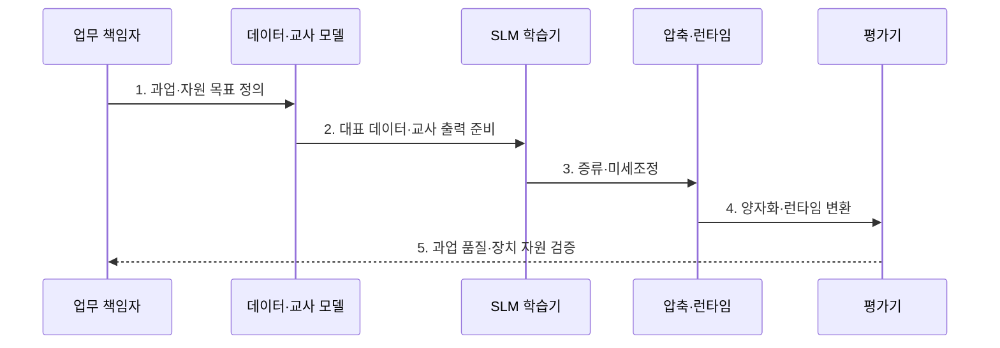

---
sidebar:
  order: 49
  label: "049. SLM (소형 언어모델)"
  badge:
    text: "기출 · 70%"
    variant: note
title: "SLM (소형 언어모델)"
date: "2026-07-31T11:53:06+09:00"
tags:
  - "notes-latest_tech"
weight: 49
extra:
  question_no: "049"
  source_status: "기출"
  source_history: "137회, 138회"
  priority: 70
  priority_note: "경량 모델의 비용·배치 전략이 주요 쟁점"
---

## 미리 알고가기

- **소형 언어모델(Small Language Model, SLM)**: 제한된 연산·메모리에서 특정 범위의 언어 과업을 수행하도록 규모를 줄인 언어 모델
- **대규모 언어모델(Large Language Model, LLM)**: 넓은 지식과 복합 과업 처리를 목표로 대규모 데이터와 파라미터로 학습한 언어 모델
- **지식 증류(Knowledge Distillation)**: 큰 교사 모델의 응답·지식을 작은 학생 모델에 학습시키는 방법
- **지도 미세조정(Supervised Fine-Tuning, SFT)**: 정답·업무 예시로 모델의 응답을 조정하는 학습 방법
- **매개변수 효율적 미세조정(Parameter-Efficient Fine-Tuning, PEFT)**: 전체 파라미터가 아닌 일부 추가·선택 파라미터만 학습하는 기법군
- **양자화(Quantization)**: 가중치를 더 적은 비트로 표현하여 모델 메모리와 연산량을 줄이는 방법
- **가지치기(Pruning)**: 영향이 작은 가중치·연결·구조를 제거하여 모델 연산량을 줄이는 방법
- **추론 런타임(Inference Runtime)**: 모델 그래프를 목표 장치의 연산자로 변환하고 실행하는 소프트웨어
- **온디바이스 추론(On-Device Inference)**: 서버에 원본 데이터를 보내지 않고 단말 내부에서 모델을 실행하는 방식

## Ⅰ. 개요

- 정의/개념: **SLM**은 제한된 연산·메모리에서 특정 범위의 언어 과업을 수행하도록 경량화한 언어 모델
- 배경/필요성: 범용 LLM의 메모리·전력·지연 비용으로 인해 **단말·현장 업무 배포**에 제약

### 쉽게 이해하기 (학습용)
- 정해진 업무를 제한된 장비에서 효율적으로 수행하도록 맞춘 작은 모델임

## Ⅱ. 특징

> 같은 파라미터 수에서 INT8·INT4 선은 FP16보다 가중치 메모리 기울기가 각각 절반·4분의 1이며, 캐시·활성값을 제외한 십진 GB 이론값이다.

- 작은 파라미터 수에 따른 **메모리·연산·배포 비용 절감**
- **증류·SFT·PEFT**를 통한 특정 과업 품질 집중
- **양자화·장치별 런타임**을 결합한 제한 자원 추론

### 쉽게 이해하기 (학습용)
- 파라미터 수와 정밀도가 낮을수록 가중치 메모리는 줄지만 업무 품질은 따로 검증해야 함

## Ⅲ. 구조 및 구성요소

| 구성요소 | 책임 |
|:---|:---|
| 경량 백본 | 자원 목표에 맞는 **소형 언어 표현 제공** |
| 과업 적응 계층 | 증류·SFT·PEFT 기반 **업무 능력 보강** |
| 압축 계층 | **양자화·가지치기**를 통한 모델 크기 축소 |
| 추론 런타임 | 목표 장치 연산자 기반 **모델 실행 최적화** |
| 출력 통제 | 업무 범위·안전 기준에 따른 **응답 허용·거부** |

### 쉽게 이해하기 (학습용)
- 작은 기반 모델에 업무 학습·압축·장치 실행·출력 제한을 연결함

## Ⅳ. 흐름도

1. **과업·자원 목표 정의**: 정확도·지연·메모리·전력의 **허용 범위** 설정
2. **대표 데이터·교사 출력 준비**: 업무 분포와 범위 밖 입력을 포함한 **학습·평가 자료** 구성
3. **증류·미세조정**: 교사 지식과 업무 예시로 **특정 과업 능력** 강화
4. **양자화·런타임 변환**: 가중치 정밀도와 연산자를 목표 장치에 맞춰 **실행 형식** 생성
5. **과업 품질·장치 자원 검증**: 압축 전후 정확도와 실기기 **지연·메모리·전력** 비교

### 쉽게 이해하기 (학습용)
- 업무와 장비 한도를 정한 뒤 학습·압축하고 실제 기기에서 품질과 비용을 확인함

## Ⅴ. 종류 및 비교

| 비교 기준 | SLM | LLM |
|:---|:---|:---|
| 적용 기준 | 제한 자원·좁은 반복 업무 | 범용·복합 과업 |
| 핵심 특징 | 낮은 비용의 **현장·단말 추론** | 넓은 지식·높은 **추론 용량** |
| 한계 | 범위 밖 일반화 취약 | 높은 메모리·전력·서빙 비용 |

### 쉽게 이해하기 (학습용)
- 좁은 업무의 효율과 넓은 문제 해결 능력 중 필요한 쪽을 선택함

## Ⅵ. 실무 고려사항 및 대책

| 고려사항 | 대책 | 효과 |
|:---|:---|:---|
| 압축 후 **과업 정확도 저하** | 원본·압축 모델의 업무별 회귀 평가 | 품질 손실 **탐지** |
| 학습 범위 밖 **입력 오류** | 거부 기준·상위 모델 위임 정책 적용 | 오답 위험 **완화** |
| 단말별 **연산자 미지원** | 목표 런타임 변환·실기기 시험 | 배포 호환성 **확보** |

### 쉽게 이해하기 (학습용)
- 작은 모델의 한계를 정하고 범위를 벗어난 요청은 더 큰 모델로 넘김

## Ⅶ. 결론

- 좁은 반복 업무는 **SLM**, 범위 밖·복합 요청은 **상위 LLM 위임**

### 쉽게 이해하기 (학습용)
- 작은 모델이 잘하는 업무만 맡기고 나머지는 상위 모델로 전달함
