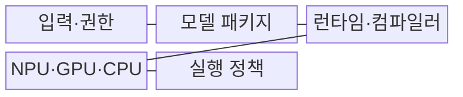
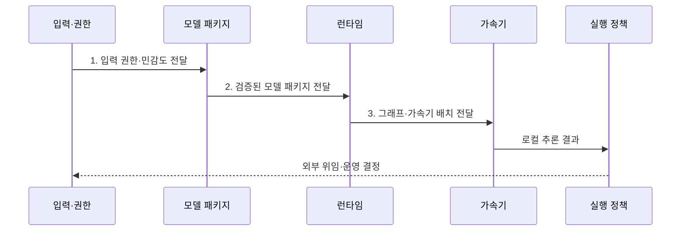

---
sidebar:
  order: 50
  label: "050. On-Device AI (온디바이스 AI)"
  badge:
    text: "기출 · 80%"
    variant: note
title: "On-Device AI (온디바이스 AI)"
date: "2026-08-02T09:23:00+09:00"
tags:
  - "notes-latest_tech"
weight: 50
extra:
  question_no: "050"
  source_status: "기출"
  source_history: "134회, 135회, 138회"
  priority: 80
  priority_note: "단말 추론·프라이버시가 반복 출제축"
---

## Ⅰ. 개요

핵심 용어

- **온디바이스 AI(On-Device AI)**: 원본 데이터를 외부 서버로 보내지 않고 단말 내부에서 AI 모델 추론을 수행하는 방식이다.
- **현장 자율성**: 네트워크 연결이나 중앙 서버 상태와 무관하게 단말이 필요한 판단을 계속 수행하는 능력이다.

- 정의/개념: **온디바이스 AI**는 원본 데이터를 외부로 보내지 않고 단말 내부에서 모델 추론을 수행하는 방식
- 배경/필요성: 클라우드 의존 추론은 망 단절·왕복 지연·민감정보 전송으로 **현장 자율성** 제약

### 쉽게 이해하기 (학습용)
- 정보를 서버로 보내지 않고 기기 안에서 직접 분석함

## Ⅱ. 특징

핵심 용어

- **신경망 처리 장치(NPU)**: 신경망의 행렬·텐서 연산을 낮은 전력으로 가속하는 전용 장치다.
- **로컬 개인정보 처리**: 원본 민감정보를 단말 내부에서 처리하여 외부 전송 범위를 줄이는 방식이다.
- **양자화(Quantization)**: 모델 가중치와 연산값을 더 적은 비트로 표현하여 메모리·연산량을 줄이는 방법이다.

- 네트워크 왕복 없이 실행하는 **오프라인·저지연 추론**
- 원본 데이터를 단말에 유지하는 **로컬 개인정보 처리**
- 압축 모델과 NPU·GPU를 결합하는 **전력·메모리 제약 실행**

### 쉽게 이해하기 (학습용)
- 통신 없이 빠르게 판단하고 원본 정보가 기기 밖으로 나가는 범위를 줄임

## Ⅲ. 구조 및 구성요소

핵심 용어

- **모델 패키지**: 압축 모델·메타데이터·서명·지원 연산자 정보를 묶은 배포 단위다.
- **그래프 분할(Graph Partitioning)**: 모델 연산을 지원 여부에 따라 NPU·GPU·CPU 또는 외부 실행 구간으로 나누는 방법이다.
- **실행 정책**: 자원·민감도·품질 기준으로 로컬 처리와 외부 위임을 결정하는 규칙이다.

| 구성요소 | 책임 |
|:---|:---|
| 입력·권한 | 센서·개인정보의 **접근 범위 통제** |
| 모델 패키지 | 압축 모델·메타데이터·서명의 **배포 단위 제공** |
| 런타임·컴파일러 | 그래프 변환과 장치별 **연산자 배치** |
| NPU·GPU·CPU | 전력·성능 조건에 따른 **로컬 추론 실행** |
| 실행 정책 | 자원·민감도별 로컬 실행과 **외부 위임 결정** |

### 쉽게 이해하기 (학습용)
- 입력 권한을 확인하고 모델을 기기 가속기에 배치하며 처리 위치를 결정함

## Ⅳ. 흐름도

핵심 용어

- **모델 서명(Model Signing)**: 배포 모델의 출처와 무결성을 암호학적 서명으로 검증하는 방법이다.
- **해시(Hash)**: 모델 파일을 고정 길이 값으로 변환하여 승인된 원본과 같은지 확인하는 결과값이다.

1. **입력 권한·민감도 전달**: 센서 권한과 데이터의 **외부 전송 범위** 전달
2. **검증된 모델 패키지 전달**: 서명·버전·지원 연산자를 검사한 **실행 패키지** 전달
3. **그래프·가속기 배치 전달**: 연산별 지원·전력 조건에 따라 **NPU·GPU·CPU** 배치

### 쉽게 이해하기 (학습용)
- 기기에서 먼저 처리하고 자원·품질 한계를 넘을 때만 허용된 범위로 외부에 맡김

## Ⅴ. 종류 및 비교

핵심 용어

- **온디바이스 AI**: 개인 단말 내부에서 오프라인·저지연·개인화 추론을 수행한다.
- **에지 AI**: 현장 인접 서버가 여러 단말의 데이터를 집계하고 분산 추론·제어를 수행한다.
- **클라우드 AI**: 중앙의 대규모 자원으로 복합 모델과 통합 분석을 수행한다.

| 비교 기준 | 온디바이스 AI | 에지 AI | 클라우드 AI |
|:---|:---|:---|:---|
| 적용 기준 | 오프라인·개인정보·즉시 응답 | 현장 다단말 집계·제어 | 대형 모델·복합 연산 |
| 핵심 특징 | 개인 단말의 **로컬 추론** | 인접 서버의 **분산 추론** | 중앙 자원의 **통합 추론** |
| 한계 | 전력·메모리·기기 파편화 | 노드 운영·현장 보안 복잡성 | 망 지연·가용성·정보 전송 |

### 쉽게 이해하기 (학습용)
- 단말·현장 서버·원격 데이터센터 중 요구에 맞는 실행 위치를 선택함

## Ⅵ. 실무 고려사항 및 대책

핵심 용어

- **오프로딩(Offloading)**: 단말에서 처리하기 어려운 연산을 정책에 따라 에지나 클라우드로 위임하는 방식이다.
- **무선 업데이트(OTA)**: 통신망을 통해 단말의 모델과 런타임을 원격 갱신하는 방식이다.
- **자동 롤백**: 새 모델 실행에 실패하면 이전 정상 버전으로 자동 복귀하는 복구 방식이다.

| 문제 | 대책 | 효과 |
|:---|:---|:---|
| 기기별 **연산자·가속기 차이** | 지원 연산자 기준 **그래프 분할**·실기기 시험 | 배포 호환성 **확보** |
| 배터리·발열의 **지속 실행 제한** | **정수 양자화**·호출 빈도·열 임계값 제어 | 전력·온도 **관리** |
| 로컬 자원·품질의 **처리 한계** | 민감정보 제거 후 정책 기반 외부 위임 | 서비스 연속성 **확보** |
| 배포 모델의 **변조 위험** | **모델 서명·해시** 검증 | 모델 무결성 **확보** |
| **OTA 업데이트 실패** | 단계 배포·이전 모델 자동 롤백 | 서비스 **신속 복구** |

### 쉽게 이해하기 (학습용)
- 기기별 차이와 배터리·보안을 확인하고 실패한 업데이트를 되돌릴 수 있게 함

## Ⅶ. 결론

핵심 용어

- **온디바이스 선택 기준**: 민감정보·오프라인 동작·즉시 응답이 중요하고 단말 자원으로 품질을 충족할 때 사용한다.
- **외부 위임 기준**: 로컬 자원이나 품질 한계를 넘을 때 민감정보를 제거하고 허용된 범위만 외부로 전달한다.

- 민감·오프라인 요청은 **온디바이스**, 자원·품질 한계 초과 시 **비식별 후 외부 위임**

### 쉽게 이해하기 (학습용)
- 기기 안에서 처리할 범위와 외부에 맡길 범위를 데이터 민감도와 자원으로 정함
