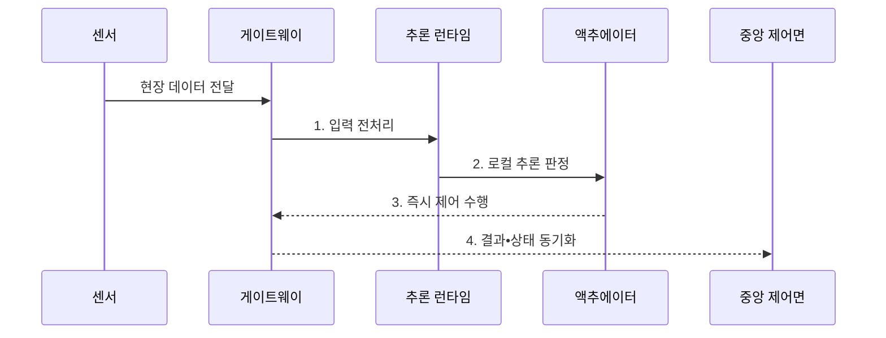

---
sidebar:
  order: 51
  label: "051. Edge AI (엣지 AI)"
  badge:
    text: "기출 • 70%"
    variant: note
title: "Edge AI (엣지 AI)"
date: "2026-08-05T14:25:51+09:00"
tags:
  - "notes-latest_tech"
weight: 51
extra:
  question_no: "051"
  source_status: "기출"
  source_history: "134회, 135회, 138회"
  priority: 70
  priority_note: "엣지 분산 추론 구조가 반복 출제축"
---

## Ⅰ. 개요

<details>
<summary>핵심 용어</summary>

- **엣지 인공지능(Edge Artificial Intelligence, Edge AI)**: 현장 인접 장치나 게이트웨이에서 인공지능 추론과 제어를 수행하는 분산 컴퓨팅 구조다.
- **현장 자율 제어**: 중앙 연결이 끊겨도 현장 장치가 로컬 판단으로 안전 동작을 계속하는 능력이다.

</details>

- 정의/개념: 데이터 발생 현장에 인접한 장치•게이트웨이에서 추론과 제한된 제어를 수행하는 **엣지 AI**
- 배경/필요성: 중앙 클라우드의 **왕복 지연•통신 단절** 로 현장 자율 제어 제약

#### 한줄 요약

- 현장 가까운 장비가 즉시 판단하고 중앙 시스템은 여러 장비의 모델과 상태를 관리하는 구조

## Ⅱ. 특징

<details>
<summary>핵심 용어</summary>

- **지연 동기화(Deferred Synchronization)**: 망 단절 중 결과를 로컬에 저장한 뒤 연결 복구 시 중앙으로 전송하는 방식이다.
- **중앙 제어면(Control Plane)**: 분산 장치의 신원•정책•모델 버전•운영 상태를 통합 관리하는 계층이다.
- **모델 드리프트(Model Drift)**: 운영 데이터의 특성이 변해 모델 예측 품질이 학습 시점보다 낮아지는 현상이다.

</details>

- **현장 인접 추론** 을 통한 응답 지연•원시 데이터 전송 감소
- 네트워크 단절 중 **로컬 자율 제어•지연 동기화**
- 중앙 제어면을 통한 **모델 버전•드리프트•장치 수명주기** 통제

#### 한줄 요약

- 연결이 끊겨도 현장 판단을 계속하고 복구 뒤 결과와 장치 상태를 중앙에 전송함

## Ⅲ. 구조 및 구성요소

<details>
<summary>핵심 용어</summary>

- **엣지 게이트웨이**: 센서 데이터를 수집•전처리하고 현장 장치와 중앙 시스템을 연결하는 장치다.
- **추론 런타임**: 학습된 모델을 목표 장치에서 불러와 입력 처리와 결과 생성을 실행하는 소프트웨어다.
- **액추에이터(Actuator)**: 추론 결과에 따라 경보•차단•구동 같은 물리 동작을 수행하는 장치다.
- **로컬 저장소(Local Storage)**: 망 단절 중 결과와 장치 상태를 임시 보관하는 저장소다.

</details>

```text
                         [중앙 제어면]
                               |
                         [엣지 게이트웨이]
                          /           \
                 [센서•카메라]     [추론 런타임]
                                    /           \
                             [액추에이터]     [로컬 저장소]
```

선의 의미: 중앙 제어면은 엣지 게이트웨이의 장치•모델 정책을 관리하고, 게이트웨이는 센서•카메라와 추론 런타임을 연결하며, 런타임은 액추에이터와 로컬 저장소를 현장 실행 경계로 사용한다.

| 구성요소 | 책임 |
|:---|:---|
| 센서•카메라 | 현장 **원시 데이터 생성** |
| 엣지 게이트웨이 | 데이터 **수집•동기화•전처리** |
| 추론 런타임 | **모델 실행•임계조건 판정** |
| 액추에이터 | 추론 결과에 따른 **즉시 제어** |
| 로컬 저장소 | **단절 구간 결과•상태 보관** |
| 중앙 제어면 | **장치 신원•모델 버전•OTA Update 관리** |

#### 한줄 요약

- 현장 데이터의 수집•판단•제어는 엣지가 맡고 배포와 관측은 중앙 제어면이 맡음

## Ⅳ. 흐름도

<details>
<summary>핵심 용어</summary>

- **입력 전처리**: 원시 센서 데이터를 모델 입력 형식으로 변환하고 불필요한 정보를 제거하는 과정이다.
- **상태 동기화**: 현장 결과와 장치 상태를 중앙 제어면에 전달하여 운영 이력을 일치시키는 과정이다.

</details>



1. **입력 전처리**: 모델 입력 형식 변환과 불필요 데이터 제거
2. **로컬 추론 판정**: 지연•안전 임계조건에 따른 현장 결과 확정
3. **즉시 제어 수행**: 망 상태와 무관한 경보•차단•장치 동작 실행
4. **결과•상태 동기화**: 단절 구간 결과와 장치 상태의 연결 복구 후 전송

#### 한줄 요약

- 현장에서 데이터를 판단해 즉시 장치를 제어하고 중앙 연결이 가능할 때 운영 결과를 동기화함

## Ⅴ. 종류 및 비교

<details>
<summary>핵심 용어</summary>

- **온디바이스 인공지능(On-Device Artificial Intelligence, On-Device AI)**: 개인 단말이 독립적으로 로컬 추론을 수행한다.
- **클라우드 인공지능(Cloud Artificial Intelligence, Cloud AI)**: 중앙의 고성능 자원으로 대규모 통합 분석과 모델 관리를 수행한다.

</details>

| 추론 배치 방식 | 온디바이스 AI | 엣지 AI | 클라우드 AI |
|:---|:---|:---|:---|
| 적용 기준 | 개인 단말의 **독립•개인화 처리** | 현장 단위 **저지연•다장치 처리** | 대규모 **통합 분석•고성능 연산** |
| 핵심 특징 | 단말 내부 **직접 추론** | 현장 인접 게이트웨이 **분산 추론** | 중앙 자원 **통합 추론** |
| 한계 | 단말 **자원•기종 파편화** | 분산 장비의 **운영 복잡성** | **망 지연•단절•원시 데이터 전송** |

#### 한줄 요약

- 개인 단말•현장 거점•중앙 서버 중 지연과 관리 범위에 맞는 실행 위치를 선택함

## Ⅵ. 실무 고려사항 및 대책

<details>
<summary>핵심 용어</summary>

- **보안 부팅(Secure Boot)**: 서명된 신뢰 코드만 장치 시작 과정에서 실행하는 보호 기법이다.
- **무선 업데이트(Over-the-Air Update, OTA Update)**: 모델과 설정을 네트워크로 원격 배포•갱신하는 방식이다.
- **롤백(Rollback)**: 배포 장애가 발생하면 모델과 설정을 이전 정상 버전으로 되돌리는 복구다.

</details>

| 문제 | 대책 | 효과 |
|:---|:---|:---|
| **망 단절** 시 중앙 추론•제어 불능 | **로컬 자율 제어•지연 동기화** | 단절 구간 **현장 제어 연속성** 확보 |
| 이기종 장치별 **OTA Update 호환성 불일치** | 장치군별 **단계 배포•롤백** | 현장 장비의 **버전 파편화** 억제 |
| 위변조 펌웨어•모델 적재 | **보안 부팅•서명 검증** | **신뢰 실행 기반** 확보 |

#### 한줄 요약

- 현장 장비는 단절 대응뿐 아니라 모델 품질과 신뢰 코드, 배포 버전까지 중앙에서 추적해야 함

## Ⅶ. 결론

<details>
<summary>핵심 용어</summary>

- **엣지 배치 기준**: 망 단절에도 지속해야 하는 실시간 현장 판단과 제어를 인접 장치에 둔다.
- **클라우드 배치 기준**: 여러 현장의 통합 분석•모델 학습•버전 관리는 중앙 자원에 둔다.

</details>

- 실시간•단절 제어는 **엣지**, 통합 분석•모델 관리는 **클라우드** 배치

#### 한줄 요약

- 즉시 판단이 필요한 범위는 현장에 두고 통합 분석과 관리는 중앙에 배치
