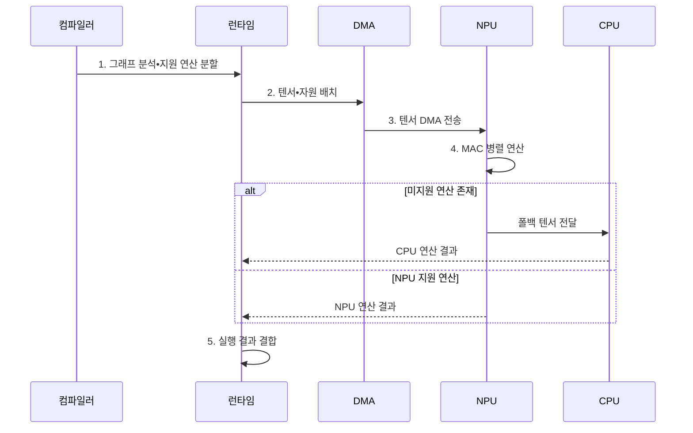

---
sidebar:
  order: 52
  label: "052. Neural Processing Unit (NPU)"
  badge:
    text: "기출 • 80%"
    variant: note
title: "Neural Processing Unit (NPU)"
date: "2026-08-05T14:25:52+09:00"
tags:
  - "notes-latest_tech"
weight: 52
extra:
  question_no: "052"
  source_status: "기출"
  source_history: "126회, 134회, 135회, 137회, 138회"
  priority: 80
  priority_note: "AI 가속기 구조•비교가 반복 출제축"
---

## Ⅰ. 개요

<details>
<summary>핵심 용어</summary>

- **신경망 처리장치(Neural Processing Unit, NPU)**: 신경망의 행렬•텐서 연산을 데이터 흐름 방식으로 병렬 처리하는 전용 가속 프로세서다.
- **곱셈 누산(Multiply-Accumulate, MAC)**: 두 값을 곱한 결과를 기존 합에 누적하는 신경망 핵심 연산이다.
- **중앙처리장치(Central Processing Unit, CPU)**: 범용 명령과 복잡한 분기를 처리하는 프로세서다.

</details>

- 정의/개념: **NPU** 는 신경망 텐서 연산을 데이터 흐름으로 병렬 처리하는 전용 가속 프로세서
- 배경/필요성: 범용 **CPU** 는 대규모 **MAC** 병렬도와 메모리 이동에서 전력 효율 제약

#### 한줄 요약

- 신경망 처리장치는 반복 행렬 계산과 데이터 재사용에 맞춘 전용 연산 장치

## Ⅱ. 특징

<details>
<summary>핵심 용어</summary>

- **텐서(Tensor)**: 신경망의 입력•가중치•중간 결과를 여러 차원의 수 배열로 표현한 데이터다.
- **온칩 메모리**: 입력•가중치•중간 결과를 칩 내부에 저장해 외부 데이터 이동을 줄이는 메모리다.
- **Roofline 모델**: 메모리 대역폭과 최대 계산 성능으로 달성 가능한 처리량 상한을 설명하는 성능 모델이다.

</details>


> 달성 처리량은 전환점 전에는 메모리 대역폭 선을, 이후에는 계산 성능 상한선을 따르는 정규화 개념도다.

- **MAC 연산 배열** 을 통한 행렬•텐서 병렬 처리
- **온칩 메모리 재사용** 을 통한 외부 데이터 이동 감소
- 컴파일러의 **연산자 매핑•폴백 비용** 과 **Roofline 모델** 기반 메모리•계산 병목 판별

#### 한줄 요약

- 계산기가 빨라도 데이터를 계속 외부에서 가져오면 처리량이 낮아지므로 칩 내부 재사용이 중요함

## Ⅲ. 구조 및 구성요소

<details>
<summary>핵심 용어</summary>

- **정적 임의 접근 메모리(Static Random-Access Memory, SRAM)**: 칩 내부에서 입력•가중치•중간 결과를 빠르게 재사용하는 메모리다.
- **직접 메모리 접근(Direct Memory Access, DMA)**: 프로세서 개입 없이 연산기와 메모리 사이의 텐서를 전송하는 방식이다.
- **곱셈 누산(Multiply-Accumulate, MAC) 연산 배열**: 다수의 곱셈과 누산을 병렬 실행하여 행렬•텐서 연산 처리량을 높이는 전용 연산부다.
- **폴백 프로세서(Fallback Processor)**: 신경망 처리장치가 지원하지 않는 연산을 중앙처리장치 등에서 대신 실행하는 처리부다.
- **컴파일러(Compiler)**: 모델을 지원 연산으로 변환•분할하는 소프트웨어다.
- **런타임(Runtime)**: 장치별 자원 배치와 실행 순서를 제어하는 소프트웨어다.

</details>

```text
                       [실행 소프트웨어]
                        /           \
                [DMA 전송 엔진]   [폴백 프로세서]
                        |
                    [온칩 SRAM]
                        |
                   [MAC 연산 배열]
```

선의 의미: 실행 소프트웨어는 NPU의 DMA 전송 엔진과 폴백 프로세서를 함께 제어하고, DMA 전송 엔진은 온칩 SRAM을 통해 MAC 연산 배열에 텐서를 공급한다.

| 구성요소 | 책임 |
|:---|:---|
| 실행 소프트웨어 | **그래프 분할•실행 순서** 제어 |
| DMA 전송 엔진 | 외부와 온칩 메모리 사이의 **DMA 텐서 전송** |
| 온칩 SRAM | 입력•가중치•중간 결과의 **온칩 SRAM 재사용** |
| MAC 연산 배열 | **곱셈 누산•텐서 병렬 연산** |
| 폴백 프로세서 | NPU 미지원 연산의 **CPU 대체 실행** |

#### 한줄 요약

- 컴파일러가 지원 연산을 나누면 전송 엔진과 내부 메모리가 데이터를 공급하고 연산 배열이 계산함

## Ⅳ. 흐름도

<details>
<summary>핵심 용어</summary>

- **연산 그래프**: 모델 연산자와 텐서 의존관계를 노드와 연결로 표현한 구조다.
- **폴백(Fallback)**: NPU가 지원하지 않는 연산을 CPU 같은 다른 프로세서에서 대신 실행하는 처리다.
- **그래프 분할**: 지원 여부와 전송 비용에 따라 NPU 구간과 폴백 구간을 나누는 과정이다.

</details>



1. **그래프 분석•지원 연산 분할**: 의존관계와 NPU•CPU 실행 구간 결정
2. **텐서•자원 배치**: 실행 순서와 외부•온칩 메모리 이동 계획 수립
3. **텐서 DMA 전송**: 입력•가중치를 온칩 메모리에 비동기 공급
4. **MAC 병렬 연산**: 온칩 텐서를 재사용해 행렬•텐서 연산 실행
5. **실행 결과 결합**: NPU 연산과 CPU 폴백 결과를 최종 출력으로 통합

#### 한줄 요약

- 지원되는 계산은 NPU에 배치하고 나머지는 CPU가 실행해 결과를 다시 결합함

## Ⅴ. 종류 및 비교

<details>
<summary>핵심 용어</summary>

- **CPU 역할**: 복잡한 분기와 범용 순차 제어 처리
- **그래픽 처리장치(Graphics Processing Unit, GPU)**: 다수 코어로 범용 병렬 연산을 처리하지만 메모리•전력 비용이 크다.
- **NPU 역할**: 데이터 흐름과 MAC 배열로 저전력 신경망 추론 가속

</details>

CPU•GPU•NPU는 제어 유연성•병렬성•전력 효율이 다르다.

| AI 프로세서 | CPU | GPU | NPU |
|:---|:---|:---|:---|
| 적용 기준 | **복잡한 제어•범용 연산** | **대규모 범용 병렬 연산** | **저전력 신경망 추론** |
| 핵심 특징 | **분기•순차 처리 유연성** | 다수 코어의 **높은 병렬도** | **데이터 흐름•MAC 배열 특화** |
| 한계 | 행렬 연산의 **전력 효율 저하** | **메모리•전력 비용** | **연산자•모델 지원 제약** |

#### 한줄 요약

- CPU는 제어, GPU는 범용 병렬 계산, NPU는 저전력 신경망 연산에 적합함

## Ⅵ. 실무 고려사항 및 대책

<details>
<summary>핵심 용어</summary>

- **연산 집약도**: 메모리에서 옮긴 데이터양에 비해 수행하는 연산량의 비율이다.
- **연산 융합**: 여러 연산자를 하나의 커널로 묶어 중간 텐서 저장과 이동을 줄이는 기법이다.
- **회귀 시험**: 모델이나 정밀도 변경 뒤 기존 입력의 품질이 낮아지지 않았는지 확인하는 시험이다.

</details>

실무에서는 **NPU 매핑•CPU 폴백** 과 **SRAM 재사용** 을 함께 측정한다.

| 문제 | 대책 | 효과 |
|:---|:---|:---|
| **미지원 연산자** 로 CPU 폴백•복사 증가 | 컴파일 보고서 기반 **NPU 매핑•경계 축소** | **폴백 종단 지연** 감소 |
| 낮은 연산 집약도로 **메모리 대역폭** 병목 | **연산 융합•온칩 SRAM 재사용** | **외부 텐서 이동•대기** 감소 |
| 저정밀 자료형 적용 시 **추론 정확도** 저하 | 장치 지원 정밀도별 **회귀 시험** | 전력 효율 내 **허용 품질** 유지 |

#### 한줄 요약

- NPU 계산 시간뿐 아니라 CPU로 넘어가는 구간과 데이터 이동까지 측정해야 실제 가속 효과를 알 수 있음

## Ⅶ. 결론

<details>
<summary>핵심 용어</summary>

- **연산자 지원률**: 전체 모델 연산 중 NPU가 직접 실행할 수 있는 비율이다.
- **폴백 경계**: 데이터 이동과 지연을 고려하여 NPU와 CPU 실행 구간을 나누는 지점이다.

</details>

- **연산자 지원률•전력 예산** 으로 NPU 매핑과 **CPU 폴백 경계** 결정

#### 한줄 요약

- 모델의 지원 연산 비율과 데이터 이동 비용이 NPU 적용 효과를 결정함
