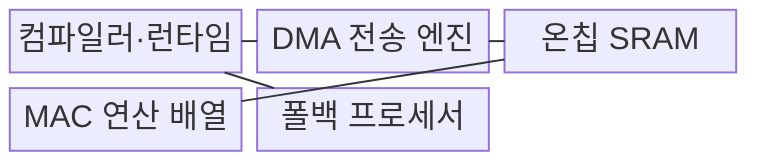
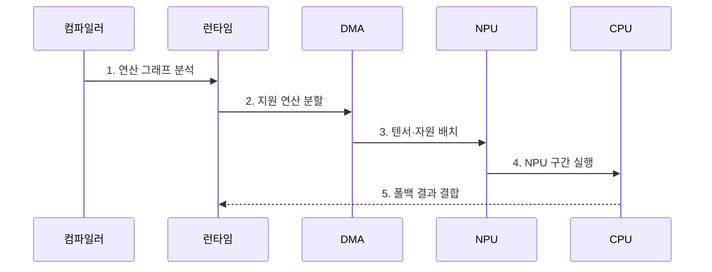

---
sidebar:
  order: 52
  label: "052. Neural Processing Unit (NPU)"
  badge:
    text: "기출 · 80%"
    variant: note
title: "Neural Processing Unit (NPU)"
date: "2026-07-27T23:59:59+09:00"
tags:
  - "notes-latest_tech"
weight: 52
extra:
  question_no: "052"
  source_status: "기출"
  source_history: "126회, 134회, 135회, 137회, 138회"
  priority: 80
  priority_note: "AI 가속기 구조·비교가 반복 출제축"
---

## 미리 알고가기

- **신경망 처리 장치(Neural Processing Unit, NPU)**: 신경망의 행렬·텐서 연산을 병렬 처리하는 전용 가속 프로세서
- **텐서(Tensor)**: 신경망의 입력·가중치·중간 결과를 여러 차원의 수 배열로 표현한 데이터
- **곱셈 누산(Multiply-Accumulate, MAC)**: 두 값을 곱한 결과를 기존 합에 누적하는 신경망 핵심 연산
- **정적 램(Static Random-Access Memory, SRAM)**: 칩 내부에서 입력·가중치·중간 결과를 빠르게 재사용하는 메모리
- **직접 메모리 접근(Direct Memory Access, DMA)**: 프로세서 개입 없이 연산기와 메모리 사이의 데이터를 전송하는 방식
- **연산 그래프(Computation Graph)**: 모델 연산자와 텐서의 의존관계를 노드와 연결로 표현한 구조
- **연산자(Operator)**: 합성곱·행렬 곱·활성화처럼 연산 그래프를 구성하는 개별 계산 단위
- **컴파일러·런타임(Compiler·Runtime)**: 모델을 장치 지원 연산으로 변환하고 장치 간 실행 순서를 제어하는 소프트웨어 계층
- **폴백(Fallback)**: NPU가 지원하지 않는 연산을 CPU 등의 다른 프로세서에서 대신 실행하는 처리
- **연산 집약도(Arithmetic Intensity)**: 메모리에서 옮긴 데이터양에 비해 수행하는 연산량의 비율
- **Roofline 모델**: 메모리 대역폭과 최대 계산 성능으로 장치의 달성 가능한 처리량 상한을 설명하는 성능 모델
- **회귀 시험(Regression Test)**: 모델이나 실행 환경 변경 뒤 기존 입력의 품질이 낮아지지 않았는지 확인하는 시험

## Ⅰ. 개요

- 정의/개념: **신경망 행렬·텐서 연산**을 데이터 흐름 방식으로 병렬 처리하는 전용 가속 프로세서
- 배경/필요성: 범용 CPU는 대규모 MAC 연산의 **병렬도·메모리 이동·전력 효율** 한계로 AI 추론 가속기 필요

### 쉽게 이해하기 (학습용)

- NPU는 신경망의 반복 행렬 계산과 데이터 재사용에 맞춘 전용 연산 장치

## Ⅱ. 특징

> 달성 처리량은 Ridge Point 전에는 메모리 대역폭 선을, 이후에는 계산 성능 상한선을 따르며 특정 NPU의 실측값이 아닌 정규화 개념도다.

- **MAC 연산 배열**을 통한 행렬·텐서 병렬 처리
- **온칩 메모리 재사용**을 통한 외부 데이터 이동 감소
- 컴파일러 지원 범위에 따른 **연산자 매핑·폴백 비용**

### 쉽게 이해하기 (학습용)

- 계산기가 빨라도 데이터를 계속 외부에서 가져오면 처리량이 낮아지므로 칩 내부 재사용이 중요함

## Ⅲ. 구조 및 구성요소

| 구성요소 | 책임 |
|:---|:---|
| **컴파일러·런타임** | 연산 그래프 분석·분할·실행 순서 제어 |
| **DMA 전송 엔진** | 외부 메모리와 온칩 메모리 사이 텐서 이동 |
| **온칩 SRAM** | 입력·가중치·중간 결과 재사용 |
| **MAC 연산 배열** | 곱셈 누산 기반 텐서 병렬 연산 |
| **폴백 프로세서** | NPU 미지원 연산의 대체 실행 |

### 쉽게 이해하기 (학습용)

- 컴파일러가 지원 연산을 나누면 전송 엔진과 내부 메모리가 데이터를 공급하고 연산 배열이 계산함

## Ⅳ. 흐름도

- **1. 연산 그래프 분석**: 연산자·텐서 형태와 의존관계 식별
- **2. 지원 연산 분할**: NPU 실행 구간과 CPU 대체 구간 결정
- **3. 텐서·자원 배치**: 실행 순서와 외부·온칩 메모리 이동 계획 수립
- **4. NPU 구간 실행**: DMA가 공급한 텐서의 MAC 배열 병렬 처리
- **5. 폴백 결과 결합**: CPU 대체 연산과 NPU 구간의 최종 출력 통합

### 쉽게 이해하기 (학습용)

- 지원되는 계산은 NPU에 배치하고 나머지는 CPU가 실행해 결과를 다시 결합함

## Ⅴ. 종류 및 비교

| AI 프로세서 | CPU | GPU | NPU |
|:---|:---|:---|:---|
| **적용 기준** | 복잡한 제어·범용 연산 | 대규모 범용 병렬 연산 | 저전력 신경망 추론 |
| **핵심 특징** | 분기·순차 처리 유연성 | 다수 코어의 높은 병렬도 | 데이터 흐름·MAC 배열 특화 |
| **한계** | 행렬 연산 전력 효율 저하 | 메모리·전력 비용 | 연산자·모델 지원 제약 |

### 쉽게 이해하기 (학습용)

- CPU는 제어, GPU는 범용 병렬 계산, NPU는 저전력 신경망 연산에 적합함

## Ⅵ. 실무 고려사항 및 대책

| 고려사항 | 대책 | 효과 |
|:---|:---|:---|
| **미지원 연산자**로 CPU 폴백·복사 증가 | 컴파일 보고서 기반 **NPU 매핑·경계 축소** | **폴백 종단 지연** 감소 |
| 낮은 연산 집약도로 **메모리 대역폭** 병목 | **연산 융합·온칩 SRAM 재사용** | **외부 텐서 이동·대기** 감소 |
| 저정밀 자료형 적용 시 **추론 정확도** 저하 | 장치 지원 정밀도별 **회귀 시험** | 전력 효율 내 **허용 품질** 유지 |

### 쉽게 이해하기 (학습용)

- NPU 계산 시간뿐 아니라 CPU로 넘어가는 구간과 데이터 이동까지 측정해야 실제 가속 효과를 알 수 있음

## Ⅶ. 결론

- **연산자 지원률·메모리 이동·전력 예산**을 기준으로 NPU 매핑 범위와 CPU 폴백 경계를 결정하는 가속 설계

### 쉽게 이해하기 (학습용)

- 모델의 지원 연산 비율과 데이터 이동 비용이 NPU 적용 효과를 결정함
