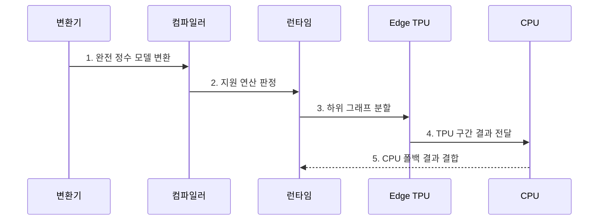

---
sidebar:
  order: 53
  label: "053. Edge TPU (엣지 텐서 처리 장치)"
  badge:
    text: "기출 · 40%"
    variant: note
title: "Edge TPU (엣지 텐서 처리 장치)"
date: "2026-07-31T11:59:04+09:00"
tags:
  - "notes-latest_tech"
weight: 53
extra:
  question_no: "053"
  source_status: "기출"
  source_history: "138회"
  priority: 40
  priority_note: "전용 엣지 가속기는 NPU 사례"
---

## 미리 알고가기

- **텐서 처리 장치(Tensor Processing Unit, TPU)**: 텐서 연산을 병렬 처리하도록 설계된 전용 가속 프로세서
- **주문형 집적 회로(Application-Specific Integrated Circuit, ASIC)**: 특정 연산에 맞춰 회로와 데이터 흐름을 고정 설계한 전용 반도체
- **8비트 정수(8-bit Integer, INT8)**: 가중치와 활성값을 8비트 정수로 표현해 저장·연산 비용을 줄이는 자료형
- **완전 정수 양자화(Full Integer Quantization)**: 모델의 가중치와 활성값을 모두 정수 표현으로 변환하는 기법
- **대표 데이터셋(Representative Dataset)**: 양자화 범위를 정하도록 실제 운영 입력의 분포를 대표해 제공하는 표본 데이터
- **양자화 인지 학습(Quantization-Aware Training, QAT)**: 학습 과정에 양자화 오차를 반영해 정수 변환 후 품질을 회복하는 기법
- **하위 그래프(Subgraph)**: 전체 연산 그래프에서 같은 장치가 연속 실행하도록 묶은 일부 연산 구간
- **컴파일러·런타임(Compiler·Runtime)**: 모델을 Edge TPU 지원 연산으로 변환하고 TPU·CPU 구간의 실행을 제어하는 소프트웨어 계층
- **폴백(Fallback)**: Edge TPU가 지원하지 않는 연산을 CPU에서 대신 실행하는 처리
- **종단 지연(End-to-End Latency)**: 입력 전처리부터 장치 전송·추론·후처리까지 전체 요청에 걸린 시간

## Ⅰ. 개요

- 정의/개념: **Edge TPU**는 완전 INT8 지원 연산을 저전력으로 실행하는 엣지 추론용 전용 ASIC
- 배경/필요성: 범용 프로세서는 제한된 전력에서 **정수 텐서 처리량·종단 지연** 충족 불가

### 쉽게 이해하기 (학습용)

- Edge TPU는 정수로 변환된 지원 연산을 현장에서 낮은 전력으로 실행하는 전용 장치

## Ⅱ. 특징

- 가중치·활성값을 함께 변환하는 **완전 INT8 양자화**
- 지원 연산만 묶어 가속하는 **하위 그래프 컴파일**
- CPU 폴백·전처리·전송을 포함한 **종단 추론 지연**

### 쉽게 이해하기 (학습용)

- 지원되지 않는 연산이 CPU로 자주 넘어가면 TPU 자체가 빨라도 전체 응답은 느려질 수 있음

## Ⅲ. 구조 및 구성요소

| 구성요소 | 책임 |
|:---|:---|
| 완전 INT8 모델 | 가중치·활성값의 **정수 표현 제공** |
| Edge TPU 컴파일러 | **지원 연산 판정·하위 그래프 분할** |
| 런타임·장치 인터페이스 | **TPU 호출·입출력 텐서 전송** |
| Edge TPU ASIC | 지원 **INT8 텐서 연산 실행** |
| CPU 폴백 | 미지원 연산의 **범용 실행** |

### 쉽게 이해하기 (학습용)

- 컴파일러가 정수 모델을 TPU 구간과 CPU 구간으로 나누고 런타임이 두 장치의 실행을 연결함

## Ⅳ. 흐름도

1. **완전 정수 모델 변환**: 대표 데이터셋 또는 QAT 기반 가중치·활성값 INT8 변환
2. **지원 연산 판정**: 컴파일러의 연산자·텐서 형상 지원 여부 확인
3. **하위 그래프 분할**: Edge TPU 구간과 CPU 폴백 구간 확정
4. **TPU 구간 결과 전달**: 지원 하위 그래프의 INT8 연산 결과 전달
5. **CPU 폴백 결과 결합**: 미지원 연산 실행 후 가속·폴백 출력 통합

### 쉽게 이해하기 (학습용)

- 정수 모델을 장치별 구간으로 나눈 뒤 TPU와 CPU가 맡은 계산 결과를 하나로 합침

## Ⅴ. 종류 및 비교

| 엣지 추론 방식 | CPU | GPU | Edge TPU |
|:---|:---|:---|:---|
| 적용 기준 | **미지원·제어 중심 연산** | 다양한 **병렬 텐서 연산** | **완전 INT8 지원 모델** |
| 핵심 특징 | **범용 명령 실행** | 프로그램 가능한 **병렬 연산** | **INT8 전용 ASIC 추론** |
| 한계 | **처리량·전력 효율 저하** | **전력·드라이버 부담** | **컴파일·연산자 지원 제약** |

### 쉽게 이해하기 (학습용)

- 범용성은 CPU가 높고 Edge TPU는 완전 정수 모델의 지원 연산에서 가장 높은 효율을 목표로 함

## Ⅵ. 실무 고려사항 및 대책

| 고려사항 | 대책 | 효과 |
|:---|:---|:---|
| 완전 INT8 변환 시 **양자화 품질** 저하 | **대표 데이터셋 보정·QAT** 적용 | **INT8 추론 정확도** 회복 |
| 미지원 연산 분할로 **CPU 폴백·전송** 증가 | 컴파일 매핑 기반 **하위 그래프·경계 조정** | CPU 왕복·**종단 지연** 감소 |

### 쉽게 이해하기 (학습용)

- 컴파일 성공 여부뿐 아니라 정수 변환 품질과 CPU 왕복, 데이터 이동 시간을 함께 측정해야 함

## Ⅶ. 결론

- INT8 품질·지원률 충족 모델은 **Edge TPU**, 미지원 연산은 **CPU 폴백**

### 쉽게 이해하기 (학습용)

- 정수 변환 품질과 TPU 지원 구간이 충분한 모델에 Edge TPU를 적용
