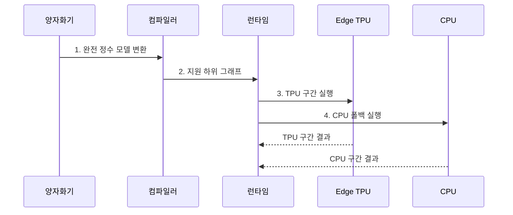

---
sidebar:
  order: 53
  label: "053. Edge TPU (엣지 텐서 처리 장치)"
  badge:
    text: "기출 • 40%"
    variant: note
title: "Edge TPU (엣지 텐서 처리 장치)"
date: "2026-08-05T14:25:53+09:00"
tags:
  - "notes-latest_tech"
weight: 53
extra:
  question_no: "053"
  source_status: "기출"
  source_history: "138회"
  priority: 40
  priority_note: "전용 엣지 가속기는 NPU 사례"
---

## Ⅰ. 개요

<details>
<summary>핵심 용어</summary>

- **엣지 텐서 처리장치(Edge Tensor Processing Unit, Edge TPU)**: 완전 8비트 정수 지원 연산을 낮은 전력으로 실행하도록 설계된 엣지 추론용 전용 반도체다.
- **주문형 반도체(Application-Specific Integrated Circuit, ASIC)**: 특정 연산에 맞춰 회로와 데이터 흐름을 고정 설계한 전용 반도체다.
- **8비트 정수(Integer 8-bit, INT8)**: 값을 8비트 정수로 표현하는 저정밀 자료형이다.
- **중앙처리장치(Central Processing Unit, CPU)**: 범용 명령과 미지원 연산을 처리하는 프로세서다.

</details>

- 정의/개념: **Edge TPU** 는 완전 **INT8** 지원 연산을 저전력 실행하는 엣지 추론용 **ASIC**
- 배경/필요성: 범용 프로세서는 제한된 전력에서 **정수 텐서 처리량•종단 지연** 충족 불가

#### 한줄 요약

- Edge TPU는 정수로 변환된 지원 연산을 현장에서 낮은 전력으로 실행하는 전용 장치

## Ⅱ. 특징

<details>
<summary>핵심 용어</summary>

- **완전 정수 양자화**: 모델의 가중치와 활성값을 모두 정수 표현으로 변환하는 기법이다.
- **하위 그래프**: 전체 연산 그래프에서 같은 장치가 연속 실행하도록 묶은 일부 연산 구간이다.
- **종단 지연**: 입력 전처리부터 장치 전송•추론•후처리까지 전체 요청에 걸린 시간이다.

</details>

- 가중치•활성값을 함께 변환하는 **완전 INT8 양자화**
- 지원 연산만 묶어 가속하는 **하위 그래프 컴파일**
- **CPU 폴백•전처리•전송** 을 포함한 **종단 추론 지연**

#### 한줄 요약

- 지원되지 않는 연산이 CPU로 자주 넘어가면 TPU 자체가 빨라도 전체 응답은 느려질 수 있음

## Ⅲ. 구조 및 구성요소

<details>
<summary>핵심 용어</summary>

- **Edge TPU 컴파일러**: 모델의 연산자와 텐서 형상을 검사해 지원 하위 그래프를 장치 코드로 변환한다.
- **런타임**: TPU 호출•입출력 전송과 CPU 폴백 구간의 실행 순서를 제어한다.
- **폴백**: Edge TPU가 지원하지 않는 연산을 CPU에서 대신 실행하는 처리다.

</details>

```text
                     [Edge TPU 컴파일러]
                       /             \
                [모델 변환기]     [실행 제어기]
                                   /           \
                           [Edge TPU ASIC]   [CPU 폴백]
```

선의 의미: Edge TPU 컴파일러는 모델 변환기의 완전 INT8 모델을 지원 구간으로 분할해 실행 제어기에 제공하고, 실행 제어기는 Edge TPU ASIC과 CPU 폴백의 실행 경계를 관리한다.

| 구성요소 | 책임 |
|:---|:---|
| 모델 변환기 | 가중치•활성값의 **완전 INT8 변환** |
| Edge TPU 컴파일러 | **지원 연산 판정•하위 그래프 분할** |
| 실행 제어기 | **TPU 호출•입출력 텐서 전송** |
| Edge TPU ASIC | 지원 **INT8 텐서 연산 실행** |
| CPU 폴백 | 미지원 연산의 **범용 실행** |

#### 한줄 요약

- 컴파일러가 정수 모델을 TPU 구간과 CPU 구간으로 나누고 런타임이 두 장치의 실행을 연결함

## Ⅳ. 흐름도

<details>
<summary>핵심 용어</summary>

- **대표 데이터셋**: 양자화 범위를 정하도록 실제 운영 입력 분포를 대표해 제공하는 표본 데이터다.
- **양자화 인지 학습(QAT)**: 학습 과정에 양자화 오차를 반영해 정수 변환 후 품질을 회복하는 기법이다.

</details>



1. **완전 정수 모델 변환**: 대표 데이터셋 또는 **QAT** 기반 가중치•활성값 **INT8 변환**
2. **지원 하위 그래프**: 연산자•텐서 형상으로 지원 구간 확정
3. **TPU 구간 실행**: 지원 하위 그래프의 INT8 연산 처리
4. **CPU 폴백 실행**: 미지원 연산을 처리하고 출력 결합

#### 한줄 요약

- 정수 모델을 장치별 구간으로 나눈 뒤 TPU와 CPU가 맡은 계산 결과를 하나로 합침

## Ⅴ. 종류 및 비교

<details>
<summary>핵심 용어</summary>

- **CPU 역할**: 미지원 연산과 복잡한 제어를 범용 명령으로 처리한다.
- **그래픽 처리장치(Graphics Processing Unit, GPU)**: 다양한 텐서 연산을 프로그램 가능한 병렬 코어로 처리한다.
- **Edge TPU 역할**: 완전 INT8 지원 연산을 전용 회로로 실행한다.

</details>

CPU•GPU•Edge TPU는 범용성과 전력 효율이 다르다.

| 엣지 추론 방식 | CPU | GPU | Edge TPU |
|:---|:---|:---|:---|
| 적용 기준 | **미지원•제어 중심 연산** | 다양한 **병렬 텐서 연산** | **완전 INT8 지원 모델** |
| 핵심 특징 | **범용 명령 실행** | 프로그램 가능한 **병렬 연산** | **INT8 전용 ASIC 추론** |
| 한계 | **처리량•전력 효율 저하** | **전력•드라이버 부담** | **컴파일•연산자 지원 제약** |

#### 한줄 요약

- 범용성은 CPU가 높고 Edge TPU는 완전 정수 모델의 지원 연산에서 가장 높은 효율을 목표로 함

## Ⅵ. 실무 고려사항 및 대책

<details>
<summary>핵심 용어</summary>

- **양자화 품질 저하**: INT8 변환 오차로 원본 모델보다 정확도가 낮아지는 문제다.
- **CPU 왕복**: 미지원 연산 때문에 TPU와 CPU 사이에서 텐서를 반복 전송하여 종단 지연이 증가하는 현상이다.

</details>

실무에서는 **INT8 품질•Edge TPU 지원률** 과 **CPU 왕복** 을 측정한다.

| 문제 | 대책 | 효과 |
|:---|:---|:---|
| 완전 INT8 변환 시 **양자화 품질** 저하 | **대표 데이터셋 보정•QAT** 적용 | **INT8 추론 정확도** 회복 |
| 미지원 연산 분할로 **CPU 폴백•전송** 증가 | 컴파일 매핑 기반 **하위 그래프•경계 조정** | CPU 왕복•**종단 지연** 감소 |

#### 한줄 요약

- 컴파일 성공 여부뿐 아니라 정수 변환 품질과 CPU 왕복, 데이터 이동 시간을 함께 측정해야 함

## Ⅶ. 결론

<details>
<summary>핵심 용어</summary>

- **Edge TPU 선택 기준**: 완전 INT8 품질과 지원 연산 비율이 목표를 충족할 때 적용한다.
- **CPU 폴백 기준**: Edge TPU가 지원하지 않는 연산만 경계를 최소화하여 CPU에서 처리한다.

</details>

- **INT8 품질•지원률** 충족 시 Edge TPU 배치, 미지원 연산은 **CPU 폴백** 처리

#### 한줄 요약

- 정수 변환 품질과 TPU 지원 구간이 충분한 모델에 Edge TPU를 적용
