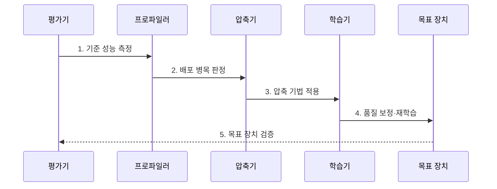

---
sidebar:
  order: 54
  label: "054. Model Compression (모델 압축)"
  badge:
    text: "기출 · 70%"
    variant: note
title: "Model Compression (모델 압축)"
date: "2026-08-02T09:23:00+09:00"
tags:
  - "notes-latest_tech"
weight: 54
extra:
  question_no: "054"
  source_status: "기출"
  source_history: "135회, 138회"
  priority: 70
  priority_note: "경량화 기법 비교가 온디바이스 기반"
---

## Ⅰ. 개요

핵심 용어

- **모델 압축(Model Compression)**: 목표 품질을 유지하며 모델 구조·표현 정밀도·학습 지식을 줄여 배포 자원 사용을 낮추는 기술이다.
- **배포 자원**: 모델 실행에 필요한 메모리·연산량·전력·응답 시간의 한도다.

- 정의/개념: **모델 압축**은 구조·정밀도·학습 지식을 줄여 품질 한도 안에서 배포 자원을 절감하는 기술
- 배경/필요성: 원본 모델의 **메모리·응답 지연·전력 사용량**이 단말 예산을 초과

### 쉽게 이해하기 (학습용)

- 모델을 작게 만드는 데서 끝나지 않고 실제 장치의 품질과 속도까지 확인하는 최적화 과정

## Ⅱ. 특징

핵심 용어

- **가지치기(Pruning)**: 기여도가 낮은 가중치·채널·계층을 제거하는 구조 압축 기법이다.
- **양자화(Quantization)**: 가중치와 활성값을 더 적은 비트로 표현하는 정밀도 압축 기법이다.
- **지식 증류(Knowledge Distillation)**: 큰 교사 모델의 출력 분포를 작은 학생 모델이 학습하는 압축 기법이다.

- **가지치기·양자화·지식 증류**를 통한 구조·표현·학습 지식 축소
- 압축 변환 뒤 보정·재학습을 통한 **목표 품질 회복**
- 파일 크기·연산량과 실제 장치의 **커널 가속·종단 지연** 공동 검증

### 쉽게 이해하기 (학습용)

- 저장 크기가 줄어도 장치가 압축된 연산 형식을 지원하지 않으면 응답 속도는 줄지 않을 수 있음

## Ⅲ. 구조 및 구성요소

핵심 용어

- **프로파일러(Profiler)**: 모델 실행 구간별 시간·메모리·연산 사용량을 측정해 병목을 찾는 도구다.
- **보정 데이터**: 양자화 범위나 압축 후 품질을 조정하도록 운영 입력을 대표해 제공하는 데이터다.
- **목표 런타임**: 압축된 연산·자료형·희소 패턴을 실제 장치에서 실행하는 소프트웨어 환경이다.

| 구성요소 | 책임 |
|:---|:---|
| 기준 모델·평가 데이터 | **압축 전 품질·자원 기준선** 제공 |
| 병목 프로파일러 | **메모리·연산·전송 병목** 식별 |
| 압축 변환기 | 병목에 맞는 **압축 기법 변환** |
| 보정·재학습기 | **보정 데이터·재학습**으로 변환 오차 회복 |
| 목표 런타임·평가기 | 실제 장치의 **품질·지연·전력 검증** |

### 쉽게 이해하기 (학습용)

- 원본 성능과 장치 병목을 측정하고 압축·품질 회복 뒤 같은 장치에서 다시 비교함

## Ⅳ. 흐름도

핵심 용어

- **기준선**: 압축 전 모델의 과업 품질·크기·지연·전력 측정값이다.
- **종단 지연**: 입력 전처리부터 모델 실행·후처리까지 전체 요청에 걸린 시간이다.
- **회귀 시험**: 압축 전후 동일 입력의 품질을 비교해 기존 과업의 성능 저하를 확인하는 시험이다.

1. **기준 성능 측정**: 원본 모델의 과업 품질·크기·지연·전력 기록
2. **배포 병목 판정**: 목표 장치의 메모리·연산·전송 제한 식별
3. **압축 기법 적용**: 병목에 맞는 가지치기·양자화·증류 선택과 변환
4. **품질 보정·재학습**: 보정 데이터와 학습을 통한 변환 오차 회복
5. **목표 장치 검증**: 동일 입력의 품질·종단 지연·자원 사용 비교

### 쉽게 이해하기 (학습용)

- 장치의 실제 병목에 맞는 압축 방법을 적용하고 원본과 같은 조건에서 결과를 비교함

## Ⅴ. 종류 및 비교

핵심 용어

- **가지치기**: 희소·축소 구조를 지원하는 장치에서 불필요한 구조를 제거한다.
- **양자화**: 메모리 대역폭과 정수 연산이 병목인 장치에서 표현 비트를 줄인다.
- **지식 증류**: 재학습 가능한 환경에서 교사 능력을 작은 학생 구조로 이전한다.

| 모델 압축 기법 | 가지치기 | 양자화 | 지식 증류 |
|:---|:---|:---|:---|
| 적용 기준 | **희소·축소 구조 지원 장치** | **메모리 대역폭·정수 연산 장치** | **소형 모델 재학습 가능 환경** |
| 핵심 특징 | **가중치·채널·계층 제거** | **가중치·활성값 비트 축소** | **교사 출력의 학생 모델 이전** |
| 한계 | **희소 커널·재학습 의존** | **정밀도 손실·연산자 제약** | **교사 편향·추가 학습 비용** |

### 쉽게 이해하기 (학습용)

- 장치가 지원하는 압축 형식과 사용할 수 있는 재학습 자원에 따라 기법을 선택함

## Ⅵ. 실무 고려사항 및 대책

핵심 용어

- **실행 커널**: 목표 프로세서에서 특정 연산·자료형·희소 패턴을 실제 수행하는 저수준 코드다.
- **폴백**: 목표 장치가 지원하지 않는 연산을 다른 프로세서에서 대신 실행하는 처리다.
- **역양자화**: 낮은 정밀도 값을 연산에 필요한 높은 정밀도 표현으로 복원하는 변환이다.

| 문제 | 대책 | 효과 |
|:---|:---|:---|
| 압축 변환으로 **과업 정확도** 저하 | 기준 데이터 기반 **보정·재학습** | 압축 후 **허용 품질** 회복 |
| **커널 미지원·폴백**으로 실측 지연 미감소 | 장치별 **연산자·자료형·희소 패턴** 확인 | 명목 압축의 **실행 가속** 전환 |
| 복합 압축 순서에 따른 **오차 누적** | 기법 조합·순서별 **회귀 시험** | **가지치기·양자화** 상호 품질 손실 억제 |
| 빈번한 **역양자화**로 변환 비용 증가 | **연산자 융합·양자화 경계 축소** | **자료형 변환 비용** 감소 |

### 쉽게 이해하기 (학습용)

- 압축률만 보지 않고 품질과 폴백·자료형 변환을 포함한 실제 장치 속도를 검증함

## Ⅶ. 결론

핵심 용어

- **양자화·가지치기 선택 기준**: 메모리·연산 병목을 목표 런타임이 낮은 정밀도나 희소 구조로 가속할 때 적용한다.
- **지식 증류 선택 기준**: 더 작은 구조가 필요하고 교사 출력으로 학생 모델을 재학습할 수 있을 때 적용한다.

- 메모리·연산 병목은 **양자화·가지치기**, 소형화는 **지식 증류**

### 쉽게 이해하기 (학습용)

- 가장 작은 모델보다 목표 품질을 지키며 실제 장치에서 효율적인 모델을 선택
