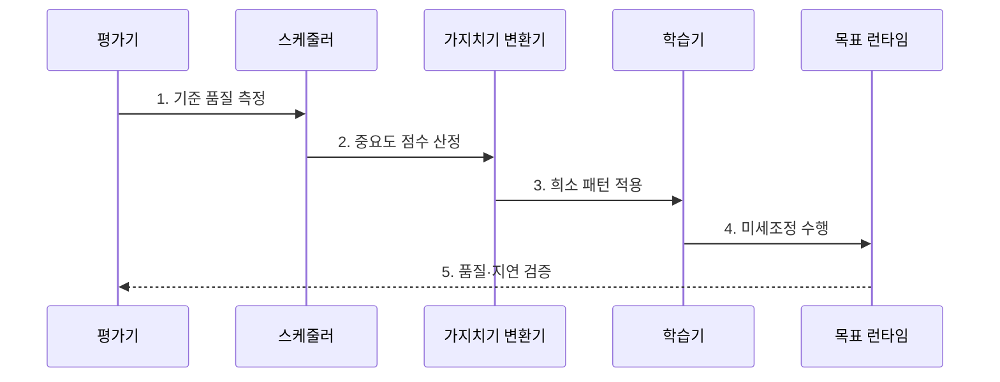

---
sidebar:
  order: 55
  label: "055. Model Pruning (모델 가지치기)"
  badge:
    text: "기출 · 60%"
    variant: note
title: "Model Pruning (모델 가지치기)"
date: "2026-07-31T11:56:03+09:00"
tags:
  - "notes-latest_tech"
weight: 55
extra:
  question_no: "055"
  source_status: "기출"
  source_history: "135회, 138회"
  priority: 60
  priority_note: "희소화와 정확도 보존의 균형이 핵심"
---

## 미리 알고가기

- **모델 가지치기(Model Pruning)**: 중요도가 낮은 가중치·채널·헤드·계층을 제거해 모델을 압축하는 기법
- **중요도 점수(Importance Score)**: 제거 후보가 모델 출력이나 손실에 기여하는 정도를 나타내는 기준
- **희소도(Sparsity)**: 전체 가중치 중 0이거나 제거된 가중치가 차지하는 비율
- **마스크(Mask)**: 제거할 가중치에는 0, 유지할 가중치에는 1을 적용하는 선택 배열
- **비구조적 가지치기(Unstructured Pruning)**: 구조 위치와 무관하게 개별 가중치를 제거하는 희소화 방식
- **반구조적 가지치기(Semi-structured Pruning)**: M개 가중치 묶음마다 N개만 유지하는 N:M 희소 패턴 방식
- **구조적 가지치기(Structured Pruning)**: 채널·헤드·계층 단위로 제거해 텐서 차원을 줄이는 방식
- **미세조정(Fine-Tuning)**: 가지치기 뒤 남은 가중치를 과업 데이터로 추가 학습해 품질을 회복하는 과정
- **희소 커널(Sparse Kernel)**: 0값의 계산을 건너뛰도록 희소 형식과 인덱스를 지원하는 실행 코드
- **잔차 연결(Residual Connection)**: 계층 입력을 변환 결과에 더해 전달하므로 구조 제거 시 텐서 형상을 맞춰야 하는 연결
- **회귀 평가(Regression Evaluation)**: 가지치기 전후 동일 입력의 과업 품질을 비교해 성능 저하를 확인하는 평가

> **키워드:** Model Pruning (모델 가지치기)

## Ⅰ. 개요

- 정의/개념: **모델 가지치기**는 중요도 기준으로 가중치·채널·헤드·계층을 제거하는 모델 압축 기법
- 배경/필요성: 과매개변수 모델은 기여도가 낮은 연결까지 계산해 **메모리·연산·전송 비용** 증가

### 쉽게 이해하기 (학습용)

- 덜 중요한 연결을 지우고 품질을 회복하되 실행 장치가 제거 형식을 활용할 수 있는지 확인하는 기법

## Ⅱ. 특징

- **중요도 점수·희소 패턴**에 따른 제거 대상 결정
- 점진적 제거와 미세조정을 통한 **품질 손실 회복**
- 구조적 제거 또는 희소 커널을 통한 **실제 실행 가속**

### 쉽게 이해하기 (학습용)

- 가중치를 많이 지웠다는 통계와 목표 장치에서 실제로 빨라졌다는 결과를 분리해 확인해야 함

## Ⅲ. 구조 및 구성요소

| 구성요소 | 책임 |
|:---|:---|
| 중요도 평가기 | 가중치·채널·헤드·계층의 **제거 점수 산정** |
| 희소 패턴·스케줄러 | **제거 단위·비율·증가폭** 제어 |
| 가지치기 변환기 | **마스크** 적용 또는 모델 차원 축소 |
| 미세조정·검증기 | 제거 후 품질 회복과 과업별 **회귀 평가** |
| 밀집·희소 실행 커널 | 축소 구조 또는 지원 **희소 패턴 가속** |

### 쉽게 이해하기 (학습용)

- 무엇을 얼마나 지울지 정하고 품질을 회복한 뒤 장치가 지원하는 실행 형식으로 검증함

## Ⅳ. 흐름도

1. **기준 품질 측정**: 원본 모델의 과업 품질·크기·추론 지연 기록
2. **중요도 점수 산정**: 가중치 크기·출력 영향에 따른 제거 우선순위 결정
3. **희소 패턴 적용**: 비구조·N:M·구조 단위의 점진적 제거
4. **미세조정 수행**: 남은 가중치 재학습을 통한 제거 후 품질 회복
5. **품질·지연 검증**: 목표 장치의 회귀 품질·메모리·실측 지연 비교

### 쉽게 이해하기 (학습용)

- 조금씩 지우고 다시 학습하면서 원본 대비 품질과 목표 장치 속도를 반복 확인함

## Ⅴ. 종류 및 비교

| 가지치기 방식 | 비구조적 | 반구조적 | 구조적 |
|:---|:---|:---|:---|
| 적용 기준 | **임의 희소성 지원 커널** | **N:M 패턴 지원 가속기** | 일반 밀집 커널의 **차원 축소** |
| 핵심 특징 | **비구조적 가중치 제거** | **반구조적 고정 개수 제거** | **구조적 채널·헤드·계층 제거** |
| 한계 | **인덱스 비용·희소 커널 의존** | **패턴·하드웨어 종속** | **품질 손실·구조 정합성 관리** |

### 쉽게 이해하기 (학습용)

- 세밀하게 지울수록 전용 실행 지원이 필요하고 묶음째 지울수록 일반 장치에서 가속하기 쉬움

## Ⅵ. 실무 고려사항 및 대책

| 고려사항 | 대책 | 효과 |
|:---|:---|:---|
| **높은 희소도**로 과업 품질 급락 | **점진적 제거·미세조정**과 회귀 평가 | 목표 희소도 내 **허용 품질** 유지 |
| 커널 미지원·인덱스 비용으로 **희소 가속** 상쇄 | 장치 지원 **N:M 패턴·구조적 제거** 선택 | 명목 희소도의 **실측 지연** 전환 |
| 채널·헤드 제거로 **텐서 형상** 불일치 | **잔차 연결·헤드 차원 정합성** 검증 | 구조적 가지치기의 **배포 실패** 방지 |

### 쉽게 이해하기 (학습용)

- 제거 비율보다 장치가 0값을 건너뛰는지와 남은 모델이 어떤 입력에서 틀리는지를 함께 확인함

## Ⅶ. 결론

- 일반 밀집 커널은 **구조적**, N:M 가속기는 **반구조적 가지치기** 선택

### 쉽게 이해하기 (학습용)

- 품질을 지키면서 목표 장치가 실제 가속할 수 있는 제거 단위와 비율을 선택
