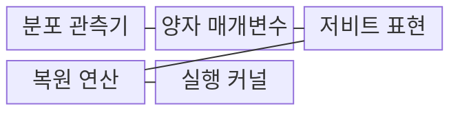
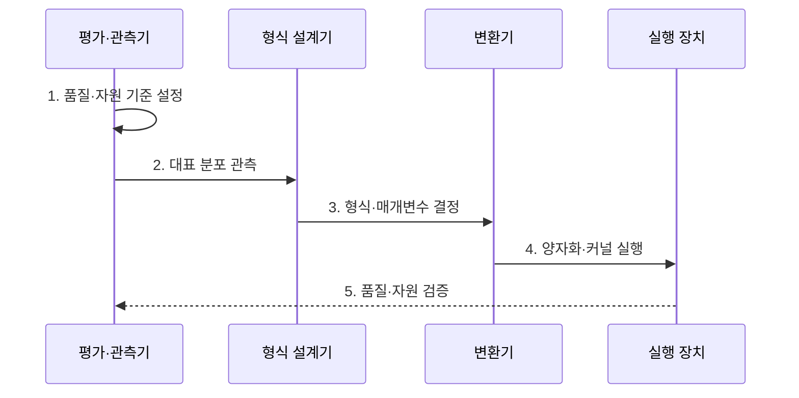

---
sidebar:
  order: 56
  label: "056. Quantization (양자화)"
  badge:
    text: "기출 · 70%"
    variant: note
title: "Quantization (양자화)"
date: "2026-08-02T09:23:00+09:00"
tags:
  - "notes-latest_tech"
weight: 56
extra:
  question_no: "056"
  source_status: "기출"
  source_history: "135회, 138회"
  priority: 70
  priority_note: "정밀도 축소와 성능 균형이 반복 쟁점"
---

## Ⅰ. 개요

핵심 용어

- **양자화(Quantization)**: 가중치와 활성값을 제한된 저비트 단계로 변환하여 메모리·연산 비용을 줄이는 기법이다.
- **저비트 표현**: 실숫값을 더 적은 비트의 정수나 부동소수점 값으로 근사한 표현이다.

- 정의/개념: **양자화(Quantization)** 는 가중치·활성값을 저비트 표현으로 변환하는 모델 압축 기법
- 배경/필요성: 고정밀 연산의 **메모리 대역폭·전력 비용** 증가로 단말 배포 제약

#### 한줄 요약
- 정보를 덜 정밀한 눈금으로 바꿔 저장·계산함

## Ⅱ. 특징

핵심 용어

- **스케일·영점**: 실수 눈금 간격과 실수 0에 대응하는 정수 위치를 정하는 양자화 매개변수다.
- **세분성**: 하나의 양자화 매개변수를 텐서·채널·그룹 중 어느 범위에서 공유할지 정하는 단위다.
- **활성값 인지 가중치 양자화(Activation-aware Weight Quantization, AWQ)**: 중요 활성값 채널을 고려하여 가중치 스케일을 조정하는 양자화 방식이다.

> 계단선은 연속 실숫값이 같은 정수 눈금으로 묶이고 양끝에서 포화됨을 나타내며, 명시한 양자화 공식으로 계산한 예시 좌표이지 모델 정확도 실측값은 아니다.

- 연속 실숫값을 유한 단계로 매핑하는 **스케일·영점**
- 채널별 분포와 활성 이상치에 따른 **양자화 오차**
- 저비트 저장과 실제 **정수 커널 가속** 의 분리 판단
- 중요 활성 채널을 보존하는 **활성값 인지 가중치 양자화(Activation-aware Weight Quantization, AWQ)** 기반 가중치 양자화

#### 한줄 요약
- 가중치만 줄이는 방식과 중간값까지 줄이는 방식의 효율과 위험은 다름

## Ⅲ. 구조 및 구성요소

핵심 용어

- **보정 데이터**: 운영 입력을 대표하여 가중치·활성값의 범위를 관측하는 표본이다.
- **복원 연산**: 정수 코드를 스케일과 영점으로 근사 실숫값에 대응시키는 변환이다.
- **양자화 커널**: 목표 장치에서 저비트 행렬 연산을 실제 수행하는 실행 코드다.

| 구성요소 | 책임 |
|:---|:---|
| 분포 관측기 | 대표 표본의 **값 범위** 측정 |
| 양자 매개변수 | **스케일·영점·세분성** 결정 |
| 저비트 표현 | 실숫값의 **정수 코드** 저장 |
| 복원 연산 | 정수 코드의 **근사 실숫값** 변환 |
| 실행 커널 | 장비의 **저정밀 연산** 수행 |

#### 한줄 요약

- 스케일과 영점을 정해 원래 값을 작은 숫자 범위로 옮긴다

## Ⅳ. 흐름도

핵심 용어

- **동적 범위**: 보정 표본에서 관측한 가중치·활성값의 최솟값과 최댓값 범위다.
- **품질·자원 기준**: 허용 정확도 손실과 목표 지연·메모리·전력을 함께 정한 평가 기준이다.

1. **품질·자원 기준 설정**: 허용 정확도 손실과 **자원 목표** 확정
2. **대표 분포 관측**: 보정 표본으로 **동적 범위** 측정
3. **형식·매개변수 결정**: 대상·비트·**스케일·영점** 선택
4. **양자화·커널 실행**: 저비트 변환과 **장비 연산** 수행
5. **품질·자원 검증**: 정확도·지연·메모리의 **동시 비교**
#### 한줄 요약

- 숫자 범위를 재고 눈금 간격을 정한 뒤 실제 칩이 그 숫자로 계산하는지까지 확인함

## Ⅴ. 종류 및 비교

핵심 용어

- **가중치 전용 학습 후 양자화(Post-Training Quantization, PTQ)**: 재학습 없이 가중치만 저비트로 변환하여 메모리를 줄인다.
- **가중치·활성값 학습 후 양자화(Post-Training Quantization, PTQ)**: 보정 데이터로 가중치와 활성값을 변환하여 정수 연산을 가속한다.
- **양자화 인지 학습(Quantization-Aware Training, QAT)**: 학습 중 양자화 오차를 반영하여 저비트 변환 후 정확도를 회복한다.

**학습 후 양자화(Post-Training Quantization, PTQ)** 는 재학습 제약이 클 때, **양자화 인지 학습(Quantization-Aware Training, QAT)** 은 정확도 회복이 우선일 때 선택한다.

| 구분 | 가중치 전용 PTQ | 가중치·활성값 PTQ | QAT |
|:---|:---|:---|:---|
| 적용 기준 | **메모리 절감** 중심 | **정수 연산 가속** | **정확도 보존** 우선 |
| 핵심 특징 | **가중치** 만 저비트 변환 | 가중치·**활성값** 변환 | 학습 중 **양자화 오차** 반영 |
| 한계 | **활성값 연산 비용** 유지 | **보정 데이터·이상치** 민감 | **재학습 비용** 증가 |

> 요약: 대상과 학습 환경에 따라 양자화 방식을 선택함

#### 한줄 요약

- 학습 후 변환과 학습 중 적응은 비용과 품질 회복력이 다르다

## Ⅵ. 실무 고려사항 및 대책

핵심 용어

- **분포 불일치**: 보정 표본의 값 범위가 실제 운영 입력과 달라 양자화 오차가 커지는 문제다.
- **활성 이상치**: 일부 채널의 매우 큰 값이 전체 양자화 눈금을 넓혀 대부분 값의 정밀도를 낮추는 현상이다.
- **커널 미지원**: 장치가 선택한 비트 형식이나 연산자를 직접 실행하지 못해 실제 가속이 발생하지 않는 문제다.

| 문제 | 대책 | 효과 |
|:---|:---|:---|
| **보정 데이터** 불일치 | 운영 분포 표본으로 **계층별 범위** 관측 | 분포 범위의 **왜곡 감소** |
| **활성 이상치** | 채널별 스케일·**클리핑** 적용 | 양자화 오차의 **집중 완화** |
| **커널 미지원** | 장비의 **연산자·비트 형식** 확인 | 실제 추론 지연 **개선** |

#### 한줄 요약
- 계층별 분포 차이를 고려해 보정을 세분화함

## Ⅶ. 결론

핵심 용어

- **학습 후 양자화·활성값 인지 가중치 양자화 선택 기준**: 재학습이 어렵고 보정 또는 중요 채널 보존만으로 허용 품질을 충족할 때 적용한다.
- **양자화 인지 학습 선택 기준**: 정확도에 민감하고 추가 학습 비용을 감수해 양자화 오차에 적응해야 할 때 적용한다.

- 재학습 제약은 **학습 후 양자화(Post-Training Quantization, PTQ)·활성값 인지 가중치 양자화(Activation-aware Weight Quantization, AWQ)**, 정확도 민감 과업은 **양자화 인지 학습(Quantization-Aware Training, QAT)** 선택

#### 한줄 요약
- 낮은 비트보다 품질과 장비 효율을 지키는 형식이 중요함
