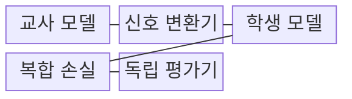
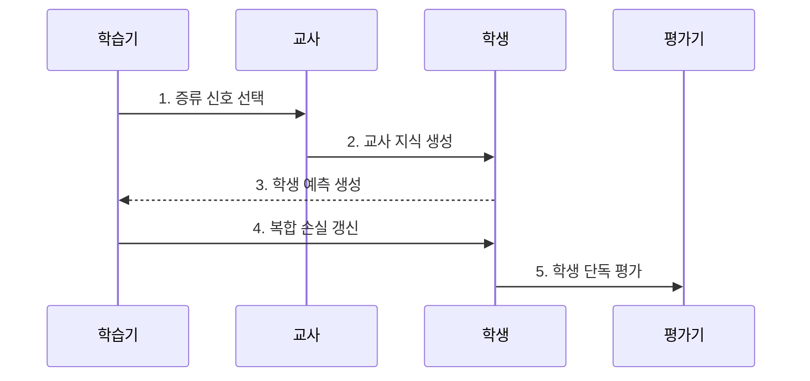

---
sidebar:
  order: 57
  label: "057. Knowledge Distillation (지식 증류)"
  badge:
    text: "기출 • 60%"
    variant: note
title: "Knowledge Distillation (지식 증류)"
date: "2026-08-04T15:57:00+09:00"
tags:
  - "notes-latest_tech"
weight: 57
extra:
  question_no: "057"
  source_status: "기출"
  source_history: "138회"
  priority: 60
  priority_note: "교사 지식 전이가 경량화 핵심 기법"
---

## Ⅰ. 개요

핵심 용어

- **지식 증류(Knowledge Distillation)**: 대형 교사 모델의 출력•특징•관계를 소형 학생 모델로 이전하는 압축 학습이다.
- **학생 모델**: 교사의 지식을 학습하여 더 적은 자원으로 독립 추론하도록 만든 작은 모델이다.

- 정의/개념: **지식 증류** 는 교사 모델의 출력•특징•관계를 학생 모델에 전달하는 압축 학습
- 배경/필요성: 정답 레이블만으로는 **클래스 관계•중간 표현** 전달 불가

#### 한줄 요약
- 선생님의 답 분포와 풀이 흔적 중 학생에게 유용한 정보를 전달함

## Ⅱ. 특징

핵심 용어

- **소프트 타깃**: 각 클래스의 상대적 관계를 담은 교사 모델의 확률분포다.
- **로짓**: 소프트맥스로 확률을 만들기 전 모델이 클래스별로 출력한 점수다.
- **템퍼러처**: 로짓을 나누어 확률분포의 평탄한 정도를 조절하는 값이다.
- **쿨백-라이블러 발산(Kullback-Leibler Divergence, KL 발산)**: 교사 분포를 기준으로 학생 확률분포의 차이를 비대칭적으로 측정한다.

> 높은 템퍼러처의 막대는 클래스 간 높이 차이가 줄어 비정답 클래스의 상대 관계가 드러나며, 명시한 로짓과 소프트맥스로 계산한 예시 좌표이지 모델 정확도 실측값은 아니다.

- 교사 **소프트 타깃** 의 정답 외 클래스 간 상대 관계 전달
- 교사•학생 **로짓•템퍼러처** 를 통한 확률분포 평활화
- 정답 손실과 **KL 발산 기반 증류 손실** 의 가중 결합

#### 한줄 요약
- 온도를 높여 정답 외 점수 차이를 강조하고, 중간 특징을 맞춰 학습함

## Ⅲ. 구조 및 구성요소

핵심 용어

- **신호 변환기**: 템퍼러처와 차원 정렬을 적용해 교사 신호를 학생이 학습할 형태로 바꾼다.
- **교사 모델(Teacher Model)**: 학생이 모방할 출력 확률•중간 특징•관계 지식을 제공하는 고성능 모델이다.
- **학생 모델 역할**: 교사 지식과 정답을 함께 학습해 경량 추론을 수행한다.
- **복합 손실**: 정답 손실과 교사 모방을 위한 증류 손실을 가중 결합한 학습 기준이다.
- **독립 평가기**: 교사 없이 학생만 실행하여 실제 품질•지연•메모리를 측정한다.

| 구성요소 | 책임 |
|:---|:---|
| 교사 모델 | **출력•특징•관계** 의 전이 지식 생성 |
| 신호 변환기 | **템퍼러처•차원 정렬** 적용 |
| 학생 모델 | 교사 신호를 모방한 **예측 생성** |
| 복합 손실 | **정답•증류 손실** 가중 결합 |
| 독립 평가기 | 학생 단독 **품질•자원** 측정 |

#### 한줄 요약

- 교사•학생 출력을 맞춰 정답•증류 손실을 계산함

## Ⅳ. 흐름도

핵심 용어

- **증류 신호**: 교사가 학생에게 전달하는 출력 분포•중간 특징•표본 관계 정보다.
- **학생 단독 평가**: 배포 조건과 같이 교사 없이 학생 모델만으로 품질과 자원을 검증하는 절차다.

**동작 원리**

1. **증류 신호 선택**: 출력•특징•관계 중 **전이 대상** 결정
2. **교사 지식 생성**: 템퍼러처를 적용한 **교사 분포** 산출
3. **학생 예측 생성**: 동일 입력에 대한 **학생 분포** 산출
4. **복합 손실 갱신**: 정답•증류 손실로 **학생 매개변수** 갱신
5. **학생 단독 평가**: 교사 없이 정확도•지연•**메모리 실측**
#### 한줄 요약

- 교사 신호로 학생을 학습한 뒤 학생 단독 품질을 평가함

## Ⅴ. 종류 및 비교

핵심 용어

- **응답 증류**: 교사의 출력 확률과 소프트 타깃을 학생이 모방한다.
- **특징 증류**: 교사와 학생의 중간 표현을 정렬하여 학습한다.
- **관계 증류**: 표본이나 계층 사이의 거리•유사도 구조를 학생에게 이전한다.

| 구분 | 응답 증류 | 특징 증류 | 관계 증류 |
|:---|:---|:---|:---|
| 적용 기준 | **출력 확률** 전달 | **중간 표현** 전달 | **표본•계층 관계** 전달 |
| 핵심 특징 | **소프트 타깃** 모방 | **특징 맵** 정렬 | **거리•유사도 구조** 모방 |
| 한계 | **교사 출력 편향** 전이 | **차원 정렬** 설계 필요 | **관계 계산 비용** 증가 |

#### 한줄 요약

- 응답•특징•관계 증류는 전달하는 교사 신호가 다름

## Ⅵ. 실무 고려사항 및 대책

핵심 용어

- **교사 오류 전이**: 교사의 잘못된 예측과 편향을 학생이 함께 학습하는 문제다.
- **단계적 증류**: 교사와 학생의 용량 차이가 클 때 중간 크기 모델을 거쳐 지식을 이전하는 방식이다.
- **손실 비중**: 정답 손실과 증류 손실이 학생 매개변수 갱신에 기여하는 상대 가중치다.

| 문제 | 대책 | 효과 |
|:---|:---|:---|
| **교사 오류** 전이 | 정답•교사 불일치 **표본 검증** | **편향 복제** 완화 |
| **모델 용량 차이** | 중간 교사•**단계적 증류** 적용 | **학습 난도** 완화 |
| **손실 비중** 민감 | 정답•증류 손실의 **가중치 검증** | **과업 정확도** 보존 |

#### 한줄 요약
- 교사 오류까지 배울 수 있으므로 별도 검증 및 실측 필수

## Ⅶ. 결론

핵심 용어

- **응답 증류 선택 기준**: 교사의 출력만 접근할 수 있을 때 확률분포를 학생이 모방하도록 학습한다.
- **특징•관계 증류 선택 기준**: 교사 내부 표현에 접근할 수 있고 더 풍부한 구조를 이전할 가치가 있을 때 적용한다.

- 출력 접근만 가능하면 **응답 증류**, 중간 표현 접근 시 **특징•관계 증류**

#### 한줄 요약
- 학생에게 맞는 교재를 골라 스스로 정확히 답하는지 확인함
